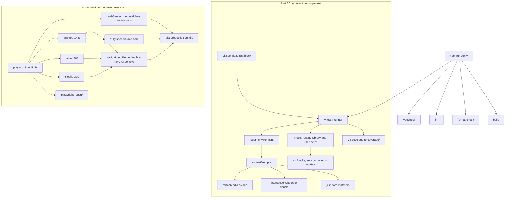

# Requirements

### Overview & Goals

Introduce a modern, two-tier automated testing stack to the portfolio so the repository demonstrates production-grade engineering practice when published on GitHub:

- **Unit / component tier** — Vitest 4 + jsdom + React Testing Library, co-located with source in `src/`.
- **End-to-end tier** — Playwright driving the real production bundle (`vite build` + `vite preview`), covering core journeys, automated WCAG scans, and a responsive viewport matrix.

The existing quality gates (`typecheck`, `lint`, `format:check`, `build`) are extended with `test` and `test:e2e`, and all governance documents (`AGENTS.md`, `README.md`, `docs/`) are synchronized.

Three additional mandates are adopted as part of this change:

- **TDD becomes the required workflow** for all development that happens *after* this plan lands — red / green / refactor, test first, always.
- **100% unit-test coverage is a hard, failing gate** — V8 thresholds for lines, statements, functions and branches are all set to 100, with a short, explicitly justified exclusion list.
- **A new `docs/testing.md`** becomes the single source of truth for the testing architecture, the TDD workflow and the coverage policy; `AGENTS.md` and `README.md` state both mandates explicitly and link to it.

### Scope

#### In Scope

- Vitest 4 configuration wired into the existing `vite.config.ts` (single source of truth for the `@/*` alias).
- jsdom setup file with centralized `IntersectionObserver` / `matchMedia` test doubles and per-test DOM cleanup.
- Unit tests for `useColorScheme`, `useActiveSection`, and the `src/data/` contract invariants.
- Component tests for `ActionLink`, `Tag`, `Eyebrow`, `ThemeToggle`, `SkipLink`, `Container`, `Section`/`SectionHeader`, `Header`, `MobileNav`, `IndexRail`.
- Unit tests for `Footer` and `App` so that every runtime module in `src/` is exercised.
- V8 coverage reporting (text, html, lcov) **with 100% thresholds enforced** — `npm run test:coverage` fails below 100% on lines, statements, functions and branches.
- Playwright config with three chromium viewport projects (320 / 768 / 1440) and a `webServer` that builds and previews the real bundle.
- E2E specs: anchor navigation & scroll-spy, theme toggle & persistence, mobile nav keyboard/focus behavior, `@axe-core/playwright` WCAG 2.1 AA scans in both themes, responsive overflow & tap-target guards.
- ESLint flat-config blocks for `eslint-plugin-testing-library` and `eslint-plugin-playwright`.
- New `tsconfig.e2e.json` project reference so `tsc -b --noEmit` also typechecks e2e code.
- Installation of four vetted agent skills via the Skills CLI.
- **New `docs/testing.md`** — testing architecture, TDD workflow, coverage policy, conventions, harness API reference and troubleshooting.
- Explicit **TDD mandate** and **100% unit coverage mandate** written into `AGENTS.md` and `README.md`.
- Documentation sync across `AGENTS.md`, `README.md`, `docs/architecture.md`, `docs/decisions.md`, `docs/concerns.md`.

#### Out of Scope

- **CI / GitHub Actions workflow** — explicitly deferred per your decision; no `.github/` directory is created.
- **Visual regression snapshots** — excluded as high-maintenance and font-rendering flaky.
- **Coverage measurement of the e2e tier** — the 100% threshold applies to the Vitest unit/component tier only; Playwright runs against the minified bundle and is not instrumented.
- **Retroactive TDD** — the initial suite delivered by this plan is necessarily written against already-existing code; the TDD mandate governs all work *after* this change lands.
- Vitest Browser Mode, cross-browser Firefox/WebKit projects, Lighthouse budgets, and any change to production runtime dependencies.
- Tests for `src/components/sections/` — the directory is still empty (`App.tsx` renders placeholder copy); tests arrive with those components.

### User Stories

- As the portfolio owner, I want `npm test` to catch regressions in the theme and scroll-spy logic so refactors stay safe.
- As the portfolio owner, I want an e2e suite that proves the site actually works in a browser against the production bundle, not just in a simulated DOM.
- As an accessibility-conscious engineer, I want automated axe scans in both color schemes so the WCAG AA promise in `AGENTS.md` is verifiable rather than aspirational.
- As a recruiter or peer browsing the GitHub repo, I want the README to show a credible, modern testing setup and clear commands to run it.
- As an AI agent working in this repo, I want `AGENTS.md` to state the testing conventions and updated quality gates so generated code includes tests by default.
- As the portfolio owner, I want the TDD requirement and the 100% coverage rule stated unambiguously in `AGENTS.md` and `README.md` so neither a human contributor nor an AI agent can quietly skip writing tests.
- As a contributor, I want one `docs/testing.md` that teaches the workflow, the harness API and how to fix a failing coverage gate.

### Functional Requirements

1. `npm test` runs the full unit suite headlessly and exits non-zero on failure.
2. `npm run test:watch` provides an interactive watch loop for development.
3. `npm run test:coverage` emits a V8 coverage report to `coverage/` and **exits non-zero if lines, statements, functions or branches fall below 100%**.
4. `npm run test:e2e` builds the site, boots `vite preview`, runs all Playwright projects, and writes an HTML report.
5. `npm run verify` chains every quality gate in one command.
6. Unit tests must not require network access or a real browser binary.
7. E2E tests must use web-first assertions and role-based locators — no fixed `waitForTimeout` sleeps.
8. Each test must be isolated: `sessionStorage`, `data-theme`, and `document.body.style.overflow` are reset between tests.
9. Test artifacts (`coverage/`, `playwright-report/`, `test-results/`) are git-ignored and prettier-ignored.
10. Every runtime module under `src/` is covered; the coverage `exclude` list is limited to `src/main.tsx`, `src/test/**`, `src/**/*.d.ts`, `src/data/types.ts` (type-only) and the test files themselves, and every entry is justified in `docs/testing.md`.
11. `docs/testing.md` exists and documents the two-tier architecture, the red/green/refactor workflow, the coverage policy and its exclusions, the `src/test/` harness API, and how to diagnose a failed gate.
12. `AGENTS.md` and `README.md` each contain an explicit, prominent statement that **all future development is test-driven** and that **unit coverage must remain at 100%**.

### Non-Functional Requirements

- **Zero production impact** — every added package is a `devDependency`; the shipped bundle is unchanged.
- **Strict typing** — no `any` in test code; test files compile under the existing strict `tsc -b`.
- **Formatting** — all new files satisfy Prettier (`tabWidth: 4`, `printWidth: 120`, single quotes).
- **Determinism** — e2e runs force `reducedMotion: 'reduce'` to neutralize the CSS scroll-driven animations that would otherwise cause flake.
- **Speed** — the unit suite should complete in a few seconds; e2e is deliberately kept to three chromium projects.
- **Enforceability over aspiration** — the TDD and coverage rules are backed by a machine-checked gate (`test:coverage` inside `verify`), not by prose alone.
- **Documentation as a contract** — `docs/testing.md` falls under the existing Mandatory Documentation Maintenance Rule; changing the testing setup without updating it is a defect.

# Technical Design

### Current Implementation

| Area | State |
|---|---|
| Runtime | React 19.0 + TypeScript 5.7 strict, Vite **8.2.2** (Rolldown), Tailwind v4 CSS-first |
| Config | `vite.config.ts` (alias `@` to `./src`, `build.target: 'baseline-widely-available'`) |
| TS projects | `tsconfig.json` references `tsconfig.app.json` (include `src`) and `tsconfig.node.json` (include `vite.config.ts`) |
| Lint | ESLint 9 flat config, `typescript-eslint` + `react-hooks` + `jsx-a11y` + `prettier` |
| Gates | `typecheck`, `lint`, `format:check`, `build` — **no test tooling at all** |
| Skills | 8 skills managed by the Skills CLI, pinned in `skills-lock.json`, installed into `.junie/`, `.agents/`, `.claude/` |
| CI | none (`.github/` does not exist) |

Highest-value behavior currently untested:

- `src/hooks/useColorScheme.ts` — `sessionStorage` read/write inside `try/catch`, `data-theme` attribute writes, `prefers-color-scheme` change listener that is ignored when a session override exists.
- `src/hooks/useActiveSection.ts` — single `IntersectionObserver`, `rootMargin` derived from the `--header-height` CSS token with a 64px fallback, document-order first-visible-wins, plus top (`scrollY < 100`) and bottom-of-page edge guards.
- `src/components/layout/MobileNav.tsx` — focus trap over a querySelector-based focusable list, Escape-to-close, body scroll-lock with restore, focus return to `triggerRef`, `matchMedia('(min-width: 48rem)')` auto-close.
- `src/components/ui/ActionLink.tsx` — anchor-vs-button branching, auto external detection via a `https?://` regex, `target`/`rel` resolution, screen-reader opens-in-new-tab affordance.
- `src/data/*` — the empty-string omission pattern and `SECTION_IDS` vs `navItems` alignment that `docs/concerns.md` flags as drift risks.

### Key Decisions

1. **Vitest 4 over Jest** — verified `vitest@4.1.11` peer-supports `vite@^8`; it reuses the existing Vite pipeline (alias, Tailwind plugin, Oxc transform) so there is no second build config to maintain.
2. **Vitest config lives inside `vite.config.ts`** — switch the import to `defineConfig` from `vitest/config` and add a `test` block. Vite ignores `test` during builds, and the `@` alias stays defined exactly once.
3. **jsdom + Testing Library, no `globals: true`** — explicit imports from `vitest` keep the ESLint flat config free of extra global declarations and keep test intent explicit.
4. **Centralized browser API doubles** — `IntersectionObserver` and `matchMedia` are missing in jsdom. Rather than ad-hoc mocks per file, `src/test/` exposes controllable factories so tests drive intersections and media-query changes instead of asserting on mock internals.
5. **Playwright runs against the production bundle** — `webServer` executes `npm run build && npm run preview`, so e2e validates the artifact that actually ships, including the pre-paint theme script in `index.html`.
6. **Viewport matrix as Playwright projects** — 320 / 768 / 1440 chromium projects map directly to concerns #4 (narrow-viewport overflow) and #11 (IndexRail overlap at `xl+`) in `docs/concerns.md`.
7. **`reducedMotion: 'reduce'` globally in e2e** — the site's `animation-timeline: view()` reveals and transitions are the single largest flake source; disabling motion is the standard Playwright determinism lever.
8. **Separate `tsconfig.e2e.json`** — e2e code needs the `DOM` lib for `page.evaluate` callbacks, which `tsconfig.node.json` (lib `ES2023`) lacks. A third project reference keeps `tsc -b --noEmit` authoritative over all TypeScript in the repo.
9. **100% coverage enforced with `all: true` and a minimal exclusion list** — thresholds of 100 on lines/statements/functions/branches, combined with `all: true` so untested files count as 0% instead of silently vanishing from the report. This bar is only credible on a codebase this small, which is exactly why it is affordable here. Exclusions are limited to the bootstrap entry (`src/main.tsx`), the harness (`src/test/**`), ambient declarations (`*.d.ts`), the type-only `src/data/types.ts`, and test files. Reaching 100% requires two tests the earlier draft lacked: `src/components/layout/Footer.test.tsx` and `src/App.test.tsx`.
10. **`verify` runs `test:coverage`, not bare `test`** — the coverage gate must be part of the standard chain, otherwise the 100% rule is advisory. `npm test` stays fast and threshold-free for the inner dev loop.
11. **A dedicated `docs/testing.md` rather than growing `architecture.md`** — testing now spans two runners, a harness, a coverage policy and a workflow mandate; that is its own concern. `architecture.md`, `decisions.md` and `concerns.md` link to it instead of duplicating it, matching the existing high-signal, single-responsibility style of `docs/`.
12. **TDD stated as a governance rule, not tooling** — no commit hooks or CI enforcement (CI is out of scope). The mandate lives in `AGENTS.md` (binding on agents) and `README.md` (binding on humans), and the 100% coverage gate is its practical backstop: new untested code cannot pass `verify`.

### Proposed Changes

#### 1. Dependencies (all devDependencies)

| Package | Version | Purpose |
|---|---|---|
| `vitest` | `^4.1.11` | Test runner |
| `@vitest/coverage-v8` | `^4.1.11` | V8 coverage provider |
| `jsdom` | `^30.0.1` | DOM environment |
| `@testing-library/react` | `^16.3.2` | React 19 compatible renderer |
| `@testing-library/dom` | `^10.4.1` | Required explicit peer of RTL 16 |
| `@testing-library/jest-dom` | `^7.0.1` | DOM matchers (`/vitest` entrypoint) |
| `@testing-library/user-event` | `^14.6.6` | Realistic keyboard/pointer interaction |
| `@playwright/test` | `^1.62.1` | E2E runner |
| `@axe-core/playwright` | `^4.13.0` | WCAG scanning |
| `eslint-plugin-testing-library` | `^7.16.2` | Lint rules for RTL usage |
| `eslint-plugin-playwright` | `^2.11.0` | Lint rules for e2e (bans `waitForTimeout`) |

#### 2. `vite.config.ts`

```ts
/// <reference types="vitest/config" />
import { defineConfig } from 'vitest/config';
import react from '@vitejs/plugin-react';
import tailwindcss from '@tailwindcss/vite';
import path from 'node:path';

export default defineConfig({
    plugins: [react(), tailwindcss()],
    resolve: { alias: { '@': path.resolve(import.meta.dirname, './src') } },
    build: { target: 'baseline-widely-available' },
    test: {
        environment: 'jsdom',
        setupFiles: ['./src/test/setup.ts'],
        include: ['src/**/*.{test,spec}.{ts,tsx}'],
        exclude: ['e2e/**', 'node_modules/**', 'dist/**'],
        css: false,
        clearMocks: true,
        restoreMocks: true,
        coverage: {
            provider: 'v8',
            all: true,
            reporter: ['text', 'html', 'lcov'],
            include: ['src/**/*.{ts,tsx}'],
            exclude: [
                'src/main.tsx', // bootstrap only: createRoot(...).render(<App />)
                'src/test/**', // the harness itself
                'src/data/types.ts', // type-only module, no runtime output
                'src/**/*.d.ts',
                'src/**/*.{test,spec}.{ts,tsx}',
            ],
            thresholds: {
                lines: 100,
                statements: 100,
                functions: 100,
                branches: 100,
            },
        },
    },
});
```

#### 3. Test harness — `src/test/`

`setup.ts` registers jest-dom matchers and enforces isolation:

```ts
import '@testing-library/jest-dom/vitest';
import { afterEach } from 'vitest';
import { cleanup } from '@testing-library/react';
import { resetMatchMedia } from './matchMedia';
import { resetIntersectionObserver } from './intersectionObserver';

afterEach(() => {
    cleanup();
    resetMatchMedia();
    resetIntersectionObserver();
    sessionStorage.clear();
    document.documentElement.removeAttribute('data-theme');
    document.body.style.overflow = '';
});
```

`matchMedia.ts` — installs a stub on `window` and exposes a driver:

```ts
export function mockMatchMedia(initial?: Record<string, boolean>): void;
export function setMediaMatches(query: string, matches: boolean): void; // dispatches a real change event
export function resetMatchMedia(): void;
```

`intersectionObserver.ts` — a fake observer class recording observed elements:

```ts
export function mockIntersectionObserver(): void;
export function emitIntersections(entries: ReadonlyArray<{ id: string; isIntersecting: boolean }>): void;
export function getObserverOptions(): IntersectionObserverInit | undefined; // asserts the rootMargin math
export function resetIntersectionObserver(): void;
```

`render.tsx` — thin wrapper re-exporting RTL plus a `renderWithUser()` helper returning `{ user, ...result }`.

#### 4. E2E harness — `e2e/`

`playwright.config.ts` at the repo root:

```ts
import { defineConfig, devices } from '@playwright/test';

const PORT = 4173;
const baseURL = `http://localhost:${PORT}`;

export default defineConfig({
    testDir: './e2e',
    fullyParallel: true,
    retries: 0,
    reporter: [['list'], ['html', { open: 'never' }]],
    use: { baseURL, trace: 'on-first-retry', reducedMotion: 'reduce' },
    projects: [
        { name: 'desktop-1440', use: { ...devices['Desktop Chrome'], viewport: { width: 1440, height: 900 } } },
        { name: 'tablet-768', use: { ...devices['Desktop Chrome'], viewport: { width: 768, height: 1024 } } },
        { name: 'mobile-320', use: { ...devices['Pixel 5'], viewport: { width: 320, height: 640 } } },
    ],
    webServer: {
        command: `npm run build && npm run preview -- --port ${PORT} --strictPort`,
        url: baseURL,
        reuseExistingServer: true,
        timeout: 120_000,
    },
});
```

`e2e/fixtures/axe.ts` extends the base `test` with a `makeAxeBuilder` fixture scoped to WCAG 2.0/2.1 A + AA tags.

#### 5. ESLint (`eslint.config.js`)

- Extend `ignores` with `coverage`, `playwright-report`, `test-results`.
- Add a block for `src/**/*.{test,spec}.{ts,tsx}` and `src/test/**` applying the `eslint-plugin-testing-library` flat React config and disabling `react-refresh/only-export-components` (test helper modules legitimately export non-components).
- Add a block for `e2e/**` and `playwright.config.ts` applying the `eslint-plugin-playwright` flat recommended config with `globals.node`.

#### 6. TypeScript

New `tsconfig.e2e.json` (lib `ES2023` + `DOM`, `types: ["node"]`, include `e2e` and `playwright.config.ts`, strict), registered as a third reference in `tsconfig.json`.

#### 7. Scripts (`package.json`)

```json
"test": "vitest run",
"test:watch": "vitest",
"test:coverage": "vitest run --coverage",
"test:e2e": "playwright test",
"test:e2e:ui": "playwright test --ui",
"verify": "npm run typecheck && npm run lint && npm run format:check && npm run test:coverage && npm run build"
```

#### 8. Ignore files

`.gitignore` and `.prettierignore` both gain `coverage`, `playwright-report`, `test-results`, `/blob-report`, `.playwright`.

#### 9. `docs/testing.md` (new document)

Structure, matching the condensed high-signal style of the existing `docs/` files:

1. **Testing Philosophy** — the TDD mandate (red → green → refactor), what "done" means, and why 100% is the bar on a codebase this size.
2. **Two-Tier Architecture** — what the unit tier owns vs. what the e2e tier owns, and the rule for deciding where a new test belongs.
3. **Commands** — `test`, `test:watch`, `test:coverage`, `test:e2e`, `test:e2e:ui`, `verify`, plus the one-off `npx playwright install chromium`.
4. **Coverage Policy** — the 100% thresholds, the full exclusion list with a one-line justification per entry, and the rule that adding an exclusion requires updating this document.
5. **Unit Test Conventions** — co-location, naming, role-based queries, `user-event` over `fireEvent`, no assertions on Tailwind classes, no inline browser-API mocks.
6. **Harness API** — the exported surface of `src/test/matchMedia.ts`, `src/test/intersectionObserver.ts` and `src/test/render.tsx`, plus what the global `afterEach` in `setup.ts` resets.
7. **E2E Conventions** — web-first assertions, role locators, the banned `waitForTimeout`, the viewport project matrix and the axe fixture.
8. **Troubleshooting** — diagnosing a coverage-threshold failure from the HTML report, debugging a flaky e2e spec with traces, and the jsdom custom-property gap around `--header-height`.

### File Structure

```
.
├── e2e/                              # NEW — Playwright specs
│   ├── fixtures/axe.ts               # NEW — AxeBuilder fixture (WCAG 2.1 AA tags)
│   ├── navigation.spec.ts            # NEW — anchors, scroll-spy, skip link
│   ├── theme.spec.ts                 # NEW — toggle, persistence, OS preference
│   ├── mobile-nav.spec.ts            # NEW — disclosure, focus trap, scroll lock
│   ├── a11y.spec.ts                  # NEW — axe scans, light + dark
│   └── responsive.spec.ts            # NEW — overflow, tap targets, IndexRail
├── src/
│   ├── test/                         # NEW — unit test harness
│   │   ├── setup.ts
│   │   ├── matchMedia.ts
│   │   ├── intersectionObserver.ts
│   │   └── render.tsx
│   ├── hooks/
│   │   ├── useColorScheme.test.ts     # NEW
│   │   └── useActiveSection.test.ts   # NEW
│   ├── data/
│   │   └── content.test.ts            # NEW — data contract invariants
│   ├── components/
│   │   ├── ui/ActionLink.test.tsx          # NEW
│   │   ├── ui/primitives.test.tsx          # NEW — Tag, Eyebrow, icons
│   │   ├── layout/ThemeToggle.test.tsx     # NEW
│   │   ├── layout/Header.test.tsx          # NEW
│   │   ├── layout/MobileNav.test.tsx       # NEW
│   │   ├── layout/Footer.test.tsx          # NEW — required for 100% coverage
│   │   └── layout/shell.test.tsx           # NEW — SkipLink, Container, Section
│   └── App.test.tsx                        # NEW — required for 100% coverage
├── playwright.config.ts              # NEW
├── tsconfig.e2e.json                 # NEW
├── vite.config.ts                    # MODIFIED — vitest test block + 100% coverage thresholds
├── tsconfig.json                     # MODIFIED — third project reference
├── eslint.config.js                  # MODIFIED — test/e2e lint blocks + ignores
├── package.json                      # MODIFIED — scripts + devDependencies
├── .gitignore / .prettierignore      # MODIFIED — test artifacts
├── AGENTS.md / README.md             # MODIFIED — TDD mandate, 100% coverage, gates, scripts
├── docs/testing.md                   # NEW — testing architecture, TDD workflow, coverage policy
└── docs/*.md                         # MODIFIED — architecture, decisions, concerns
```

### Architecture Diagram



### Risks

| Risk | Mitigation |
|---|---|
| jsdom has no `IntersectionObserver` / `matchMedia`; ad-hoc mocks would drift across files | Single source of truth in `src/test/`, reset in a global `afterEach` |
| jsdom `getComputedStyle` returns empty for `--header-height`, silently exercising only the 64px fallback branch | Tests explicitly set the custom property on `document.documentElement` to cover the rem and px parsing branches |
| CSS scroll-driven reveals make e2e scroll assertions flaky | Global `reducedMotion: 'reduce'` plus web-first attribute assertions instead of sleeps |
| Scroll-spy `aria-current` can settle on a neighbouring section mid-scroll | Assert after hash navigation settles, and only on the deterministic top and bottom edge guards |
| Playwright browser binaries are a large first-time download | `npx playwright install chromium` documented as a one-off step; only chromium projects are configured |
| `e2e/` sits outside `tsconfig.app.json`, so type errors could hide from `npm run typecheck` | Dedicated `tsconfig.e2e.json` added to the root project references |
| `App.tsx` sections are still placeholders, so e2e text assertions could bind to temporary copy | E2E asserts on stable landmarks, roles, IDs and `aria-*` state — never on placeholder prose |
| Vitest picking up `e2e/*.spec.ts` and clashing with Playwright | Explicit include/exclude in the Vitest config plus `testDir: './e2e'` in Playwright |
| A 100% threshold can tempt contributors into low-value, assertion-free tests, or into silently widening the exclude list | `docs/testing.md` states that exclusions require documented justification; the list is short, enumerated inline in `vite.config.ts`, and reviewed under the doc-maintenance rule |
| V8 branch coverage counts TypeScript-generated branches (default parameters, optional chaining) that are awkward to reach | Prefer an explicit test per branch; where a branch is genuinely unreachable, simplify the code rather than adding an ignore hint — a documented last resort is an inline `/* v8 ignore next */` with a comment |
| `all: true` pulls barrels (`src/data/index.ts`) and the icon module into the report at 0% if never imported | The data-contract tests import through the barrels and every icon is rendered at least once in `primitives.test.tsx` |
| The 100% gate blocks progress when a new component lands without tests | Intentional — under TDD the test exists first, so the gate is never met in a red state at commit time |

# Skills to Install

### Findings from the Skills CLI

Searched the registry with `npx skills find` across `vitest`, `playwright`, `playwright e2e`, `testing library react`, `accessibility a11y audit`, and `github actions ci`. Skills were filtered on install count and source reputation per the `find-skills` guidance.

### Recommended — install these four

| Skill | Installs | Why it fits |
|---|---|---|
| `antfu/skills@vitest` | 33.4K | Vitest 4 config, API and patterns. Same author as the **already-installed `vite` skill**, so guidance stays internally consistent with your Vite 8 / Rolldown setup. |
| `microsoft/playwright-cli@playwright-cli` | 132.4K | Official Microsoft skill. Authoritative coverage of the Playwright CLI, config, projects, and `webServer`. |
| `currents-dev/playwright-best-practices-skill@playwright-best-practices` | 75.9K | Flake-resistance patterns: web-first assertions, role-based locators, test isolation, no hard waits — directly enforced by the `eslint-plugin-playwright` rules in this plan. |
| `addyosmani/web-quality-skills@accessibility` | 47.6K | WCAG and axe-core guidance that backs the `a11y.spec.ts` suite and the WCAG AA commitment in `AGENTS.md`. |

Install commands (project-level, consistent with the existing eight entries in `skills-lock.json`):

```bash
npx skills add antfu/skills@vitest -y
npx skills add microsoft/playwright-cli@playwright-cli -y
npx skills add currents-dev/playwright-best-practices-skill@playwright-best-practices -y
npx skills add addyosmani/web-quality-skills@accessibility -y
```

Each install writes into `.junie/skills/`, `.agents/skills/`, `.claude/skills/` (all git-ignored) and appends a pinned hash entry to the tracked `skills-lock.json`.

### Deliberately not installed

- **React Testing Library skills** — the best candidate (`itechmeat/llm-code@react-testing-library`) has only ~1.3K installs from an unvetted author; the rest sit under 250. The already-installed `vercel-react-best-practices` and `react-vite-best-practices` skills plus official RTL docs cover this adequately.
- **CI / GitHub Actions skills** — top result is ~1.2K installs from an unvetted source, and CI is out of scope per your decision.
- **Third-party Vitest skills** (`secondsky`, `existential-birds`, and similar, all under 900 installs) — superseded by `antfu/skills@vitest`.

# Test Plan

### Validation Approach

Each implementation stage ends with `npm test` (and `npm run test:e2e` for e2e stages) followed by the existing gates. Because the initial suite is written against pre-existing code, the 100% thresholds are switched on only once the suite is complete, so intermediate stages are never blocked by a red gate. The final stages run the full `npm run verify` chain — which now includes `test:coverage` at 100% — plus `npm run test:e2e`, confirming zero errors and zero warnings.

The coverage gate itself is validated two ways: `npm run test:coverage` must report 100% across all four metrics, and `coverage/index.html` must list every runtime module under `src/` so nothing has silently slipped into the exclusion list.

### Unit / Component Scenarios

**`useColorScheme`** (`src/hooks/useColorScheme.test.ts`)
- Resolves dark from a pre-seeded `sessionStorage` entry.
- Falls back to the existing `data-theme` DOM attribute when storage is empty.
- Falls back to `prefers-color-scheme: dark` when both storage and the attribute are absent.
- `setTheme('dark')` writes the `data-theme` attribute and the `sessionStorage` key; `toggle()` inverts it.
- An OS change event flips the theme when no session override exists, and is ignored when one does.
- A throwing `sessionStorage` (private-mode simulation) does not crash the hook — covers concern #7.

**`useActiveSection`** (`src/hooks/useActiveSection.test.ts`)
- Observes every element resolvable from `SECTION_IDS` and skips missing IDs.
- `rootMargin` computes from a rem-valued `--header-height`, from a px value, and falls back to `-64px` when unset or invalid.
- With multiple sections intersecting, the first in `SECTION_IDS` document order wins — covers concern #10.
- Empty intersecting set with `scrollY < 100` selects the first ID; bottom-of-page selects the last.
- Unmount calls `observer.disconnect()` and clears the visible-ID set.

**Data contracts** (`src/data/content.test.ts`)
- Every `navItems[].id` exists in `SECTION_IDS`; `SECTION_IDS` starts with `hero`.
- `navItems` indices are unique, zero-padded and sequential (01 to 05).
- No value in `siteProfile.links` is the literal `#` — covers concern #6.
- Every `Project.media` supplies non-zero `width` and `height` — covers concern #1.
- `principles` and `technologies` entries have unique, non-empty IDs.

**`ActionLink`** (`src/components/ui/ActionLink.test.tsx`)
- Renders an anchor when `href` is present, a `button type="button"` otherwise.
- `https://` hrefs auto-resolve `target="_blank"` plus `rel="noopener noreferrer"` and render the opens-in-a-new-tab screen-reader text.
- Hash hrefs stay in-tab with no external icon.
- Explicit `isExternal`, `target`, and `rel` props override the auto-detection.
- `onClick` fires for both the anchor and button branches.

**`ThemeToggle`** — exposes `aria-pressed` reflecting `isDark`, swaps Sun/Moon icons, and a `user-event` click flips `data-theme` on the document element.

**`Header`** — renders the Primary nav landmark with all five items; the item matching `activeId` carries `aria-current="true"` while others do not; the hamburger toggles `aria-expanded` and its label between Open menu and Close menu; the CV `ActionLink` is omitted when `siteProfile.links.cv` is empty.

**`MobileNav`** — renders nothing when closed; when open exposes `role="dialog"` and `aria-modal="true"`, focuses the first focusable element, and sets body overflow hidden; Escape invokes `onClose`; Tab from the last element wraps to the first and Shift+Tab from the first wraps to the last; unmount restores the previous body overflow and returns focus to `triggerRef` — covers concern #9; a `matchMedia` change to matching invokes `onClose`.

**Shell primitives** — `SkipLink` targets `#main` and is the first tab stop; `Container` merges `className` and honours the `as` polymorphic prop; `Section` applies the scroll-anchor ID and wires `aria-labelledby` to its `SectionHeader` heading; `Tag`/`Eyebrow` render children with the expected semantics; `IndexRail` is `aria-hidden` and exposes no interactive tab stops.

**`Footer`** (`src/components/layout/Footer.test.tsx`) — renders the `contentinfo` landmark, emits every non-empty link from `siteProfile.links` while omitting the empty-string ones, and renders the copyright line from the data layer rather than a hard-coded string.

**`App`** (`src/App.test.tsx`) — renders header, `#main` landmark and footer together; wires `useActiveSection` output into `Header`'s `activeId`; opens and closes `MobileNav` through the header trigger; exposes exactly one `h1`. This integration seam closes the last coverage gap outside `src/main.tsx`.

### E2E Scenarios

**`navigation.spec.ts`**
- Landing page exposes exactly one `h1` and the banner / main / contentinfo landmarks.
- Clicking each desktop nav link updates the location hash and brings the target section heading into view, unobstructed by the sticky header.
- Scrolling to a section sets `aria-current="true"` on the matching nav link (web-first assertion, no sleeps).
- Tabbing from a fresh load focuses the skip link first; activating it moves focus to `#main`.

**`theme.spec.ts`**
- Clicking the toggle flips `html[data-theme]` and `aria-pressed`.
- The choice survives a `page.reload()` via `sessionStorage`, and a fresh context starts from the OS preference.
- `test.use({ colorScheme: 'dark' })` yields `data-theme="dark"` on first paint — validates the inline `index.html` pre-paint script with no flash.

**`mobile-nav.spec.ts`** (mobile-320 project)
- The hamburger is visible below `md` and hidden at desktop widths.
- Opening reveals the dialog, locks body scroll, and moves focus inside; Escape closes it and returns focus to the trigger.
- Selecting a nav item closes the overlay and navigates to the anchor.
- Resizing past 768px while open auto-closes the overlay.

**`a11y.spec.ts`**
- Full-page axe scan (WCAG 2.0/2.1 A + AA) in light theme with zero violations.
- The same scan in dark theme, guarding the contrast concern #3.
- A scan with the mobile nav open, so the trapped dialog state is audited too.

**`responsive.spec.ts`**
- At 320px, `document.documentElement.scrollWidth <= clientWidth` — no horizontal overflow (concern #4).
- Interactive controls (theme toggle, hamburger, nav links, action links) report a bounding box of at least 44x44 px.
- `IndexRail` is absent from the layout below `xl` and does not intercept pointer events at 1440px (concern #11).

### Edge Cases

- `sessionStorage` access throwing (private browsing) must not break theme resolution.
- `--header-height` unset, malformed, or zero falls back to 64px.
- A `SECTION_IDS` entry with no matching DOM element must be skipped without throwing.
- `MobileNav` opened with zero focusable descendants must not throw on Tab.
- Empty-string links must render no anchor at all — never an `href="#"`.

### Coverage Gate Scenarios

- `npm run test:coverage` reports 100% lines, statements, functions and branches, and exits `0`.
- Temporarily disabling one test makes the command exit non-zero with a threshold error — confirming the gate is live rather than cosmetic.
- The report includes `src/App.tsx` and every file under `src/components/`, `src/hooks/` and `src/data/` (except the type-only `types.ts`), and excludes exactly the five documented entries.
- `npm run verify` fails when the coverage gate fails, proving the chain is wired correctly.

### Documentation Scenarios

- `docs/testing.md` exists and covers all eight sections listed in the Technical Design.
- `AGENTS.md` and `README.md` each contain an explicit TDD statement and an explicit 100%-coverage statement, and both link to `docs/testing.md`.
- `npm run format:check` passes on all new and modified Markdown.

### Test Changes

All tests listed above are new; there are no existing tests to update or migrate. `src/components/sections/` is intentionally left untested until those components exist — and under the new mandate, those components will be built test-first.

# Documentation Updates

Per the **Mandatory Documentation Maintenance Rule** in `AGENTS.md`, every document below is synchronized as part of this change.

### `AGENTS.md`

- **Architectural Boundaries** — add a Testing Stack constraint: Vitest + jsdom + React Testing Library for units and Playwright for e2e are the sanctioned tools; do not introduce Jest, Cypress, Enzyme, Karma, or additional runners; keep `@axe-core/playwright` as the only a11y-scanning dependency.
- **New top-level "Test-Driven Development (Mandatory)" section** — placed directly after Architectural Boundaries so it is impossible to miss:
  - All development from this point forward is test-driven. Write a failing test first (**red**), implement the minimum code to pass it (**green**), then **refactor** with the suite green.
  - No production code may be added or changed without a test written beforehand. "Tests will follow later" is not permitted.
  - Bug fixes start with a regression test that reproduces the bug and fails.
  - **Unit-test coverage must remain at 100%** (lines, statements, functions, branches). `npm run test:coverage` enforces this and is part of `npm run verify`.
  - Coverage exclusions are a closed set defined in `vite.config.ts`; adding one requires documented justification in `docs/testing.md`.
  - Never lower a threshold, never add a blanket ignore, and never write assertion-free tests to inflate coverage.
  - Read `docs/testing.md` before writing any test.
- **Documentation Governance** — register `docs/testing.md` in the `docs/` inventory as the testing architecture, TDD workflow and coverage-policy reference, and bring it under the Mandatory Documentation Maintenance Rule.
- **Code Style & Standards** — add a Testing Standards subsection:
  - Unit tests are co-located as `*.test.ts(x)` beside the source module; e2e specs live in `e2e/`.
  - Query by accessible role and name (`getByRole`) before test IDs; never assert on Tailwind class strings.
  - Use `user-event` over raw `fireEvent` for interaction.
  - Browser API doubles come from `src/test/` — no inline `IntersectionObserver` or `matchMedia` mocks.
  - E2E uses web-first assertions and role locators; `page.waitForTimeout` is banned (enforced by `eslint-plugin-playwright`).
  - New behavior must ship with tests written first; new components need at least a render plus a11y-contract test.
  - Every new runtime module must reach 100% coverage in the same change that introduces it.
- **Quality Gates** — replace the command block with:

```bash
npm run typecheck      # tsc -b --noEmit (0 TypeScript errors)
npm run lint           # eslint . (0 errors, 0 warnings)
npm run format:check   # prettier --check . (clean formatting)
npm run test:coverage  # vitest run --coverage (all unit tests green, 100% coverage)
npm run build          # vite build (successful production bundle)
npm run test:e2e       # playwright test (all e2e projects green)
```

  plus a note that `npm run verify` chains the non-e2e gates including the 100% coverage gate, that `npm test` is the fast threshold-free inner-loop variant, and that `npx playwright install chromium` is a one-time prerequisite.

### `README.md`

- **Tech Stack** — add a Testing line: Vitest 4 + jsdom + React Testing Library (unit/component), Playwright + axe-core (e2e and accessibility).
- **Project Structure** — insert `e2e/`, `src/test/`, `playwright.config.ts`, `tsconfig.e2e.json` and `docs/testing.md` into the tree.
- **Available Scripts** — document `test`, `test:watch`, `test:coverage`, `test:e2e`, `test:e2e:ui`, `verify`.
- **New Testing section** — the two-tier strategy, what each tier owns, the 320/768/1440 viewport matrix, the WCAG 2.1 AA axe gate, where reports land (`coverage/`, `playwright-report/`), the `npx playwright install chromium` first-run step, and a pointer to `docs/testing.md` for full detail.
- **New "Development Workflow" callout** — a short, prominent block stating that this repository follows **strict TDD** (write the failing test first) and maintains **100% unit-test coverage as an enforced gate**, so anyone browsing the GitHub repo sees the quality bar immediately.
- **Development Guidelines** — add TDD as the first guideline and extend the Quality Gates item to include `npm run test:coverage` at 100% and `npm run test:e2e`.
- **Documentation index** — list `docs/testing.md` alongside the existing three documents.

### `docs/testing.md` (new)

Create the document with the eight sections defined in the Technical Design tab: Testing Philosophy (TDD mandate), Two-Tier Architecture, Commands, Coverage Policy (100% thresholds plus the justified exclusion list), Unit Test Conventions, Harness API (`src/test/`), E2E Conventions and Troubleshooting. It carries the test-pipeline Mermaid diagram and is referenced from `AGENTS.md`, `README.md`, `docs/architecture.md`, `docs/decisions.md` and `docs/concerns.md`, so the detail lives in exactly one place.

### `docs/architecture.md`

- Add architectural concepts: **Two-Tier Testing Architecture** (Vitest/jsdom unit tier sharing the Vite pipeline; Playwright tier exercising the built artifact via `vite preview`), **Centralized Browser API Doubles** (`src/test/`), and **Accessibility-as-a-Gate** (axe scans in both themes across the viewport matrix).
- Extend the directory-layout block with `src/test/`, a new top-level `e2e/` entry, and `docs/testing.md`.
- Cross-link to `docs/testing.md` for the detailed testing architecture instead of duplicating it here.

### `docs/decisions.md`

Append, continuing the existing numbering:

- **14. Vitest 4 over Jest** — reuses the Vite 8 pipeline, alias and transform; verified peer support for `vite@^8`.
- **15. Vitest Config Colocated in `vite.config.ts`** — one alias definition, no parallel build config.
- **16. jsdom + React Testing Library over Browser Mode** — fast, dependency-light, well-understood; DOM-API gaps are covered by centralized doubles.
- **17. Explicit Vitest Imports over `globals: true`** — keeps the ESLint flat config free of injected globals.
- **18. Playwright Against the Production Preview Build** — e2e validates the shipped artifact including the pre-paint theme script.
- **19. Viewport Projects over Per-Test Resizing** — 320/768/1440 chromium projects give clean, parallel responsive coverage.
- **20. Automated axe-core Accessibility Gate** — makes the WCAG AA commitment executable.
- **21. 100% Unit Coverage as a Failing Gate** — thresholds of 100 on lines/statements/functions/branches with `all: true` and a short, justified exclusion list; affordable because the codebase is small, and it makes the TDD mandate mechanically enforceable.
- **22. Test-Driven Development Mandated for All Future Work** — red/green/refactor is the required workflow; recorded as a governance decision in `AGENTS.md` and `README.md` rather than enforced by hooks, with the coverage gate as the practical backstop.
- **23. Dedicated `docs/testing.md`** — testing spans two runners, a harness, a coverage policy and a workflow mandate, so it gets its own document; the other `docs/` files link to it rather than duplicating it.
- **24. No Visual Regression, No CI Yet** — deliberate scope limits recorded with rationale so the omissions read as decisions rather than gaps.

### `docs/concerns.md`

Append, continuing the existing numbering:

- **12. jsdom Browser API Gaps** — `IntersectionObserver` and `matchMedia` are absent and `getComputedStyle` returns empty custom properties; mitigated by `src/test/` doubles and tests that explicitly set `--header-height` to exercise every parsing branch.
- **13. E2E Flakiness from Scroll-Driven Animation** — mitigated by global `reducedMotion: 'reduce'`, web-first assertions, and a lint-enforced ban on `waitForTimeout`.
- **14. Test State Leakage** — `sessionStorage`, `data-theme`, and `body.style.overflow` are process-global in jsdom; a global `afterEach` resets all three.
- **15. Placeholder Content Coupling** — `src/components/sections/` is unbuilt and `App.tsx` renders temporary copy; e2e must assert on landmarks, roles and `aria-*` state, never on placeholder prose.
- **16. Playwright Binary and Build Cost** — e2e rebuilds the bundle per run and needs a chromium download; mitigated by `reuseExistingServer`, chromium-only projects, and documenting the one-off install.
- **17. 100% Coverage Can Incentivise Hollow Tests** — a numeric target invites assertion-free renders and creeping exclusions; mitigated by role-based behavioral assertions, a closed exclusion list enumerated in `vite.config.ts`, and the rule in `docs/testing.md` that any new exclusion needs written justification.
- **18. Coverage Gate Friction as the Codebase Grows** — once `src/components/sections/` is built, holding 100% costs real effort; accepted deliberately and made sustainable by writing tests first so the gate is never met in a red state.

# Delivery Steps

###   Step 1: Install testing skills and wire the Vitest harness into the build
`npm test` runs a green Vitest suite in jsdom with the `@/*` alias resolving and all tooling configs updated.

- Install the four vetted agent skills via the Skills CLI, updating `skills-lock.json`: `antfu/skills@vitest`, `microsoft/playwright-cli@playwright-cli`, `currents-dev/playwright-best-practices-skill@playwright-best-practices`, `addyosmani/web-quality-skills@accessibility`.
- Add devDependencies: `vitest`, `@vitest/coverage-v8`, `jsdom`, `@testing-library/react`, `@testing-library/dom`, `@testing-library/jest-dom`, `@testing-library/user-event`.
- Convert `vite.config.ts` to import `defineConfig` from `vitest/config` and add the `test` block (jsdom env, `setupFiles`, include/exclude, `clearMocks`, `restoreMocks`, and V8 coverage with `all: true`, the documented exclusion list and text/html/lcov reporters; the 100% thresholds are switched on in a later stage so intermediate stages are not blocked).
- Create `src/test/setup.ts` registering `@testing-library/jest-dom/vitest` and a global `afterEach` that runs `cleanup()` and resets `sessionStorage`, `data-theme`, and `document.body.style.overflow`.
- Create `src/test/matchMedia.ts` and `src/test/intersectionObserver.ts` exposing installable, controllable doubles (`setMediaMatches`, `emitIntersections`, `getObserverOptions`, reset helpers).
- Create `src/test/render.tsx` re-exporting RTL plus a `renderWithUser()` helper.
- Add `test`, `test:watch`, and `test:coverage` scripts to `package.json`.
- Extend `eslint.config.js` with an `eslint-plugin-testing-library` block for test files and add `coverage` to `ignores`; add `coverage` to `.gitignore` and `.prettierignore`.

###   Step 2: Unit-test the hooks and the data layer contracts
The theme, scroll-spy, and content-contract logic is fully covered by fast, isolated unit tests.

- Add `src/hooks/useColorScheme.test.ts` covering `sessionStorage` resolution, `data-theme` fallback, `prefers-color-scheme` fallback, `setTheme`/`toggle` side effects, OS change events being ignored under a session override, and a throwing storage stub simulating private mode.
- Add `src/hooks/useActiveSection.test.ts` covering observer registration for `SECTION_IDS`, `rootMargin` derivation from rem and px values of `--header-height` plus the 64px fallback, first-in-document-order selection among multiple intersecting sections, the top and bottom-of-page edge guards, missing DOM elements, and `disconnect()` on unmount.
- Add `src/data/content.test.ts` asserting `navItems` IDs are a subset of `SECTION_IDS`, indices are unique and sequential, no link equals `#`, every `Project.media` declares non-zero `width`/`height`, and principle/technology IDs are unique and non-empty.
- Drive all browser APIs through the `src/test/` doubles rather than inline mocks.

###   Step 3: Component-test the UI primitives and layout shell
Every existing component in `src/components/` has behavior and accessibility-contract coverage via React Testing Library.

- Add `src/components/ui/ActionLink.test.tsx` for the anchor-vs-button branch, auto external detection with `target`/`rel` resolution, the opens-in-a-new-tab screen-reader text, prop overrides, and `onClick` on both branches.
- Add `src/components/ui/primitives.test.tsx` for `Tag`, `Eyebrow`, and the SVG icon primitives.
- Add `src/components/layout/ThemeToggle.test.tsx` asserting `aria-pressed`, the icon swap, and that a `user-event` click flips `data-theme` on the document element.
- Add `src/components/layout/Header.test.tsx` for the Primary nav landmark, `aria-current` on the active item only, hamburger `aria-expanded` and label toggling, and CV link omission when `siteProfile.links.cv` is empty.
- Add `src/components/layout/MobileNav.test.tsx` for closed-state null render, dialog semantics, initial focus, body scroll lock and restore, Escape-to-close, forward and reverse Tab wrapping, focus return to `triggerRef`, and `matchMedia` auto-close past `48rem`.
- Add `src/components/layout/shell.test.tsx` for `SkipLink`, `Container` polymorphism and class merging, `Section`/`SectionHeader` `aria-labelledby` wiring, and `IndexRail` being `aria-hidden` with no tab stops.
- Add `src/components/layout/Footer.test.tsx` for the `contentinfo` landmark, non-empty link rendering with empty-string omission, and the data-driven copyright line.
- Add `src/App.test.tsx` for the header / `#main` / footer composition, `activeId` wiring from `useActiveSection`, mobile-nav open and close through the header trigger, and the single-`h1` invariant.
- Query by accessible role and name throughout; never assert on Tailwind class strings.
- Run `npm run test:coverage` and close every remaining gap with real assertions before the thresholds are switched on.

###   Step 4: Scaffold Playwright and cover the core user journeys
`npm run test:e2e` builds the site, serves it via `vite preview`, and runs journey specs green across three viewport projects.

- Add devDependencies `@playwright/test` and `eslint-plugin-playwright`; document `npx playwright install chromium` as a one-time step.
- Create `playwright.config.ts` with `testDir: './e2e'`, a `baseURL` on port 4173, global `reducedMotion: 'reduce'`, `trace: 'on-first-retry'`, list plus HTML reporters, the `desktop-1440` / `tablet-768` / `mobile-320` chromium projects, and a `webServer` running the build followed by preview.
- Create `tsconfig.e2e.json` (lib ES2023 plus DOM, node types, including `e2e` and `playwright.config.ts`) and register it as a third reference in `tsconfig.json`.
- Add `e2e/navigation.spec.ts` for landmark and single-h1 structure, nav-link anchor navigation, scroll-spy `aria-current`, and the skip-link-first tab order.
- Add `e2e/theme.spec.ts` for toggle behavior, `sessionStorage` persistence across reload, a clean new context defaulting to the OS preference, and a dark `colorScheme` producing a flash-free pre-paint `data-theme`.
- Add `e2e/mobile-nav.spec.ts` for open/close, body scroll lock, Escape with focus return, nav-item selection closing the overlay, and auto-close on widening past 768px.
- Add `test:e2e` and `test:e2e:ui` scripts, an `eslint-plugin-playwright` flat block for `e2e/**`, and `playwright-report` plus `test-results` to `.gitignore` and `.prettierignore`.

###   Step 5: Add automated accessibility and responsive e2e guards
Axe-core WCAG 2.1 AA scans and responsive layout guards run as part of the e2e suite in both color schemes.

- Add the `@axe-core/playwright` devDependency.
- Create `e2e/fixtures/axe.ts` extending the base `test` with a `makeAxeBuilder` fixture scoped to the `wcag2a`, `wcag2aa`, `wcag21a`, and `wcag21aa` tags.
- Add `e2e/a11y.spec.ts` asserting zero violations for a full-page scan in light theme, the same in dark theme guarding the contrast concern, and a scan with the mobile navigation open so the trapped dialog state is audited.
- Add `e2e/responsive.spec.ts` asserting no horizontal overflow at 320px, a minimum 44x44 px bounding box for the theme toggle, hamburger, nav links and action links, and that `IndexRail` is absent below `xl` while never intercepting pointer events at 1440px.
- Assert only on landmarks, roles, IDs and `aria-*` state so the specs survive the placeholder copy currently rendered by `App.tsx`.

###   Step 6: Enforce the 100% coverage gate and author docs/testing.md
The coverage thresholds are live, `npm run verify` fails below 100%, and `docs/testing.md` documents the whole strategy.

- Enable `thresholds: { lines: 100, statements: 100, functions: 100, branches: 100 }` in the `coverage` block of `vite.config.ts`.
- Run `npm run test:coverage`, close any residual gaps with behavioral tests (never with new exclusions), and confirm the report lists every runtime module under `src/`.
- Verify the gate is real by temporarily disabling a test, observing a non-zero exit, then restoring it.
- Add the `verify` script chaining `typecheck`, `lint`, `format:check`, `test:coverage` and `build`.
- Create `docs/testing.md` with the eight sections: Testing Philosophy and the TDD mandate, Two-Tier Architecture, Commands, Coverage Policy with the justified exclusion list, Unit Test Conventions, `src/test/` Harness API, E2E Conventions, and Troubleshooting.
- Embed the test-pipeline Mermaid diagram in `docs/testing.md` as its architectural reference.

###   Step 7: Write the TDD and coverage mandates into AGENTS.md, README.md and the docs/ knowledge base
Every governance document states that future development is test-driven with 100% unit coverage, and the full gate chain passes cleanly.

- Update `AGENTS.md`: add a mandatory Test-Driven Development section (red/green/refactor, no production code without a prior failing test, regression test first for bug fixes, 100% coverage non-negotiable, exclusions require justification), a Testing Stack architectural boundary, a Testing Standards subsection under Code Style, `docs/testing.md` registered under Documentation Governance, and an expanded Quality Gates block using `npm run test:coverage` plus `npm run test:e2e` and the `npx playwright install chromium` prerequisite.
- Update `README.md`: add testing tooling to the Tech Stack, insert `e2e/`, `src/test/`, `playwright.config.ts`, `tsconfig.e2e.json` and `docs/testing.md` into the Project Structure tree, document all new scripts, add a Testing section, and add a prominent development-workflow callout stating strict TDD and the enforced 100% coverage bar.
- Update `docs/architecture.md`: add the Two-Tier Testing Architecture, Centralized Browser API Doubles and Accessibility-as-a-Gate concepts, extend the directory layout, and cross-link to `docs/testing.md`.
- Update `docs/decisions.md` with decisions 14 through 24, including the 100% coverage gate, the TDD mandate, the dedicated testing document, and the deliberate exclusions.
- Update `docs/concerns.md` with concerns 12 through 18, including the hollow-test incentive of a numeric coverage target and the growing cost of holding 100% as `src/components/sections/` is built.
- Run the complete chain (`typecheck`, `lint`, `format:check`, `test:coverage`, `build`, `test:e2e`), confirming zero errors, zero warnings and 100% coverage.