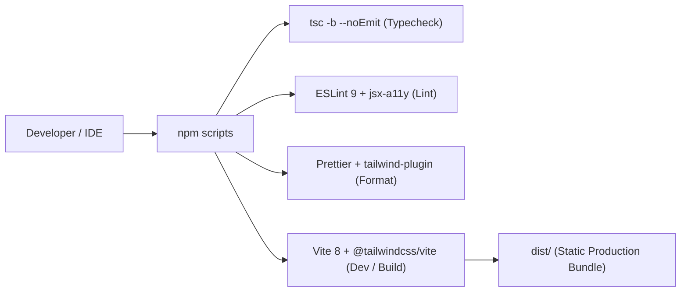

# Requirements

### Overview & Goals
The objective of this task is to deliver **Step 1** of the personal landing portfolio roadmap (`.junie/plans/personal-landing-portfolio-mvp.md`): initializing a robust, modern, production-grade frontend toolchain for Oleksandr Misiuk's portfolio website.

This establishes the clean foundation for all subsequent steps (tokens, data layer, layout shell, and portfolio sections) by configuring Vite, React 19, TypeScript, Tailwind CSS v4, ESLint 9 (flat config), and Prettier within the existing repository.

### Scope

#### In Scope (Step 1)
- Initializing Vite + React 19 + TypeScript in the current repository without overwriting existing files (`Editor.md`, `skills-lock.json`, `.junie`, `.agents`).
- Installing and configuring **Tailwind CSS v4** via `@tailwindcss/vite` (zero PostCSS/tailwind.config boilerplate).
- Setting up path aliases (`@` → `./src`) across `vite.config.ts` and `tsconfig.app.json`.
- Configuring `build.target: 'baseline-widely-available'`.
- Setting up **ESLint 9** flat config with `typescript-eslint`, `eslint-plugin-react-hooks`, `eslint-plugin-react-refresh`, `eslint-plugin-jsx-a11y`, and `eslint-config-prettier`.
- Setting up **Prettier** with `prettier-plugin-tailwindcss`, `.prettierrc.json`, and `.prettierignore`.
- Configuring npm scripts: `dev`, `build`, `preview`, `lint`, `format`, `format:check`, `typecheck`.
- Adding `.gitignore`, `README.md`, `AGENTS.md`, and `docs/` documenting tech stack, scripts, project layout, key concepts/decisions/concerns, and agent guidelines.
- Creating the `docs/` directory (`docs/architecture.md`, `docs/decisions.md`, `docs/concerns.md`) with condensed key concepts, architectural approaches, decisions, and concerns.
- Stripping Vite demo boilerplate (`App.css`, demo logos, counter) down to a minimal semantic shell verifying Tailwind styles.
- Verifying all quality gates (`npm run typecheck`, `npm run lint`, `npm run format:check`, `npm run build`).

#### Out of Scope (Deferred to Later Steps)
- Design tokens, typography variables, font packages (`@fontsource-variable/*`), and theme switching (Step 2).
- Content data layer and TypeScript data schemas (Step 3).
- Navigation, sticky header, mobile nav, and layout components (Step 4).
- Section components: Hero, Selected Work, How I Work, About, Technologies, Contact (Steps 5 & 6).

### User Stories
- As an **engineer developing the portfolio**, I want a fast, zero-friction Vite + Tailwind CSS v4 environment with path aliases so that I can write clean, modular React TypeScript code.
- As an **engineer maintaining the codebase**, I want strict TypeScript, accessibility-aware linting (`jsx-a11y`), and automated formatting (`prettier-plugin-tailwindcss`) so that code quality and consistency remain high across every commit.
- As an **engineering manager or reviewer inspecting the repo**, I want to see modern flat ESLint configs, clean npm scripts, and an uncluttered project structure reflecting senior frontend best practices.

### Functional & Toolchain Requirements
- `index.html` configured with document title `"OLEKSANDR MISIUK - Software Engineer"`, standard viewport/charset meta tags, and favicon link.
- `npm run dev`: starts Vite development server with HMR.
- `npm run build`: typechecks and bundles the application into `dist/`.
- `npm run preview`: serves the production build locally.
- `npm run lint`: lints the entire project using ESLint 9 flat config, reporting 0 errors and 0 warnings.
- `npm run typecheck`: runs `tsc -b --noEmit` with 0 errors.
- `npm run format`: formats all project files via Prettier.
- `npm run format:check`: verifies formatting compliance across the repo.
- Path alias `@/` correctly resolves to `src/` in both editor/IDE and Vite bundling.

### Non-Functional Requirements
- **Zero bloat**: No unused demo files, assets, or heavy external UI/state libraries.
- **Node & npm compatibility**: Fully compatible with Node 24+ and npm 11+.
- **Clean Git state**: Proper `.gitignore` preventing generated files and OS caches from polluting git history.

# Technical Design

### Current Implementation
The repository currently contains `Editor.md` (project brief), `skills-lock.json`, `.git`, `.junie`, and `.agents`. Node is version 24.18.0 and npm is version 11.16.0. No build tooling or source code exists yet.

### Key Decisions
- **Scaffold approach**: Initialize Vite React-TS in place while ensuring `Editor.md`, `skills-lock.json`, `.junie`, and `.agents` are completely preserved.
- **Tailwind CSS v4**: Use `@tailwindcss/vite` plugin directly in `vite.config.ts`. Avoid legacy `tailwind.config.js` or PostCSS configurations.
- **Path Aliasing**: Define `@` → `./src` in `vite.config.ts` (`resolve.alias`) and `tsconfig.app.json` (`compilerOptions.paths` / `baseUrl`) to enable clean absolute imports across the project.
- **Modern Build Target**: Set `build.target: 'baseline-widely-available'` in `vite.config.ts` for clean modern JS output.
- **Flat ESLint 9 + A11y**: Use flat config `eslint.config.js` with TypeScript-ESLint, React Hooks, React Refresh, JSX A11y, and Prettier integration to catch accessibility and syntax defects early.
- **Prettier with Tailwind sorting**: Use `prettier-plugin-tailwindcss` to guarantee consistent class ordering without runtime overhead.
- **Agent Guidelines & Documentation**: Add `AGENTS.md` alongside `README.md` to define architectural boundaries (static SPA, no backend/external UI libs), code style rules, quality verification commands, and file structure rules for AI coding agents.
- **Project Documentation (`docs/`) & Agent Maintenance Policy**: Establish a dedicated `docs/` directory containing condensed Markdown files (`docs/architecture.md`, `docs/decisions.md`, `docs/concerns.md`) documenting core concepts, design approaches, technical choices, and known concerns. `AGENTS.md` explicitly references `docs/` and strictly mandates that agents must update these docs whenever new logic is implemented or existing logic is modified.

### Proposed Changes & Configuration

#### `vite.config.ts`
```ts
import { defineConfig } from 'vite';
import react from '@vitejs/plugin-react';
import tailwindcss from '@tailwindcss/vite';
import path from 'node:path';

export default defineConfig({
  plugins: [react(), tailwindcss()],
  resolve: {
    alias: {
      '@': path.resolve(__dirname, './src'),
    },
  },
  build: {
    target: 'baseline-widely-available',
  },
});
```

#### `tsconfig.app.json`
```json
{
  "compilerOptions": {
    "tsBuildInfoFile": "./node_modules/.tmp/tsconfig.app.tsbuildinfo",
    "target": "ES2022",
    "useDefineForClassFields": true,
    "lib": ["ES2022", "DOM", "DOM.Iterable"],
    "module": "ESNext",
    "skipLibCheck": true,

    /* Bundler mode */
    "moduleResolution": "bundler",
    "allowImportingTsExtensions": true,
    "isolatedModules": true,
    "moduleDetection": "force",
    "noEmit": true,
    "jsx": "react-jsx",

    /* Path Aliases */
    "baseUrl": ".",
    "paths": {
      "@/*": ["./src/*"]
    },

    /* Linting */
    "strict": true,
    "noUnusedLocals": true,
    "noUnusedParameters": true,
    "noFallthroughCasesInSwitch": true,
    "noUncheckedSideEffectImports": true
  },
  "include": ["src"]
}
```

#### `eslint.config.js`
```js
import js from '@eslint/js';
import globals from 'globals';
import reactHooks from 'eslint-plugin-react-hooks';
import reactRefresh from 'eslint-plugin-react-refresh';
import jsxA11y from 'eslint-plugin-jsx-a11y';
import tseslint from 'typescript-eslint';
import prettier from 'eslint-config-prettier';

export default tseslint.config(
  { ignores: ['dist', 'node_modules'] },
  {
    extends: [
      js.configs.recommended,
      ...tseslint.configs.recommended,
      prettier,
    ],
    files: ['**/*.{ts,tsx}'],
    languageOptions: {
      ecmaVersion: 2020,
      globals: globals.browser,
    },
    plugins: {
      'react-hooks': reactHooks,
      'react-refresh': reactRefresh,
      'jsx-a11y': jsxA11y,
    },
    rules: {
      ...reactHooks.configs.recommended.rules,
      'react-refresh/only-export-components': [
        'warn',
        { allowConstantExport: true },
      ],
      ...jsxA11y.configs.recommended.rules,
    },
  },
);
```

#### `.prettierrc.json`
```json
{
  "semi": true,
  "singleQuote": true,
  "tabWidth": 4,
  "trailingComma": "all",
  "printWidth": 120,
  "plugins": ["prettier-plugin-tailwindcss"]
}
```

#### `package.json` Scripts
```json
{
  "scripts": {
    "dev": "vite",
    "build": "tsc -b && vite build",
    "preview": "vite preview",
    "lint": "eslint .",
    "format": "prettier --write .",
    "format:check": "prettier --check .",
    "typecheck": "tsc -b --noEmit"
  }
}
```

### File Structure
```
.
├── .gitignore
├── .prettierignore
├── .prettierrc.json
├── AGENTS.md
├── Editor.md
├── README.md
├── docs/
│   ├── architecture.md
│   ├── concerns.md
│   └── decisions.md
├── eslint.config.js
├── index.html
├── package.json
├── public/
│   ├── cv/.gitkeep
│   └── favicon.svg
├── skills-lock.json
├── src/
│   ├── App.tsx
│   ├── assets/
│   ├── components/
│   │   ├── layout/
│   │   ├── sections/
│   │   └── ui/
│   ├── data/
│   ├── hooks/
│   ├── main.tsx
│   ├── styles/
│   │   └── index.css
│   └── vite-env.d.ts
├── tsconfig.app.json
├── tsconfig.json
├── tsconfig.node.json
└── vite.config.ts
```

### Architecture Diagram


### Risks & Mitigations
- **Directory non-empty during scaffold**: Create/populate project configs explicitly or safely scaffold without overwriting `.junie`, `.agents`, `Editor.md`, or `skills-lock.json`.
- **Node path typing**: Install `@types/node` as devDependency so `path.resolve` in `vite.config.ts` is fully type-safe.
- **Tailwind v4 Vite plugin resolution**: Use `@tailwindcss/vite` directly with `@import "tailwindcss";` in `src/styles/index.css`.

# Testing

### Validation Approach
Verification for Step 1 relies on automated toolchain gates and observable build outputs. No external test framework is introduced.

### Key Scenarios

1. **Typecheck Gate**
   - Execute `npm run typecheck` (`tsc -b --noEmit`).
   - Expected: 0 TypeScript diagnostics or compilation errors across `src/` and config files.

2. **Lint Gate**
   - Execute `npm run lint` (`eslint .`).
   - Expected: 0 errors and 0 warnings from TypeScript-ESLint, React Hooks, and JSX A11y.

3. **Format Gate**
   - Execute `npm run format:check` (`prettier --check .`).
   - Expected: All files match formatting rules with clean status.

4. **Production Build Gate**
   - Execute `npm run build` (`tsc -b && vite build`).
   - Expected: Clean build generation in `dist/` with optimized HTML, JS, and CSS chunks.

5. **Path Alias Resolution**
   - Test an import using `@/styles/index.css` or `@/App` inside `src/main.tsx`.
   - Expected: Both TypeScript compiler and Vite resolve the import without error.

6. **Dev Server and Preview Boot**
   - Start preview server via `npm run preview` and verify local HTML response.
   - Expected: Document renders without runtime exceptions or overlay errors, with `<title>` matching "OLEKSANDR MISIUK - Software Engineer".

7. **Documentation and Agent Governance Gate**
   - Verify `docs/` exists containing `architecture.md`, `decisions.md`, and `concerns.md` summarizing condensed key concepts, approaches, decisions, and concerns.
   - Verify `AGENTS.md` explicitly cites `docs/` and contains the mandatory requirement to update documentation on logic additions or modifications.

### Edge Cases & Regression Verification
- **Preserved Existing Files**: Confirm `Editor.md`, `skills-lock.json`, `.junie/`, and `.agents/` remain intact and uncorrupted.
- **Clean Git Status**: Confirm temporary build files (`dist/`, `node_modules/`, `*.tsbuildinfo`) are properly ignored by `.gitignore`.

# Delivery Steps

### ✓ Step 1: Scaffold Vite and TypeScript baseline
A clean Vite + React 19 + TypeScript project structure is initialized in the root directory while preserving existing repository files.

- Initialize the project package structure using Vite with the React + TypeScript template, preserving `Editor.md`, `skills-lock.json`, `.agents`, `.junie`, and `.git`.
- Establish target directory layout: `src/components/layout/`, `src/components/sections/`, `src/components/ui/`, `src/data/`, `src/hooks/`, `src/styles/`, `src/assets/`, and `public/cv/`.
- Create a clean `index.html` with title "OLEKSANDR MISIUK - Software Engineer", viewport meta tags, and placeholder favicon link.
- Verify `package.json` dependencies for React 19, TypeScript, and Vite baseline.

### ✓ Step 2: Configure Tailwind CSS v4 and path aliases
Tailwind CSS v4 is integrated via `@tailwindcss/vite` and `@` path aliases resolve correctly in Vite and TypeScript.

- Install Tailwind CSS v4 dependencies: `tailwindcss` and `@tailwindcss/vite`.
- Configure `vite.config.ts` with `react()`, `@tailwindcss/vite`, resolve alias `@` pointing to `./src`, and `build.target: 'baseline-widely-available'`.
- Update `tsconfig.app.json` (and `tsconfig.json`) to support path aliases with `baseUrl: "."` and `paths: { "@/*": ["./src/*"] }`.
- Create `src/styles/index.css` with `@import "tailwindcss";` and import it into `src/main.tsx`.

### ✓ Step 3: Setup ESLint, Prettier, and npm scripts
ESLint 9 flat config, Prettier, and npm verification scripts are fully configured and functioning.

- Install Prettier, `prettier-plugin-tailwindcss`, `eslint-config-prettier`, and `eslint-plugin-jsx-a11y`.
- Create `.prettierrc.json` (`tabWidth: 4`, `printWidth: 120`, single quotes, trailing commas, Tailwind plugin) plus `.prettierignore`.
- Update `eslint.config.js` to flat config combining TypeScript-ESLint, React Hooks, React Refresh, JSX A11y, and Prettier integration.
- Add npm scripts to `package.json`: `dev`, `build`, `preview`, `lint`, `format`, `format:check`, `typecheck`.
- Create `.gitignore` ignoring `node_modules`, `dist`, `.DS_Store`, while tracking project configs and documentation.
- Write `README.md` covering the tech stack, available npm scripts, project structure, and workflow guidelines.
- Create `AGENTS.md` establishing AI agent instructions, architectural constraints (zero external UI/state libs, static-first, typed data layer), code formatting standards, and quality gate commands.

### ✓ Step 4: Clean boilerplate and validate toolchain gates
Default Vite boilerplate is replaced with a clean application shell, and all automated quality gates pass.

- Remove Vite demo artifacts: `App.css`, demo SVG logos, and counter state logic.
- Implement a minimal, semantic `src/App.tsx` shell verifying Tailwind utility classes and base styling.
- Create `public/favicon.svg` placeholder and verify `src/main.tsx` renders `App`.
- Execute and verify all quality gates: `npm run typecheck`, `npm run lint`, `npm run format:check`, and `npm run build`.
- Validate that `npm run preview` / `npm run dev` boots cleanly without console or bundling errors.

### ✓ Step 5: Initialize project documentation in docs/ and configure AGENTS.md governance
The `docs/` directory is created with condensed architecture, decision, and concern documentation, and `AGENTS.md` is updated with mandatory documentation synchronization rules.

- Create `docs/architecture.md` summarizing key frontend concepts, static SPA architecture, component organization, and data-flow patterns.
- Create `docs/decisions.md` capturing key architectural decisions (Tailwind v4 CSS-first `@theme`, session-only theme override, typed TS content layer, zero external UI/state libs).
- Create `docs/concerns.md` documenting critical concerns, accessibility/responsive pitfalls, browser compatibility guards, and performance constraints.
- Update `AGENTS.md` to explicitly link to `docs/` and mandate that AI agents must read these documents before making changes and update them whenever new logic is implemented or existing logic is modified.
- Validate that all quality gates (`npm run lint`, `npm run format:check`, `npm run typecheck`, `npm run build`) remain green after adding the documentation files.