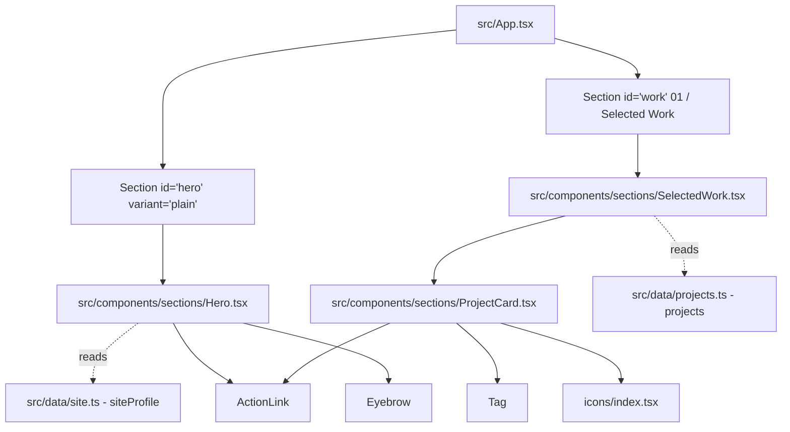

# Requirements

### Overview & Goals
Step 5 of the portfolio roadmap delivers the core above-the-fold impression and primary project showcase by implementing the `Hero`, `SelectedWork`, and `ProjectCard` components. It transitions the application shell from placeholder text into a fully functional, highly polished editorial presentation while adhering strictly to TDD, 100% unit coverage, zero external UI/state libraries, and WCAG AA accessibility standards.

### Scope
- **In Scope**:
  - `Hero` component (`src/components/sections/Hero.tsx`): Large typography headline (`h1`), role statement, availability status indicator badge, entrance animation respecting `prefers-reduced-motion`, and primary/ghost CTAs ("View Work" -> `#work`, "Get in touch" -> `#contact`).
  - `ProjectCard` component (`src/components/sections/ProjectCard.tsx`): Title (`h3`), summary, status badges (`building`, `shipped`, `placeholder`), tech stack tags (`Tag`), media container with strict aspect ratio and explicit dimensions to prevent CLS, and conditional action links (`ActionLink`) for Live Demo, GitHub, and Case Study.
  - `SelectedWork` section component (`src/components/sections/SelectedWork.tsx`): Showcase list/grid mapping data from `src/data/projects.ts` with graceful empty state fallback handling.
  - Integration into `src/App.tsx` replacing placeholder paragraphs within the `hero` and `work` sections.
  - 100% unit test coverage (`Hero.test.tsx`, `ProjectCard.test.tsx`, `SelectedWork.test.tsx`, updated `App.test.tsx`).
  - Documentation synchronization across `docs/architecture.md`, `docs/decisions.md`, `docs/concerns.md`, and `docs/testing.md`.
- **Out of Scope**:
  - Sections 02–05 (`how-i-work`, `about`, `technologies`, `contact`), which are scheduled for Step 6.
  - Introducing third-party UI/icon libraries or state management libraries.

### User Stories
- **As a prospective client or engineering leader**, I want to immediately see Oleksandr's name, role, availability status, and core engineering statement when landing on the site, so that I understand his profile and value proposition.
- **As a recruiter or collaborator**, I want clear CTA buttons in the Hero section to quickly jump to the project showcase or initiate contact.
- **As a visitor**, I want to browse featured work cards displaying project titles, summaries, tech tags, status, and direct links without experiencing layout shifts or broken empty links.
- **As a keyboard or assistive technology user**, I want logical heading hierarchy (`h1` -> `h2` -> `h3`), accessible landmarks, visible `:focus-visible` rings, and zero WCAG AA violations.

### Functional Requirements
1. **Hero Section (`Hero.tsx`)**:
   - Render the single page `h1` displaying `siteProfile.name` styled with `--text-display`.
   - Render role and statement paragraph (`siteProfile.role` — `siteProfile.statement`) using `--text-lead text-ink-muted`.
   - Render an availability status badge displaying `siteProfile.status` with a pulsing visual status dot.
   - Render two `ActionLink` CTAs: "View Work" (variant `primary`, `href="#work"`) and "Get in touch" (variant `ghost`, `href="#contact"`).
   - Apply subtle CSS entrance animation (`hero-rise`) wrapped with `motion-reduce:animate-none`.
2. **Selected Work Section (`SelectedWork.tsx`)**:
   - Render list of projects from `src/data/projects.ts` in document order.
   - If the `projects` list is empty, display a styled, accessible fallback message ("Featured case studies and projects will be published soon.") rather than an empty container.
3. **Project Card (`ProjectCard.tsx`)**:
   - Render semantic `<article>` container with `aria-labelledby={`${project.id}-title`}`.
   - Render title as `h3` (`id={`${project.id}-title`}`).
   - Render status badge mapped from `project.status`: `building` ("In Progress"), `shipped` ("Shipped"), `placeholder` ("Architecture / Concept").
   - Render project summary paragraph (`text-body text-ink-muted`).
   - Render technology tags using the atomic `Tag` primitive.
   - Render media container:
     - For `kind: 'image'`: `` with explicit `width`, `height`, `loading="lazy"`, `decoding="async"`, and `alt` inside an `aspect-[16/10]` container.
     - For `kind: 'video'`: `<video>` with `poster`, `width`, `height`, `preload="none"`.
     - When media is omitted: render clean card layout without CLS or empty broken asset frames.
   - Render action links conditionally via `ActionLink`: Live Demo (`externalUrl`), GitHub (`repoUrl`), and Case Study (`caseStudyUrl`). Omit unsupplied links.

### Non-Functional Requirements
- **Performance & CLS**: 0 layout shift from images or fonts via explicit media dimensions and fluid clamp scales.
- **Accessibility**: Strict WCAG 2.1 AA compliance, valid heading hierarchy, accessible touch targets (≥ 44×44px for CTAs).
- **Quality Gates**: 100% unit test coverage across statements, branches, functions, and lines enforced by `npm run test:coverage`. All Playwright e2e and axe scans passing.

# Technical Design

### Current Implementation
- `src/App.tsx` renders the application shell with sticky `Header`, `SkipLink`, `IndexRail`, `Footer`, and six `Section` containers (`hero`, `work`, `how-i-work`, `about`, `technologies`, `contact`).
- Currently, `hero` and `work` sections contain temporary placeholder text (`[Hero section content arriving in Step 5]`, `[Selected work case studies arriving in Step 5]`).
- Atomic UI primitives (`ActionLink`, `Tag`, `Eyebrow`, `icons`) and layout primitives (`Container`, `Section`, `SectionHeader`) are already implemented and tested in `src/components/ui/` and `src/components/layout/`.
- Data layer contracts (`SiteProfile`, `Project`, `ProjectMedia`, `ProjectStatus`) and initial data are defined in `src/data/`.
- `@keyframes hero-rise` is already defined in `src/styles/index.css`.

### Key Decisions
1. **Section Encapsulation vs. Composition**:
   - *Decision*: Keep `Section` in `App.tsx` as the structural layout container (`variant="plain"` for `hero`, `variant="default"` with `index="01" label="Selected Work"` for `work`), and place `Hero` and `SelectedWork` inside their respective sections.
   - *Rationale*: Preserves uniform layout grid alignment, section IDs, scroll anchors, and `IntersectionObserver` scroll-spy registration without duplicating section headers.
2. **CLS-Safe Media Container**:
   - *Decision*: Wrap project media in fixed aspect-ratio containers (`aspect-[16/10] sm:aspect-[16/9]`) with `loading="lazy"`, `decoding="async"`, and explicit `width` / `height` attributes from `ProjectMedia`.
   - *Rationale*: Eliminates Cumulative Layout Shift during image download and guarantees visual consistency across cards.
3. **Graceful Empty State**:
   - *Decision*: Provide an explicit empty state branch in `SelectedWork` when `projects.length === 0`.
   - *Rationale*: Prevents awkward blank gaps if project data is temporarily emptied or filtered, and provides a clear testable branch.
4. **Purely Presentational Section Components**:
   - *Decision*: Allow `Hero` and `SelectedWork` to accept optional props (e.g. `profile?: SiteProfile`, `projects?: readonly Project[]`) with default values imported from `@/data`.
   - *Rationale*: Ensures frictionless standard usage in `App.tsx` while allowing 100% unit test coverage for edge cases, empty arrays, and custom data variants.

### Architecture Diagram


### Components
- `src/components/sections/Hero.tsx`:
  - Renders the hero intro unit: status pill with pulsing green indicator dot, `h1` headline with `siteProfile.name`, lead statement, and CTA action row (`ActionLink` primary for `#work`, ghost for `#contact`).
  - Implements CSS entrance animation using `animate-[hero-rise_0.6s_ease-out_both] motion-reduce:animate-none`.
- `src/components/sections/SelectedWork.tsx`:
  - Renders the project showcase container. Iterates over `projects` and renders `ProjectCard` items separated by consistent vertical spacing (`space-y-12 sm:space-y-16`).
  - Renders accessible empty state when `projects` is empty.
- `src/components/sections/ProjectCard.tsx`:
  - Renders individual project card: header with title `h3` and status pill, summary copy, tech tag cloud, media preview (if provided), and action links for Live Demo, GitHub repo, and Case Study.
  - Omits missing links and renders clean card fallback when media is absent.

### File Structure
```
src/components/sections/
├── Hero.tsx
├── Hero.test.tsx
├── SelectedWork.tsx
├── SelectedWork.test.tsx
├── ProjectCard.tsx
└── ProjectCard.test.tsx
```

### Risks & Mitigations
- **Risk**: Missing media assets causing broken images or layout shift.
  - *Mitigation*: Fallback card styling when media is omitted; explicit `width`, `height`, and `aspect-[16/10]` CSS on all ``/`<video>` elements.
- **Risk**: Coverage drops below 100% due to untested conditional links or media branches.
  - *Mitigation*: Dedicated test matrices in `ProjectCard.test.tsx` and `SelectedWork.test.tsx` covering all status types, media permutations (image, video, none), and URL permutations.

# Testing

### Validation Approach
Development follows strict Test-Driven Development (TDD):
1. Write failing unit tests (**Red**) in `src/components/sections/*.test.tsx`.
2. Implement minimum component code (**Green**).
3. Refactor with all suites passing (**Refactor**).
4. Run `npm run test:coverage` to verify 100% coverage across all metrics.
5. Run `npm run test:e2e` and `npm run verify` to ensure zero regressions across viewports and accessibility scans.

### Key Scenarios
1. **Hero Unit Tests (`Hero.test.tsx`)**:
   - Renders `siteProfile.name` in a unique `h1` element.
   - Renders role, statement, and status badge text.
   - Renders "View Work" CTA linking to `#work` with primary styling.
   - Renders "Get in touch" CTA linking to `#contact` with ghost styling.
   - Allows passing custom `profile` prop and handles optional fields.
2. **ProjectCard Unit Tests (`ProjectCard.test.tsx`)**:
   - Renders project title (`h3`), summary text, and tech tags (`Tag`).
   - Renders status badge correctly for `building`, `shipped`, and `placeholder`.
   - Renders image media with `src`, `alt`, `width`, `height`, `loading="lazy"`, `decoding="async"`.
   - Renders video media with `poster`, `width`, `height`, and video controls.
   - Renders card cleanly when `media` is undefined.
   - Renders external link (`externalUrl`) with `isExternal` and `ArrowUpRightIcon`.
   - Renders repository link (`repoUrl`) and case study link (`caseStudyUrl`).
   - Completely omits action buttons for unsupplied or empty URLs.
3. **SelectedWork Unit Tests (`SelectedWork.test.tsx`)**:
   - Renders default projects list from `@/data/projects`.
   - Renders custom projects passed via props.
   - Renders accessible fallback empty state when `projects = []`.
4. **App Integration Tests (`App.test.tsx`)**:
   - Verifies single `h1` landmark on page.
   - Verifies section headings (`h2` for Selected Work, `h3` for project titles).
   - Verifies active section scroll-spy and mobile nav functionality remain intact.

### Edge Cases
- Empty project list in `SelectedWork` -> displays graceful empty state message.
- Project with no media -> renders structured text/tag card without empty media frame.
- Project with no action links -> renders card without empty button row.
- User preferring reduced motion -> animations disabled via `motion-reduce:animate-none`.
- Viewports at 320px -> text wraps cleanly with `break-words` and touch targets remain ≥ 44×44px.

### Test Changes
- Add `src/components/sections/Hero.test.tsx` (new).
- Add `src/components/sections/ProjectCard.test.tsx` (new).
- Add `src/components/sections/SelectedWork.test.tsx` (new).
- Update `src/App.test.tsx` to assert on integrated section content and heading hierarchy.

# Delivery Steps

### ✓ Step 1: Implement Hero section component with TDD
`Hero` component renders the headline, role statement, live availability status badge, action CTAs, and entrance animations with 100% unit test coverage.
- Write unit tests in `src/components/sections/Hero.test.tsx` verifying semantic markup (`h1`), `siteProfile` data binding, status badge presentation, and action CTA links (`#work` and `#contact`).
- Implement `src/components/sections/Hero.tsx` consuming `@/data/site` (`siteProfile`), using `ActionLink` for primary/ghost CTAs and fluid typography tokens.
- Add subtle entrance animation (`animate-[hero-rise_0.6s_ease-out_both]`) styled with `@keyframes hero-rise` and guarded with `motion-reduce:animate-none`.
- Validate that `Hero.test.tsx` passes with 100% line, branch, statement, and function coverage.

### ✓ Step 2: Implement ProjectCard component with TDD
`ProjectCard` renders project metadata, status badge, tech tags, CLS-safe media containers, and conditional action links with 100% unit test coverage.
- Write comprehensive unit tests in `src/components/sections/ProjectCard.test.tsx` covering all status variants (`building`, `shipped`, `placeholder`), image media with explicit dimensions, video media with posters, missing-media fallbacks, and conditional action link rendering (`externalUrl`, `repoUrl`, `caseStudyUrl`).
- Implement `src/components/sections/ProjectCard.tsx` using semantic `<article>` markup, `Tag` components for technologies, `ActionLink` for external and internal URLs, and fixed aspect ratio media containers (`aspect-[16/10]`) with `loading="lazy"` and `decoding="async"`.
- Validate that all branches and conditional link/media permutations achieve 100% unit test coverage.

### ✓ Step 3: Implement SelectedWork section and integrate into App
`SelectedWork` section and updated `App.tsx` render the real Hero and project showcase with zero regressions and 100% suite coverage.
- Write unit tests in `src/components/sections/SelectedWork.test.tsx` validating list rendering, prop overrides, and the empty state fallback when no projects exist.
- Implement `src/components/sections/SelectedWork.tsx` mapping `projects` to `ProjectCard` components and rendering a clean empty state fallback if `projects.length === 0`.
- Update `src/App.tsx` replacing hero and selected work placeholder paragraphs with `<Hero />` and `<SelectedWork />`.
- Update `src/App.test.tsx` to assert on the integrated heading hierarchy (`h1` -> `h2` -> `h3`) and navigation flow.

### ✓ Step 4: Synchronize documentation and execute full quality verification
All documentation in `docs/` is synchronized with the new components, and all automated quality gates pass with zero errors.
- Update `docs/architecture.md`, `docs/decisions.md`, `docs/concerns.md`, and `docs/testing.md` to reflect `Hero`, `SelectedWork`, `ProjectCard`, CLS mitigations, and empty state behaviors.
- Run `npm run test:coverage` to verify that all new and existing modules achieve 100% unit test coverage.
- Run `npm run test:e2e` across desktop, tablet, and mobile viewports to verify navigation, responsive behavior, and automated WCAG 2.1 AA axe-core compliance.
- Run `npm run verify` to confirm typecheck, linting, formatting, coverage, and production build gates pass with zero warnings or errors.