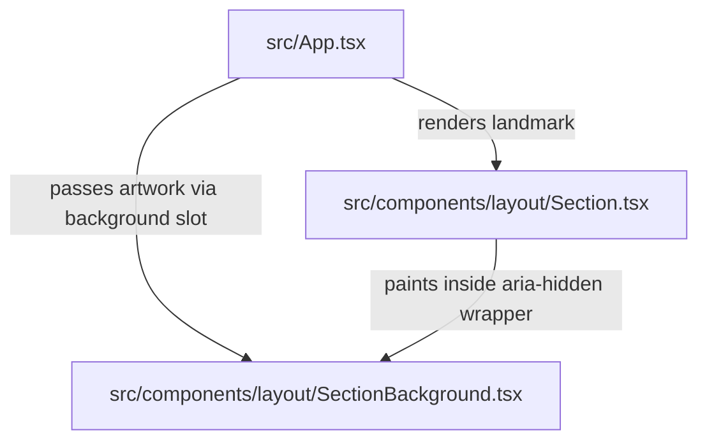

# Requirements

### Overview & Goals
Extract the `SectionBackground` component and its associated TypeScript interface `SectionBackgroundProps` from `src/components/layout/Section.tsx` into a dedicated, single-responsibility module at `src/components/layout/SectionBackground.tsx`. Update all consumers, unit tests, and project documentation in accordance with repository standards.

### Scope
#### In Scope
- Create `src/components/layout/SectionBackground.tsx` with `SectionBackgroundProps` and `SectionBackground`.
- Remove `SectionBackground` and `SectionBackgroundProps` from `src/components/layout/Section.tsx`.
- Update `src/App.tsx` to import `SectionBackground` from `@/components/layout/SectionBackground`.
- Extract `SectionBackground` unit tests from `src/components/layout/shell.test.tsx` into `src/components/layout/SectionBackground.test.tsx`.
- Update `docs/architecture.md` and `docs/decisions.md` to reflect the new component file location.
- Maintain 100% unit test coverage across lines, statements, functions, and branches.

#### Out of Scope
- Modifying the visual rendering, styling classes, or prop contract of `SectionBackground`.
- Modifying other layout or presentational components (`Container`, `Section`, `SectionHeader`, `SkipLink`, `Hero`, etc.).

### User Stories
- As a codebase maintainer, I want `SectionBackground` isolated in its own file so that `Section.tsx` is strictly focused on the section landmark container and both components adhere to the single-responsibility principle.

### Functional Requirements
- `SectionBackground` accepts `light: string`, optional `dark?: string`, and optional `priority?: boolean` (defaulting to `false`).
- Renders a decorative light image with `alt=""`, `decoding="async"`, `loading="lazy"`, `fetchPriority="auto"` when `priority` is false or omitted.
- When `priority` is `true`, sets `loading="eager"` and `fetchPriority="high"`.
- When `dark` is supplied, renders a secondary decorative `` with `hidden dark:block` and toggles `dark:hidden` on the light image.
- Always renders the full-bleed canvas gradient scrim overlay (`from-canvas/75 via-canvas/20 to-canvas absolute inset-0 bg-linear-to-b`).

### Non-Functional Requirements
- Maintain 100% code coverage in Vitest (`lines`, `statements`, `functions`, `branches`).
- Zero TypeScript compiler errors and zero ESLint warnings.
- Comply with Prettier formatting guidelines (`tabWidth: 4`, `printWidth: 120`, single quotes).

# Technical Design

### Current Implementation
`SectionBackground` and `SectionBackgroundProps` currently reside in `src/components/layout/Section.tsx` (lines 41–78). `src/App.tsx` imports both `Section` and `SectionBackground` from `@/components/layout/Section`. The unit test suite for `SectionBackground` is co-located inside `src/components/layout/shell.test.tsx`.

### Key Decisions
- **Dedicated Layout Module (`src/components/layout/SectionBackground.tsx`)**: Matches the layout component structure where each layout primitive (`Container.tsx`, `SectionHeader.tsx`, `SkipLink.tsx`, `Header.tsx`, `Footer.tsx`) has its own file.
- **Direct Named Import in Consumers**: `src/App.tsx` will import `SectionBackground` directly from `@/components/layout/SectionBackground`, keeping dependency graphs explicit and clear.
- **Dedicated Co-located Test Suite (`src/components/layout/SectionBackground.test.tsx`)**: Follows the `*.test.ts(x)` co-location standard defined in `docs/testing.md` and keeps `shell.test.tsx` focused on `Container`, `Section`, `SectionHeader`, and `SkipLink`.
- **Documentation Synchronization**: Synchronize `docs/architecture.md` (component layout) and `docs/decisions.md` (Decision 34) in adherence to the mandatory documentation governance rule.

### Proposed Changes
1. **`src/components/layout/SectionBackground.tsx`**: Create new component file containing `SectionBackgroundProps` and `SectionBackground`.
2. **`src/components/layout/Section.tsx`**: Remove `SectionBackgroundProps` and `SectionBackground`.
3. **`src/components/layout/SectionBackground.test.tsx`**: Create test file with unit tests for `SectionBackground` verifying lazy vs eager loading, dual-theme images, and decorative attributes.
4. **`src/components/layout/shell.test.tsx`**: Remove `SectionBackground` import and test block.
5. **`src/App.tsx`**: Update import statement to `import { SectionBackground } from '@/components/layout/SectionBackground';`.
6. **`docs/architecture.md` & `docs/decisions.md`**: Update module references and Decision 34 description.

### Data Models / Contracts
```typescript
export interface SectionBackgroundProps {
    light: string;
    dark?: string;
    priority?: boolean;
}
```

### Components
- `SectionBackground` (`src/components/layout/SectionBackground.tsx`): Theme-aware dual-image background primitive with scrim.
- `Section` (`src/components/layout/Section.tsx`): Structural section landmark container with grid and background slot.
- `App` (`src/App.tsx`): Root application component composing `Section` and `SectionBackground` for the hero section.

### File Structure
```
src/components/layout/
├── Container.tsx
├── Footer.tsx
├── Footer.test.tsx
├── Header.tsx
├── Header.test.tsx
├── MobileNav.tsx
├── MobileNav.test.tsx
├── MobileNav.empty.test.tsx
├── Section.tsx                   # (modified: remove SectionBackground)
├── SectionBackground.tsx         # (new)
├── SectionBackground.test.tsx    # (new)
├── SectionHeader.tsx
├── SkipLink.tsx
├── ThemeToggle.tsx
├── ThemeToggle.test.tsx
└── shell.test.tsx                # (modified: remove SectionBackground tests)
```

### Architecture Diagram


### Risks
- **Test coverage regression**: If any branches are omitted in the new test file, `npm run test:coverage` will fail. *Mitigation*: Migrate and verify all branch assertions for both light-only and light+dark configurations, with priority `true` and `false`.

# Testing

### Validation Approach
Verify behavior using Vitest unit tests in `src/components/layout/SectionBackground.test.tsx` and run the full quality gate pipeline (`npm run verify` and `npm run test:e2e`).

### Key Scenarios
- **Single image with default priority**: Renders single light `` with `src`, `alt=""`, `loading="lazy"`, `fetchpriority="auto"`, and `decoding="async"` when `dark` is omitted.
- **Dual images with eager priority**: Renders light and dark `` elements with `loading="eager"`, `fetchpriority="high"`, and `decoding="async"` when `priority={true}` and `dark` is provided.
- **Gradient scrim overlay**: Verifies presence of the `from-canvas/75 via-canvas/20 to-canvas absolute inset-0 bg-linear-to-b` scrim div.

### Edge Cases
- `dark` image provided without `priority` prop (defaults `loading` to `lazy` and `fetchpriority` to `auto`).
- Component rendered with `priority={false}` explicitly passed.

### Test Changes
- Create `src/components/layout/SectionBackground.test.tsx` containing tests for all props and branch permutations.
- Update `src/components/layout/shell.test.tsx` to remove the migrated `SectionBackground` tests and import.

# Delivery Steps

### ✓ Step 1: Extract SectionBackground into dedicated component with co-located unit tests
SectionBackground is isolated in src/components/layout/SectionBackground.tsx with dedicated, passing unit tests in src/components/layout/SectionBackground.test.tsx maintaining 100% test coverage.

- Create `src/components/layout/SectionBackground.tsx` exporting `SectionBackgroundProps` and `SectionBackground` with light/dark image rendering, priority loading controls, and gradient scrim overlay.
- Create `src/components/layout/SectionBackground.test.tsx` containing comprehensive unit tests verifying single decorative light image rendering (lazy loading, auto priority), dual theme images (eager loading, high priority), async decoding, and decorative alt attributes.
- Remove the `SectionBackground` test suite and unused import from `src/components/layout/shell.test.tsx`.

### ✓ Step 2: Update App composition and clean up Section layout component
Section.tsx only contains the Section layout container, and App.tsx imports and composes SectionBackground directly from its new module.

- Remove `SectionBackground` and `SectionBackgroundProps` from `src/components/layout/Section.tsx`.
- Update `src/App.tsx` to import `SectionBackground` from `@/components/layout/SectionBackground` and verify the `#hero` background composition.
- Verify that unit tests for `Section` in `shell.test.tsx` and all section presentational components remain green.

### ✓ Step 3: Update project documentation and execute verification quality gates
Project documentation in docs/ reflects the new component structure, and all verification quality gates pass with zero errors.

- Update `docs/architecture.md` directory layout and component list to reflect `SectionBackground.tsx` as an independent layout component.
- Update `docs/decisions.md` Decision 34 to document `SectionBackground` as a dedicated module in `src/components/layout/SectionBackground.tsx`.
- Execute all quality gates (`npm run verify` covering `typecheck`, `lint`, `format:check`, `test:coverage`, `build` and `npm run test:e2e`) to ensure 100% unit coverage, zero TypeScript errors, and clean formatting.