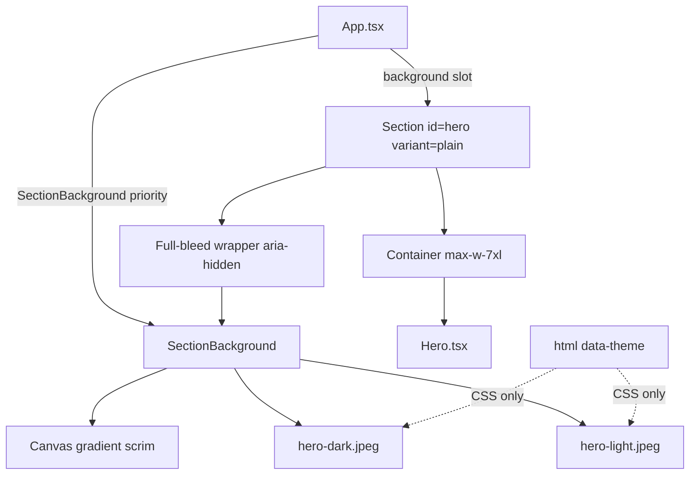

# Review Findings

The previous plan was right that the background belongs on `<section>` (outside `Container`) so it can go edge-to-edge. Several choices still fight this repo's own standards and common layout/performance practice.

### What stays
- Backgrounds live on `Section`, not inside `Hero`.
- Dual `` elements switched with `[data-theme]` CSS (`dark:hidden` / `hidden dark:block`). `<picture media="(prefers-color-scheme)">` would ignore the manual theme toggle.
- Decorative accessibility: wrapper `aria-hidden="true"`, `alt=""`, `pointer-events-none`.
- Vite static imports at the composition root (`App.tsx`).
- Gradient scrim for WCAG AA contrast.
- Existing `e2e/a11y.spec.ts` and `e2e/responsive.spec.ts` already cover contrast and 320px overflow — run them; do not duplicate.

### What changes, and why
1. **Composition slot, not a fat config object.** `Section` is a layout landmark (Decision 25). A `SectionBackgroundImage` interface with `light`, `dark`, `alt`, `fetchPriority`, `loading`, `decoding`, `className`, and `scrim` turns it into an image component. Generic support is `background?: React.ReactNode`: `Section` only positions a full-bleed layer; a small `SectionBackground` export owns dual-image + scrim.
2. **Do not put `overflow-hidden` on every `<section>`.** `.reveal` animates `translateY(1.25rem)`; `:focus-visible` uses `outline-offset: 3px`. Clipping the landmark clips both. Clip only the absolutely positioned background wrapper.
3. **`relative isolate`, not naked `-z-10`.** Absolutely positioned `z-auto` paints above in-flow content. `-z-10` without `isolate` can slip behind the page canvas. Pattern: `relative isolate` on the section when a background exists; wrapper `absolute inset-0 -z-10 overflow-hidden`.
4. **Hero-tuned defaults must not be Section defaults.** Defaulting a reusable primitive to `loading="eager"` + `fetchPriority="high"` + `opacity-40` would make any future section background compete for LCP. Defaults stay lazy/auto. Hero passes `priority`.
5. **Do not mark both theme images `fetchPriority="high"` as a generic default.** Two high-priority requests dilute the hint. Files are ~116–124KB, so dual download for the hero pair is acceptable. Do not read `data-theme` in JS just to pick one.
6. **Unit tests must not assert Tailwind class strings** (`docs/testing.md`). Assert `src`, `alt=""`, `aria-hidden`, `loading` / `fetchpriority`. Visibility on theme toggle belongs in `e2e/theme.spec.ts`.
7. **TDD order.** Red tests first. No implement-then-test stages. Do not couple `App.test.tsx` to hashed asset URLs; `shell.test.tsx` covers `Section` with mock `src` strings.
8. **Drop dead API and CSS.** Configurable `alt` on an `aria-hidden` layer is never announced. `transition-opacity` does nothing when visibility is `display: none`. Each `` must be `absolute inset-0` so the pair cannot stack in normal flow.

# Requirements

### Overview & Goals
Give `Section` a generic full-bleed background slot and use it to paint theme-aware hero artwork edge-to-edge:
- `src/assets/hero-light.jpeg` in light theme
- `src/assets/hero-dark.jpeg` in dark theme

The inner `Container` keeps copy and controls on the standard max-width grid. Theme switching stays CSS-only against `[data-theme]`. Foreground text stays WCAG AA via a gradient scrim. Unit coverage stays at 100%. No new UI or state libraries.

### Scope
- **In Scope**:
  - Add an optional `background?: React.ReactNode` slot to `Section` that paints a full-bleed decorative layer behind `Container`.
  - Export `SectionBackground` from `src/components/layout/Section.tsx` for theme-aware dual images plus a contrast scrim.
  - Wire `<Section id="hero" variant="plain" background={...}>` in `src/App.tsx` with `hero-light.jpeg` and `hero-dark.jpeg`.
  - Keep `Hero.tsx` presentational — no asset imports, no background markup.
  - CSS-only theme switching against `[data-theme]` (`dark:hidden` / `hidden dark:block`).
  - Gradient scrim (`from-canvas/20 via-canvas/75 to-canvas`) so hero copy stays WCAG AA.
  - `priority` on the hero background only (`loading="eager"`, `fetchPriority="high"`, `decoding="async"`).
  - Unit coverage in `src/components/layout/shell.test.tsx`. E2E visibility in `e2e/theme.spec.ts`.
  - Docs updates in `docs/architecture.md`, `docs/decisions.md`, and `docs/concerns.md`.

- **Out of Scope**:
  - Changing other section bodies (`SelectedWork`, `HowIWork`, `About`, `Technologies`, `Contact`).
  - A `SectionBackgroundImage` config object, configurable `alt` / `scrim` / per-attribute loading knobs, or Tailwind class-string unit assertions.
  - `overflow-hidden` on the `<section>` landmark.
  - New assertions in `App.test.tsx` against hashed asset URLs.
  - Image processing libraries, animation libraries, or state managers.
  - Data-layer or copy changes in `src/data/`.

### User Stories
- **As a visitor on any screen size**, I want full-width hero artwork from edge to edge so the landing view feels immersive while copy stays readable.
- **As a visitor switching themes**, I want the artwork to follow light/dark instantly, with no flash, layout shift, or reload.
- **As a keyboard or screen-reader user**, I want the artwork treated as decorative so it does not add tab stops or announcements.

### Functional Requirements
1. **Generic Section background slot**:
   - `Section` accepts optional `background?: React.ReactNode`.
   - When set, `Section` adds `relative isolate` and renders the node inside a full-bleed wrapper (`absolute inset-0 -z-10 overflow-hidden pointer-events-none aria-hidden="true"`).
   - When omitted, markup and classes stay as they are today — no extra wrapper, no `isolate`.
   - `overflow-hidden` is only on that wrapper, never on `<section>`.
2. **Theme-aware `SectionBackground`**:
   - Props: `light: string`, optional `dark?: string`, optional `priority?: boolean` (default `false`).
   - Always decorative: `alt=""`. No `alt` prop.
   - Light-only: one ``, visible in both themes.
   - Light + dark: light uses `dark:hidden`, dark uses `hidden dark:block`.
   - Each image is `absolute inset-0 object-cover object-center`.
   - Always renders the canvas fade scrim. No opt-out until a second consumer needs it.
3. **Hero composition**:
   - `App.tsx` imports the two JPEGs and passes `background={<SectionBackground light={heroLight} dark={heroDark} priority />}` to the hero `Section`.
   - Copy stays inside `Container`; the image spans the section width.
4. **Contrast**:
   - Scrim sits between images and content.
   - Body copy ≥ 4.5:1, large display text ≥ 3:1, verified by existing axe-core scans.
5. **Accessibility**:
   - Wrapper `aria-hidden="true"`, images `alt=""`, `pointer-events-none`.
   - No new tab stops.

### Non-Functional Requirements
- **Performance**: `priority` → `loading="eager"` + `fetchPriority="high"` + `decoding="async"`. Without `priority` → `loading="lazy"` + `fetchPriority="auto"` + `decoding="async"`.
- **Layout stability**: Absolutely positioned images do not affect section height. No `overflow-hidden` on the landmark (preserves `.reveal` and focus rings).
- **Standards**: TypeScript strict, Tailwind v4 tokens, Prettier, TDD, 100% unit coverage. Unit tests never assert Tailwind class strings.

# Technical Design

### Current Implementation
`Section` (`src/components/layout/Section.tsx`) is a landmark wrapper: `id`, optional `SectionHeader`, `py-section`, `scroll-mt-(--header-height)`, `.reveal`. All children go through `Container` (`max-w-7xl` + gutters). `Hero` is a presentational child of `<Section id="hero" variant="plain">` in `src/App.tsx`. Artwork inside `Hero` (the reverted approach) was clipped to the container. Theme is `html[data-theme]` with `@custom-variant dark (&:where([data-theme='dark'], [data-theme='dark'] *));`. `.reveal` uses `transform: translateY(1.25rem)`; `:focus-visible` uses `outline-offset: 3px`.

### Key Decisions
1. **Composition slot on `Section`, not an image config object.**
   - *Chosen*: `background?: React.ReactNode`. `Section` only positions a full-bleed decorative layer. `SectionBackground` (same file, named export) owns dual `` + scrim.
   - *Rejected*: `backgroundImage: SectionBackgroundImage` with eight knobs. That violates Decision 25 (Section is a structural landmark) and YAGNI for a single consumer.
2. **Hero stays presentational; `App.tsx` composes.**
   - *Chosen*: `App.tsx` imports the JPEGs and passes `background={<SectionBackground light={heroLight} dark={heroDark} priority />}`.
   - *Rationale*: Composition root owns assets. `Hero` stays copy + CTAs.
3. **CSS dual-image switch, not `<picture>` or JS.**
   - *Chosen*: Two absolutely positioned ``s; light `dark:hidden`, dark `hidden dark:block`.
   - *Rejected*: `<picture media="(prefers-color-scheme)">` (ignores manual toggle). Rejected reading `data-theme` in React (re-renders, can flash).
4. **Scrim is part of `SectionBackground`, not a Section flag.**
   - *Chosen*: Always `bg-gradient-to-b from-canvas/20 via-canvas/75 to-canvas`. Light image `opacity-40`, dark `opacity-30`.
   - *Rejected*: `scrim?: boolean` until a second consumer needs it.
5. **`priority` boolean, not raw loading attributes on the layout primitive.**
   - *Chosen*: `priority` → eager/high/async. Default lazy/auto/async. Hero is the only `priority` caller.
   - *Rejected*: Defaulting eager/high on `Section`. Rejected `fetchPriority`/`loading`/`decoding` as public Section props.
6. **Isolate + clip the layer, not the landmark.**
   - *Chosen*: `relative isolate` on `<section>` only when `background` is set. Wrapper `absolute inset-0 -z-10 overflow-hidden`. Images `absolute inset-0`.
   - *Rejected*: `overflow-hidden` on every `<section>` (clips `.reveal` and focus rings). Rejected `-z-10` without `isolate` (can paint behind the page canvas).

### Proposed Changes

#### 1. `src/components/layout/Section.tsx`
Keep existing `Section` layout. Add a `background` slot and a sibling `SectionBackground` export in the same file (KISS — no extra module).

```tsx
export interface SectionBackgroundProps {
    light: string;
    dark?: string;
    priority?: boolean;
}

export function SectionBackground({ light, dark, priority = false }: SectionBackgroundProps) {
    const loading = priority ? 'eager' : 'lazy';
    const fetchPriority = priority ? 'high' : 'auto';

    return (
        <>
            
            {dark ? (
                
            ) : null}
            <div className="from-canvas/20 via-canvas/75 to-canvas absolute inset-0 bg-gradient-to-b" />
        </>
    );
}
```

`Section` changes only:
- `background?: React.ReactNode` on `SectionProps`.
- `className` includes `relative isolate` **only when** `background` is set. Never `overflow-hidden` on `<section>`.
- When `background` is set, render it before `Container`:

```tsx
{background ? (
    <div aria-hidden="true" className="pointer-events-none absolute inset-0 -z-10 overflow-hidden">
        {background}
    </div>
) : null}
```

#### 2. `src/App.tsx`

```tsx
import heroDark from '@/assets/hero-dark.jpeg';
import heroLight from '@/assets/hero-light.jpeg';
import { Section, SectionBackground } from '@/components/layout/Section';

<Section
    id="hero"
    variant="plain"
    background={<SectionBackground light={heroLight} dark={heroDark} priority />}
>
    <Hero />
</Section>
```

#### 3. `src/components/sections/Hero.tsx`
Unchanged. Copy, status pill, CTAs only.

### Data Models / Contracts

```ts
export interface SectionBackgroundProps {
    light: string;
    dark?: string;
    priority?: boolean; // default false → lazy/auto; true → eager/high
}

export interface SectionProps {
    id: string;
    index?: string;
    label?: string;
    variant?: 'default' | 'plain';
    background?: React.ReactNode;
    className?: string;
    children: React.ReactNode;
}
```

### Components
- `Section` — landmark + optional full-bleed `background` slot. No image knowledge.
- `SectionBackground` — dual theme images + scrim. Exported from the same file.
- `App` — composition root: imports JPEGs, passes `priority` hero background.
- `Hero` — unchanged presentational content.
- `Container` — unchanged max-width grid for foreground.

### File Structure
- Modified: `src/components/layout/Section.tsx`, `src/components/layout/shell.test.tsx`, `src/App.tsx`, `e2e/theme.spec.ts`, `docs/architecture.md`, `docs/decisions.md`, `docs/concerns.md`
- Assets (unchanged): `src/assets/hero-light.jpeg`, `src/assets/hero-dark.jpeg`
- Not modified: `Hero.tsx`, `App.test.tsx`, `e2e/a11y.spec.ts`, `e2e/responsive.spec.ts` (already cover contrast and 320px overflow)

### Architecture Diagram



### Risks & Mitigations
- **Clipping `.reveal` / focus rings**: never `overflow-hidden` on `<section>`. Clip only the background wrapper.
- **Background painting over copy or behind the page**: `relative isolate` + wrapper `-z-10`. Images themselves `absolute inset-0` so they cannot stack in flow.
- **Text contrast**: scrim + 0.4/0.3 image opacity; existing `e2e/a11y.spec.ts` axe scans in both themes.
- **LCP / bandwidth**: files are ~116–124KB. `priority` only on hero. Dual download accepted so CSS can switch without JS. Do not set `fetchPriority="high"` as a Section default.
- **Horizontal overflow at 320px**: wrapper `overflow-hidden` + `object-cover`. Existing `e2e/responsive.spec.ts` overflow assertion covers this.

# Testing

### Validation Approach
TDD is mandatory: failing tests first, then the minimum production code. Two tiers:
1. **Unit (`npm run test:coverage`)**: jsdom cannot apply Tailwind theme variants. Assert structure, `src`, `alt=""`, `aria-hidden`, `loading`, `fetchpriority` — never Tailwind class strings.
2. **E2E (`npm run test:e2e`)**: real CSS visibility on theme toggle. Existing `e2e/a11y.spec.ts` and `e2e/responsive.spec.ts` already cover WCAG AA and 320px overflow — run them, do not duplicate.
3. **`npm run verify`**: typecheck, lint, format, 100% coverage, build.

### Key Scenarios
- **No background**: `Section` has no `aria-hidden` decorative wrapper. Existing landmark/header tests still pass.
- **Slot projects children**: passing `background={}` places that node inside the `aria-hidden` wrapper; the section still exposes its heading/content roles.
- **`SectionBackground` light-only**: one `img`, `alt=""`, default `loading="lazy"` and `fetchpriority="auto"`.
- **`SectionBackground` dual + `priority`**: two `img`s with the given `src`s, `loading="eager"`, `fetchpriority="high"`, `decoding="async"`.
- **E2E theme toggle**: `#hero [aria-hidden="true"] img` — light visible / dark hidden, then after toggle the reverse. Pre-paint dark scheme shows the dark image first.

### Edge Cases
- Default `priority={false}` branch on `SectionBackground`.
- `dark` omitted vs provided (both branches).
- Reduced motion: background is static; existing `motion-reduce` on Hero is untouched.

### Test Changes
- **`src/components/layout/shell.test.tsx`** (write first):
  - `Section` without `background` has no decorative wrapper.
  - `Section` with `background` wraps it in `aria-hidden="true"` and does not add tab stops.
  - `SectionBackground` light-only: one image, empty alt, lazy/auto.
  - `SectionBackground` dual + `priority`: two images, eager/high/async, matching `src`s.
- **`e2e/theme.spec.ts`**: visibility switch on toggle; dark image visible on first paint when `colorScheme: 'dark'`.
- **Do not** add `App.test.tsx` asset-URL assertions, class-string assertions, or a `scrim: false` test (no such API).

# Delivery Steps

### ✓ Step 1: Add a full-bleed `background` slot to Section (TDD)
`Section` can project an optional decorative node edge-to-edge behind `Container` without clipping reveal motion or focus rings.

- Write failing tests in `src/components/layout/shell.test.tsx` first: no wrapper when `background` is omitted; `aria-hidden="true"` wrapper and no extra tab stops when it is provided.
- Add `background?: React.ReactNode` to `SectionProps` in `src/components/layout/Section.tsx`.
- When set, add `relative isolate` on `<section>` and render the node in `absolute inset-0 -z-10 overflow-hidden pointer-events-none` with `aria-hidden="true"`.
- Do not add `overflow-hidden` to the landmark. Leave header/grid/`Container` markup unchanged.
- Re-run existing `Section` tests so landmarks, `aria-labelledby`, and the plain variant still pass.

### ✓ Step 2: Add `SectionBackground` and wire hero assets in App (TDD)
Hero artwork paints full-width at the section level; `Hero.tsx` stays presentational.

- Write failing `SectionBackground` tests in `shell.test.tsx`: light-only (one `img`, `alt=""`, lazy/auto); dual + `priority` (two `src`s, eager/high/async).
- Export `SectionBackground` from `src/components/layout/Section.tsx` with `light`, optional `dark`, optional `priority`. Images are `absolute inset-0 object-cover`; always include the canvas scrim. No `alt`/`scrim`/`className` knobs.
- In `src/App.tsx`, import `hero-light.jpeg` / `hero-dark.jpeg` and pass `background={<SectionBackground light={heroLight} dark={heroDark} priority />}` to `<Section id="hero" variant="plain">`.
- Leave `Hero.tsx` and `App.test.tsx` unchanged. Confirm `npm run test:coverage` is 100%.
- Extend `e2e/theme.spec.ts`: light image visible / dark hidden, then reverse after toggle; dark image visible on first paint under `colorScheme: 'dark'`.

### ✓ Step 3: Sync docs and run quality gates
Docs match the composition-slot design, and every gate is green.

- `docs/architecture.md`: `Section` full-bleed `background` slot; `SectionBackground` dual-image + scrim; hero wired from `App.tsx`.
- `docs/decisions.md`: composition over a config object; CSS theme switch; `priority` boolean; isolate without landmark overflow.
- `docs/concerns.md`: contrast scrim, dual-download bandwidth (~120KB each), stacking/`isolate`, not clipping `.reveal`.
- Run `npm run verify` and `npm run test:e2e` (existing a11y + responsive specs included). Zero errors, 100% unit coverage.