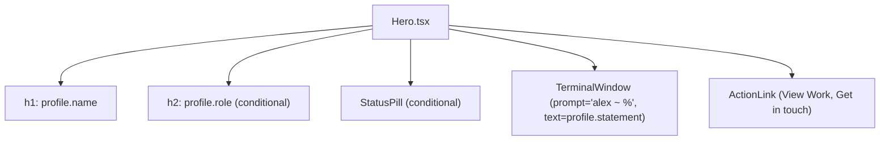

# Requirements

### Overview & Goals
The goal of this change is to refine the above-the-fold typographic hierarchy in the `Hero` section (`src/components/sections/Hero.tsx`):
1. Scale down the primary `<h1>` heading (profile name) from the oversized display scale (`text-display`) to a more balanced, editorial fluid size (`text-4xl sm:text-5xl lg:text-6xl`).
2. Introduce a semantic `<h2>` heading displaying `profile.role` (e.g., "Software Engineer") directly beneath `<h1>`.
3. Simplify the `TerminalWindow` prompt in `Hero` to use a constant `prompt="alex ~ %"` instead of interpolating `profile.role` (`alex@${profile.role} ~ %`), avoiding redundancy since the role is now prominently stated in the `<h2>` heading.

### Scope
- **In Scope**:
  - Adjust `<h1>` font sizing classes in `src/components/sections/Hero.tsx`.
  - Add conditional `<h2>` rendering `profile.role` with appropriate typography tokens (`text-lead sm:text-h3 text-ink-muted`).
  - Pass static `prompt="alex ~ %"` to `TerminalWindow` in `Hero.tsx` and remove dynamic role concatenation.
  - Update unit tests in `src/components/sections/Hero.test.tsx` and `src/App.test.tsx` to maintain 100% coverage.
  - Update project documentation in `docs/architecture.md`, `docs/decisions.md`, and `docs/concerns.md`.
- **Out of Scope**:
  - Modifying `TerminalWindow.tsx` primitive API (it already supports arbitrary `prompt?: string`).
  - Adding external styling or font libraries.
  - Modifying other section headers or data contracts in `src/data/`.

### User Stories
- **As a visitor**, I want to clearly read Oleksandr's name and professional role in a clean, hierarchical layout above the fold without visual clutter.
- **As a visitor using a screen reader**, I want a structured heading outline (`<h1>` name followed by `<h2>` role) that accurately communicates the page author's identity and title.
- **As a developer**, I want `Hero` and `TerminalWindow` to remain decoupled, type-safe, and fully tested with 100% branch, statement, function, and line coverage.

### Functional Requirements
- `<h1>` displays `profile.name` with reduced font size (`text-4xl sm:text-5xl lg:text-6xl font-mono font-bold tracking-tight uppercase text-ink`).
- `<h2>` displays `profile.role` with secondary styling (`text-lead sm:text-h3 text-ink-muted font-mono font-medium tracking-tight`) when `profile.role` is non-empty.
- If `profile.role` is empty or undefined, the `<h2>` element is omitted from the DOM.
- `TerminalWindow` receives `prompt="alex ~ %"` whenever `profile.statement` is rendered.

# Technical Design

### Current Implementation
- `src/components/sections/Hero.tsx` currently applies `text-display` (`clamp(2.75rem, 1.6rem + 5.2vw, 6.5rem)`) to `<h1>` and calculates `const prompt = profile.role ? \`alex@\${profile.role} ~ %\` : 'alex ~ %';` before passing `prompt` to `TerminalWindow`.
- `src/components/sections/Hero.test.tsx` tests the dynamic prompt string `alex@Staff UI Engineer ~ %` and expects a single `<h1>` with no `<h2>` in `Hero`.
- `src/App.test.tsx` checks that the 5 non-hero sections contain `h2` headings.

### Key Decisions
1. **Typography & Hierarchy**:
   - *Choice*: Scale `<h1>` down using Tailwind v4 fluid utility classes (`text-4xl sm:text-5xl lg:text-6xl font-mono font-bold tracking-tight uppercase text-ink`) and render `<h2>` using `text-lead sm:text-h3 text-ink-muted font-mono font-medium tracking-tight`.
   - *Rationale*: Keeps typography aligned with the existing JetBrains Mono editorial aesthetic, provides high contrast and WCAG AA compliance, and establishes clear visual grouping with `<h1>`.
2. **Decoupled Static Prompt**:
   - *Choice*: Set `prompt="alex ~ %"` directly in `Hero.tsx` and eliminate dynamic `profile.role` prompt interpolation.
   - *Rationale*: Avoids duplicate repetition of the role string between the new `<h2>` and the terminal window while retaining the authentic Unix prompt look.
3. **Conditional Role Rendering**:
   - *Choice*: Conditionally render `<h2>` via `{profile.role ? <h2 ...>{profile.role}</h2> : null}`.
   - *Rationale*: Follows the existing decoupled data layer and empty string omission patterns across the codebase without rendering empty heading elements.

### Architecture & Component Structure



### Proposed Code Changes

#### `src/components/sections/Hero.tsx`
```tsx
export function Hero({ profile = defaultSiteProfile, className = '' }: HeroProps) {
    return (
        <div
            className={`flex animate-[hero-rise_0.6s_ease-out_both] flex-col gap-6 motion-reduce:animate-none ${className}`.trim()}
        >
            <div className="flex flex-col gap-2">
                <h1 className="text-4xl sm:text-5xl lg:text-6xl text-ink font-mono font-bold tracking-tight uppercase">
                    {profile.name}
                </h1>
                {profile.role ? (
                    <h2 className="text-lead sm:text-h3 text-ink-muted font-mono font-medium tracking-tight">
                        {profile.role}
                    </h2>
                ) : null}
            </div>

            {profile.status ? (
                <StatusPill color="emerald" pulse variant="surface" size="md" className="self-start">
                    <span className="text-sm">{profile.status}</span>
                </StatusPill>
            ) : null}

            {profile.statement ? (
                <TerminalWindow prompt="alex ~ %" text={profile.statement} className="min-h-40 max-w-2xl" />
            ) : null}

            <div className="flex flex-wrap items-center gap-4 pt-2">
                <ActionLink href="#work" variant="primary">
                    View Work
                </ActionLink>
                <ActionLink href="#contact" variant="ghost">
                    Get in touch
                </ActionLink>
            </div>
        </div>
    );
}
```

### Affected Files
- `src/components/sections/Hero.tsx`
- `src/components/sections/Hero.test.tsx`
- `src/App.test.tsx`
- `docs/architecture.md`
- `docs/decisions.md`
- `docs/concerns.md`

# Testing

### Validation Approach
Following mandatory Test-Driven Development (TDD):
1. Update `src/components/sections/Hero.test.tsx` with failing tests for the new `<h2>` role rendering, empty role omission, and static `alex ~ %` terminal prompt.
2. Implement changes in `src/components/sections/Hero.tsx` until all unit tests pass green.
3. Update `src/App.test.tsx` integration tests to assert the Hero `<h2>` alongside the section header `<h2>`s.
4. Run `npm run verify` to guarantee 100% test coverage across all metrics and zero lint/type errors.
5. Run `npm run test:e2e` to verify Playwright accessibility scans (axe-core WCAG AA) and responsive layout tests.

### Key Scenarios
1. **Hero Default Render**:
   - `<h1>` renders `Oleksandr Misiuk`.
   - `<h2>` renders `Software Engineer`.
   - `TerminalWindow` displays prompt `alex ~ %`.
2. **Hero Custom Profile**:
   - Custom `profile.name` rendered in `<h1>`.
   - Custom `profile.role` rendered in `<h2>`.
   - `TerminalWindow` renders `prompt="alex ~ %"` with custom statement.
3. **Empty Role Handling**:
   - When `profile.role` is `''` or omitted, no `<h2>` element is rendered in the DOM.
4. **Empty Statement Handling**:
   - When `profile.statement` is `''`, `TerminalWindow` is not rendered.
5. **A11y & Hierarchy**:
   - Heading hierarchy consists of a single `<h1>`, followed by `<h2>` for role and `<h2>` for section headers, with zero axe-core WCAG AA violations.

# Delivery Steps

### ✓ Step 1: Update Hero heading hierarchy and TerminalWindow prompt
The `Hero` component renders a scaled-down `<h1>` for the profile name, an `<h2>` for `profile.role`, and passes `prompt="alex ~ %"` to `TerminalWindow`, backed by 100% unit test coverage.

- Update `src/components/sections/Hero.tsx` to scale down `<h1>` typography from `text-display` to a balanced fluid scale (`text-4xl sm:text-5xl lg:text-6xl font-mono font-bold tracking-tight uppercase text-ink`).
- Add conditional `<h2>` heading for `profile.role` (`{profile.role ? <h2 className="text-lead sm:text-h3 text-ink-muted font-mono font-medium tracking-tight">{profile.role}</h2> : null}`) placed directly beneath `<h1>`.
- Replace dynamic `prompt` calculation in `Hero.tsx` with static `prompt="alex ~ %"` passed to `TerminalWindow`, eliminating role duplication.
- Update `src/components/sections/Hero.test.tsx` to assert on `<h1>` name, `<h2>` role heading, graceful omission when `role` is empty, and `alex ~ %` terminal prompt verification.
- Update `src/App.test.tsx` to include the Hero `<h2>` role heading within root integration tests.

### ✓ Step 2: Synchronize documentation and execute quality gates
Project documentation in `docs/` is synchronized with the new heading structure, and all typecheck, lint, formatting, 100% coverage, and e2e quality gates pass.

- Update `docs/architecture.md` to describe the updated Hero presentation structure (`<h1>` name + `<h2>` role) and decoupled terminal prompt.
- Update `docs/decisions.md` with an architectural decision detailing the typography hierarchy refinement and prompt simplification.
- Update `docs/concerns.md` (concern #14 on semantic heading structure) to document the role `<h2>` inside Hero.
- Execute and verify all quality gates: `npm run typecheck`, `npm run lint`, `npm run format:check`, `npm run test:coverage` (enforcing 100% coverage), `npm run build`, and `npm run test:e2e`.