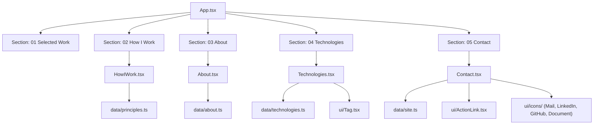

# Requirements

### Overview & Goals

Complete Step 6 of the personal landing portfolio MVP according to `.junie/plans/personal-landing-portfolio-mvp.md`. This step delivers the remaining 4 portfolio sections (`HowIWork`, `About`, `Technologies`, and `Contact`), connects them to the central layout shell in `App.tsx`, verifies 100% unit test coverage, runs end-to-end responsive and WCAG AA accessibility checks, synchronizes project documentation in `docs/`, and marks all delivery steps in `.junie/plans/personal-landing-portfolio-mvp.md` as completed.

### Scope

#### In Scope
- **`HowIWork` Section Component (`src/components/sections/HowIWork.tsx`)**:
  - Displays the 4 engineering principles from `src/data/principles.ts` in an asymmetric responsive grid.
  - Formats mono indices (`01`, `02`, `03`, `04`), `<h3>` titles, and body descriptions.
  - Supports custom `principles` prop with default fallback and empty state handling.
- **`About` Section Component (`src/components/sections/About.tsx`)**:
  - Displays biographical prose paragraphs from `src/data/about.ts`.
  - Constrained to readable measure (`max-w-[62ch]`).
  - Supports custom `content` prop with default fallback and empty state handling.
- **`Technologies` Section Component (`src/components/sections/Technologies.tsx`)**:
  - Displays a compact semantic `<ul>` of mono tags from `src/data/technologies.ts`.
  - Wraps cleanly at all viewport widths without proficiency bars, percentages, or external icons.
  - Supports custom `technologies` prop with default fallback and empty state handling.
- **`Contact` Section Component (`src/components/sections/Contact.tsx`)**:
  - Displays closing call-to-action statement ("Let's build something great.") and profile links from `src/data/site.ts`.
  - Uses `ActionLink` with self-contained SVG icons (`MailIcon`, `LinkedInIcon`, `GitHubIcon`, `DocumentIcon`).
  - Conditionally omits any empty link strings (no `#` dead links).
  - Supports custom `profile` prop with default fallback.
- **Layout Integration (`src/App.tsx`)**:
  - Replaces Step 6 placeholders with `<HowIWork />`, `<About />`, `<Technologies />`, and `<Contact />`.
- **Unit & Integration Testing**:
  - Co-located unit test suites for all 4 new section components.
  - Updated `src/App.test.tsx` verifying full landmark and heading composition.
  - 100% unit-test coverage across statements, branches, functions, and lines.
- **Documentation & Plan Updates**:
  - Synchronize `docs/architecture.md`, `docs/decisions.md`, `docs/concerns.md`.
  - Mark Steps 3, 4, 5, and 6 as completed (`✓`) in `.junie/plans/personal-landing-portfolio-mvp.md`.

#### Out of Scope
- Introducing external UI component libraries or heavy animation/state libraries.
- Modifying previously completed components (`Hero`, `SelectedWork`, `Header`, `Footer`, `IndexRail`) unless required for integration.
- Adding third-party icon libraries or runtime backend/CMS integrations.

### User Stories

- **As a recruiter or hiring manager**, I want to read Oleksandr's engineering principles, background story, and technical stack so that I can evaluate his engineering maturity and technical fit.
- **As a prospective collaborator**, I want clear and accessible contact actions (LinkedIn, Email, GitHub, CV) so that I can easily reach out or download his resume.
- **As a mobile or assistive technology user**, I want a clean, semantic layout with valid heading hierarchy, accessible tap targets (≥ 44px), and zero contrast violations in both light and dark themes.

### Functional Requirements

1. **How I Work Section (`#how-i-work`)**:
   - Rendered within `Section` with `index="02"` and `label="How I Work"`.
   - Displays principles in a responsive 2-column grid (`grid-cols-1 md:grid-cols-2`).
   - Each item exposes a mono index, an `<h3>` heading, and body copy.
2. **About Section (`#about`)**:
   - Rendered within `Section` with `index="03"` and `label="About"`.
   - Renders biographical paragraphs styled with `text-body text-ink-muted leading-relaxed` and max measure `max-w-[62ch]`.
3. **Technologies Section (`#technologies`)**:
   - Rendered within `Section` with `index="04"` and `label="Technologies"`.
   - Renders a semantic `<ul>` containing `<li>` tags with monospace chip styling.
   - Wraps cleanly across mobile (320px) to desktop (1920px).
4. **Contact Section (`#contact`)**:
   - Rendered within `Section` with `index="05"` and `label="Contact"`.
   - Renders closing statement and interactive contact actions.
   - Only renders links that have non-empty URL values in `siteProfile.links`.
5. **App Composition**:
   - Main landmark `#main` houses all 6 sections in proper numerical order (00 Hero, 01 Selected Work, 02 How I Work, 03 About, 04 Technologies, 05 Contact).

### Non-Functional Requirements

- **Accessibility**: Strict WCAG 2.1 AA compliance with 0 axe-core violations in light and dark modes. Single unique `<h1>` and ordered `<h2>`/`<h3>` headings. Minimum 44×44px tap targets for interactive links/buttons.
- **Performance**: Zero runtime state overhead, pure presentational components, CSS-driven transitions respecting `prefers-reduced-motion`.
- **Quality Gates**: 100% unit-test coverage (`npm run test:coverage`), clean linting (`npm run lint`), formatting check (`npm run format:check`), TypeScript typecheck (`npm run typecheck`), and successful build (`npm run build`).

# Technical Design

### Current Implementation

- The project toolchain (Vite 8, React 19, Tailwind CSS v4, Vitest 4, Playwright) is active and green.
- Design tokens, typography tokens (`@theme`), and light/dark theme switching (`ThemeContext`, `useTheme`, `themeScript.ts`) are fully functioning.
- Typed content modules exist in `src/data/`:
  - `src/data/principles.ts` (4 principles: `product-first`, `thoughtful-architecture`, `details-matter`, `ownership`)
  - `src/data/about.ts` (3 biographical paragraphs)
  - `src/data/technologies.ts` (10 core technology strings)
  - `src/data/site.ts` (`siteProfile` with `name`, `role`, `statement`, `status`, and `links`)
- Responsive layout shell (`Header`, `IndexRail`, `Section`, `SectionHeader`, `Footer`, `Container`, `SkipLink`) and initial sections (`Hero`, `SelectedWork`, `ProjectCard`) are implemented.
- `src/App.tsx` currently contains placeholder text nodes for sections `how-i-work`, `about`, `technologies`, and `contact`.

### Key Decisions

1. **Presentational Section Components with Data Defaults**:
   - *Chosen Approach*: Each section component (`HowIWork`, `About`, `Technologies`, `Contact`) accepts optional props for its data payload, defaulting to the typed data imports from `@/data/`.
   - *Rationale*: Keeps components decoupled and purely presentational while allowing straightforward unit testing with custom mock fixtures and empty data states.
2. **Semantic Monospace Technology Tags**:
   - *Chosen Approach*: `Technologies` renders a semantic `<ul>`/`<li>` structure utilizing the existing `Tag` component (`src/components/ui/Tag.tsx`) with monospace styling.
   - *Rationale*: Conforms to the project aesthetic (no proficiency bars, percentages, or logos) while maintaining screen reader semantic structure.
3. **Contact Action Links with Icon Primitives**:
   - *Chosen Approach*: `Contact` uses `ActionLink` with variants (`primary` for main CTA / Email, `ghost` for social and CV) and self-contained SVG primitives from `src/components/ui/icons/`.
   - *Rationale*: Reuses established UI primitives, ensures 44px tap targets, handles external links with accessible `(opens in a new tab)` screen-reader cues, and omits empty links cleanly.
4. **Asymmetric Grid for Principles**:
   - *Chosen Approach*: `HowIWork` arranges items in a responsive grid (`grid-cols-1 md:grid-cols-2 gap-8 lg:gap-10`) with mono indices (`01`, `02`, `03`, `04`) formatted with `padStart(2, '0')`.
   - *Rationale*: Provides strong visual rhythm and structured hierarchy matching the portfolio design tokens.

### Architecture Diagram



### Components

- `HowIWork` (`src/components/sections/HowIWork.tsx`):
  - Props: `principles?: readonly Principle[]`, `className?: string`
  - Renders 2-column grid of principles with mono index, `<h3>` title, and paragraph body.
- `About` (`src/components/sections/About.tsx`):
  - Props: `content?: AboutContent`, `className?: string`
  - Renders prose paragraphs within `max-w-[62ch]` container.
- `Technologies` (`src/components/sections/Technologies.tsx`):
  - Props: `technologies?: readonly string[]`, `className?: string`
  - Renders wrapped `<ul>` of `Tag` elements.
- `Contact` (`src/components/sections/Contact.tsx`):
  - Props: `profile?: SiteProfile`, `className?: string`
  - Renders closing statement, status/availability info, and interactive `ActionLink` items for email, LinkedIn, GitHub, and CV.

### File Structure

```
src/
├── components/
│   ├── sections/
│   │   ├── Hero.tsx
│   │   ├── Hero.test.tsx
│   │   ├── SelectedWork.tsx
│   │   ├── SelectedWork.test.tsx
│   │   ├── ProjectCard.tsx
│   │   ├── ProjectCard.test.tsx
│   │   ├── HowIWork.tsx          [NEW]
│   │   ├── HowIWork.test.tsx     [NEW]
│   │   ├── About.tsx             [NEW]
│   │   ├── About.test.tsx        [NEW]
│   │   ├── Technologies.tsx      [NEW]
│   │   ├── Technologies.test.tsx [NEW]
│   │   ├── Contact.tsx           [NEW]
│   │   └── Contact.test.tsx      [NEW]
│   ├── layout/
│   │   └── ...
│   └── ui/
│       └── ...
├── data/
│   └── ...
├── App.tsx                       [MODIFIED - Wire 4 new sections]
└── App.test.tsx                  [MODIFIED - Assert complete page structure]
docs/
├── architecture.md               [MODIFIED - Sync completed section tree]
├── decisions.md                  [MODIFIED - Document Step 6 decisions]
└── concerns.md                   [MODIFIED - Document any section considerations]
.junie/plans/
└── personal-landing-portfolio-mvp.md [MODIFIED - Mark delivery steps completed]
```

### Risks & Mitigations

- **Risk**: Missing coverage on edge cases (e.g. empty link values or empty data arrays).
  - *Mitigation*: Test suites will explicitly test default props, custom data fixtures, and empty/partial states to maintain 100% statement, branch, function, and line coverage.
- **Risk**: Responsive layout shift or text overflow at 320px viewport.
  - *Mitigation*: Technologies list uses `flex-wrap` and `break-words`; HowIWork collapses to a single column on small screens; verified with Playwright responsive test suite.
- **Risk**: Heading hierarchy disruption.
  - *Mitigation*: Sections use `<h2>` via `SectionHeader`, while inner item titles (e.g. principles) strictly use `<h3>`, preserving valid HTML5 outline.

# Testing

### Validation Approach

Testing follows strict Test-Driven Development (TDD) as mandated by project guidelines:
1. Write failing tests first (**red**) in `*.test.tsx` beside each new component.
2. Implement the component to pass tests (**green**).
3. Refactor and ensure 100% coverage threshold is enforced by `npm run test:coverage`.
4. Validate end-to-end user flows, responsiveness, and accessibility with Playwright and `@axe-core/playwright`.

### Key Scenarios

1. **`HowIWork` Component**:
   - Renders 4 principles from default `principles` data.
   - Renders custom principles passed via props.
   - Displays formatted 2-digit index (`01`, `02`, etc.) for each item.
   - Displays semantic `<h3>` heading matching principle title.
   - Handles empty principles array with accessible fallback text.
2. **`About` Component**:
   - Renders biographical paragraphs from default `aboutContent`.
   - Renders custom paragraphs passed via props.
   - Handles empty paragraphs array with fallback.
3. **`Technologies` Component**:
   - Renders semantic `<ul>` containing all technologies from default `technologies` data.
   - Renders custom array of technologies.
   - Handles empty technology list with fallback.
4. **`Contact` Component**:
   - Renders closing statement "Let's build something great.".
   - Renders email `ActionLink` with `mailto:` href when present.
   - Renders LinkedIn `ActionLink` with external target/rel and icon when present.
   - Renders GitHub `ActionLink` when present.
   - Renders CV download `ActionLink` with `download` attribute when present.
   - Correctly omits links that are empty strings (no empty or broken anchors).
5. **`App` Integration**:
   - Renders all 6 sections (`hero`, `work`, `how-i-work`, `about`, `technologies`, `contact`) under `#main`.
   - Primary navigation links scroll to target section headings.
   - Heading structure conforms to single `<h1>` and ordered `<h2>`/`<h3>`.
6. **E2E & Accessibility**:
   - Run `npm run test:e2e` across chromium, firefox, webkit, and mobile viewports.
   - Zero WCAG 2.1 AA violations via `makeAxeBuilder().analyze()`.
   - No horizontal overflow at 320px, 360px, 768px, 1024px, 1440px, 1920px.

### Edge Cases

- Empty profile links (e.g. GitHub or CV empty in `siteProfile`): Ensure no empty `<a>` tags or `#` fallback hrefs are rendered.
- Empty data arrays: Empty principles, about paragraphs, or technology list renders fallback gracefully without runtime exceptions.
- Extreme screen widths (320px viewport): Technology tags wrap neatly without causing horizontal scrollbars (`scrollWidth <= clientWidth`).
- Screen readers: External action links announce `(opens in a new tab)` via `sr-only` span.

### Test Changes

- **New Test Files**:
  - `src/components/sections/HowIWork.test.tsx`
  - `src/components/sections/About.test.tsx`
  - `src/components/sections/Technologies.test.tsx`
  - `src/components/sections/Contact.test.tsx`
- **Updated Test Files**:
  - `src/App.test.tsx` (expanded integration assertions for all 6 section components)
- **Commands to Run**:
  - `npm run test:coverage` (100% coverage verification)
  - `npm run test:e2e` (Playwright end-to-end and axe-core validation)
  - `npm run verify` (typecheck, lint, format check, coverage, build)

# Delivery Steps

### ✓ Step 1: Implement HowIWork and About section components with unit tests
The `HowIWork` and `About` components are implemented in `src/components/sections/` and covered with 100% unit test coverage.

- Implement `src/components/sections/HowIWork.tsx` accepting optional `principles?: readonly Principle[]` (defaulting to `principles` from `@/data/principles`) and `className?: string`.
- Render the 4 engineering principles in a responsive asymmetric 2-column grid (`grid grid-cols-1 md:grid-cols-2 gap-8 lg:gap-10`) with mono indices (`01`, `02`, `03`, `04`), semantic `<h3>` titles (`text-h3 text-ink font-semibold`), and body paragraphs (`text-body text-ink-muted leading-relaxed`).
- Add accessible fallback in `HowIWork` when `principles` array is empty.
- Implement `src/components/sections/About.tsx` accepting optional `content?: AboutContent` (defaulting to `aboutContent` from `@/data/about`) and `className?: string`.
- Render biographical paragraphs constrained to `max-w-[62ch]` with `space-y-4 sm:space-y-6 text-body text-ink-muted leading-relaxed`, with empty state fallback.
- Write unit tests in `src/components/sections/HowIWork.test.tsx` and `src/components/sections/About.test.tsx` verifying default data rendering, custom props, empty array handling, semantic headings, and accessibility attributes.

### ✓ Step 2: Implement Technologies and Contact section components with unit tests
The `Technologies` and `Contact` components are implemented in `src/components/sections/` and covered with 100% unit test coverage.

- Implement `src/components/sections/Technologies.tsx` accepting optional `technologies?: readonly string[]` (defaulting to `technologies` from `@/data/technologies`) and `className?: string`.
- Render technologies as a compact semantic `<ul>` of mono tags (`Tag` component or mono chips) wrapping cleanly without proficiency bars, percentages, or third-party logos.
- Implement `src/components/sections/Contact.tsx` accepting optional `profile?: SiteProfile` (defaulting to `siteProfile` from `@/data/site`) and `className?: string`.
- Render the closing statement ("Let's build something great.") and action CTA buttons using `ActionLink` with icons (`MailIcon`, `LinkedInIcon`, `GitHubIcon`, `DocumentIcon`), conditionally omitting links that are empty strings.
- Write unit tests in `src/components/sections/Technologies.test.tsx` and `src/components/sections/Contact.test.tsx` validating default rendering, custom inputs, link omission logic, and a11y roles.

### ✓ Step 3: Assemble all sections in App and update integration tests
All 6 sections are wired into `App.tsx` and verified with updated integration tests.

- Update `src/App.tsx` by replacing the placeholder elements in sections `how-i-work`, `about`, `technologies`, and `contact` with `<HowIWork />`, `<About />`, `<Technologies />`, and `<Contact />`.
- Update `src/App.test.tsx` to assert that all section headings, principles, technologies, and contact links are mounted in the page hierarchy with valid `<h1>`-`<h3>` structure.
- Verify active section scrolling and index rail alignment across all 6 sections.

### ✓ Step 4: Synchronize documentation and mark MVP delivery steps complete
Project documentation is synchronized and all MVP delivery steps in `.junie/plans/personal-landing-portfolio-mvp.md` are marked completed.

- Update `docs/architecture.md` to reflect the completed component hierarchy with all 6 sections and data bindings.
- Update `docs/decisions.md` and `docs/concerns.md` if any section-specific decisions or responsive considerations are refined.
- Update `.junie/plans/personal-landing-portfolio-mvp.md` delivery steps so that Steps 3, 4, 5, and 6 are marked with `✓` completion indicators.

### ✓ Step 5: Run full verification and quality gates pass
All quality gates pass with zero errors, 100% test coverage, clean formatting, and green Playwright E2E suites.

- Execute `npm run typecheck` to verify 0 TypeScript errors.
- Execute `npm run lint` and `npm run format:check` to verify ESLint and Prettier compliance.
- Execute `npm run test:coverage` to verify 100% coverage across lines, statements, branches, and functions for all modules.
- Execute `npm run build` to ensure production bundle compiles cleanly.
- Execute `npm run test:e2e` to verify all end-to-end specs across navigation, responsiveness, theme switching, mobile drawer, and axe-core accessibility pass.