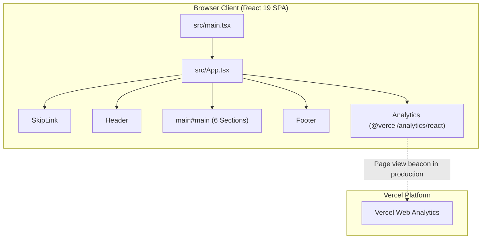

# Requirements

### Overview & Goals
Integrate `@vercel/analytics` into the static single-page React portfolio application to collect privacy-friendly visitor metrics, page views, and traffic insights when deployed to Vercel, without introducing performance overhead, third-party cookies, or layout shifts.

### Scope
- **In Scope**:
  - Install `@vercel/analytics` as a runtime dependency via `npm i @vercel/analytics`.
  - Integrate the `<Analytics />` component from `@vercel/analytics/react` into `src/App.tsx`.
  - Update unit tests in `src/App.test.tsx` to verify component rendering integrity under the Vitest/jsdom harness.
  - Maintain 100% unit test coverage across lines, statements, functions, and branches.
  - Synchronize documentation across `docs/architecture.md`, `docs/decisions.md`, and `docs/concerns.md`.
  - Validate all quality gates (`npm run verify` and `npm run test:e2e`).
- **Out of Scope**:
  - Custom event tracking or user identification (not needed for a personal portfolio).
  - Introducing heavy third-party analytics scripts (Google Analytics, Mixpanel) or cookie banners.
  - Modifying build targets or introducing server-side logic.

### User Stories
- **As the portfolio owner (Oleksandr)**, I want automatic visitor analytics on Vercel so that I can see visitor counts and page traffic without managing servers or third-party cookie consent banners.
- **As a portfolio visitor**, I want my visit to be counted anonymously without intrusive tracking cookies or performance degradation.

### Functional Requirements
- The `@vercel/analytics/react` `<Analytics />` component must be mounted inside the root application shell (`src/App.tsx`).
- In development (`NODE_ENV === 'development'`) and test environments (`jsdom`, Playwright), `@vercel/analytics` must remain inert and not emit telemetry requests.
- In production deployments on Vercel, `@vercel/analytics` automatically activates and sends anonymous page view telemetry.

### Non-Functional Requirements
- **Performance**: Zero perceptible footprint (< 3 kB gzipped), non-blocking script loading, and zero layout shift.
- **Privacy**: 100% cookie-free, GDPR/CCPA compliant telemetry.
- **Code Quality & Testing**: Must satisfy 100% unit test coverage and all repository quality gates (`typecheck`, `lint`, `format:check`, `test:coverage`, `build`, `test:e2e`).

# Technical Design

### Current Implementation
- `src/App.tsx` serves as the root React 19 single-page application shell, assembling `SkipLink`, `Header`, `main#main` (containing `Hero`, `SelectedWork`, `HowIWork`, `About`, `Technologies`, `Contact`), and `Footer`.
- Application is built with Vite 8 + Tailwind CSS v4 and tested with Vitest 4 + jsdom and Playwright.

### Key Decisions
- **Decision 1: Use `<Analytics />` from `@vercel/analytics/react` in `src/App.tsx`**:
  - *Approach*: Import `{ Analytics } from '@vercel/analytics/react'` and mount `<Analytics />` within the root container div in `src/App.tsx`.
  - *Rationale*: Idiomatic React integration that automatically aligns with the React component lifecycle and Vercel Web Analytics guidelines.
- **Decision 2: Environment-Gated Telemetry**:
  - *Approach*: Leverage default Vercel Analytics behaviour where tracking scripts are only injected in production deployments.
  - *Rationale*: Keeps local development and automated testing runs hermetic, fast, and free of extraneous network requests.
- **Decision 3: Zero DOM & Layout Impact**:
  - *Approach*: `<Analytics />` returns `null` in the DOM tree, ensuring no layout shift, visual elements, or accessibility tree noise.

### Proposed Changes
1. **`package.json`**: Add `@vercel/analytics` to `dependencies`.
2. **`src/App.tsx`**:
   - Import `{ Analytics } from '@vercel/analytics/react'`.
   - Render `<Analytics />` inside the root container.
3. **`src/App.test.tsx`**:
   - Ensure the test suite exercises `App` with `<Analytics />` rendered and verifies existing layout/landmarks continue to pass with 100% coverage.
4. **`docs/`**:
   - `docs/architecture.md`: Document `@vercel/analytics` in the architecture overview and component tree.
   - `docs/decisions.md`: Record Decision #47 for `@vercel/analytics` adoption.
   - `docs/concerns.md`: Record Concern #23 covering analytics privacy and test environment safety.

### Components
- `src/App.tsx`: Incorporates `<Analytics />` component alongside layout landmarks.

### File Structure
- **Modified**:
  - `package.json` / `package-lock.json`
  - `src/App.tsx`
  - `src/App.test.tsx`
  - `docs/architecture.md`
  - `docs/decisions.md`
  - `docs/concerns.md`

### Architecture Diagram

### Risks & Mitigations
- **Risk**: Test suite interference or unwanted network calls during `npm test` or Playwright runs.
  - *Mitigation*: `@vercel/analytics` defaults to no-op in non-production environments; tests run hermetically in `jsdom`.
- **Risk**: Coverage regression on `src/App.tsx`.
  - *Mitigation*: Vitest runs against `src/App.test.tsx` to ensure 100% coverage on lines, statements, functions, and branches is retained.

# Testing

### Validation Approach
- Follow Test-Driven Development (TDD): ensure unit tests in `src/App.test.tsx` validate the integration and maintain 100% coverage.
- Execute full quality gate chain (`npm run verify`) and end-to-end tests (`npm run test:e2e`).

### Key Scenarios
- **Unit Tier (`npm test` / `npm run test:coverage`)**:
  - `src/App.test.tsx`: Verify that rendering `<App />` mounts all landmarks, sections, and `<Analytics />` without runtime exceptions.
  - Verify 100% coverage threshold across lines, statements, functions, and branches in `vite.config.ts`.
- **E2E Tier (`npm run test:e2e`)**:
  - Verify production preview bundle builds and runs cleanly with Playwright across all 3 viewports (`desktop-1440`, `tablet-768`, `mobile-320`).
  - Verify `@axe-core/playwright` accessibility scans remain 100% green without violations.

### Edge Cases
- Verify that running tests in `NODE_ENV === 'test'` does not throw or attempt unmocked HTTP requests.
- Verify production build bundle (`npm run build`) completes successfully with zero warnings or type errors.

### Test Changes
- Update `src/App.test.tsx` to verify that `App` renders cleanly with `<Analytics />`.

# Delivery Steps

### ✓ Step 1: Install @vercel/analytics dependency and update package manifests
`@vercel/analytics` is installed in `dependencies` and verified in `package.json` and `package-lock.json`.

- Run `npm i @vercel/analytics` to add the package to `package.json` dependencies.
- Verify that TypeScript compiler (`npm run typecheck`) recognizes `@vercel/analytics` and `@vercel/analytics/react` type declarations without errors.
- Confirm `package.json` and `package-lock.json` reflect the new dependency cleanly.

### ✓ Step 2: Integrate Analytics component into App.tsx and update unit tests
The `<Analytics />` component is mounted in `src/App.tsx` and covered with 100% unit test coverage.

- Follow TDD to update `src/App.test.tsx` verifying that `<App />` renders all landmarks and sections correctly with the analytics component present.
- Import `{ Analytics }` from `@vercel/analytics/react` in `src/App.tsx` and render `<Analytics />` within the root container div.
- Run `npm run test:coverage` to confirm 100% coverage across all metrics (lines, statements, branches, and functions).

### ✓ Step 3: Synchronize project documentation and verify all quality gates
All project documentation in `docs/` is synchronized and all quality gates pass cleanly.

- Update `docs/architecture.md` to document `@vercel/analytics` within the architectural concepts, directory layout, and component hierarchy diagram.
- Update `docs/decisions.md` with Decision #47 detailing the rationale for adopting `@vercel/analytics` for privacy-preserving, cookie-free visitor metrics.
- Update `docs/concerns.md` with Concern #23 addressing environment gating (inert in development/test) and privacy isolation.
- Execute the full quality gate suite to ensure 0 errors and 0 warnings: `npm run verify` (`typecheck`, `lint`, `format:check`, `test:coverage`, `build`) and `npm run test:e2e` (`playwright test`).