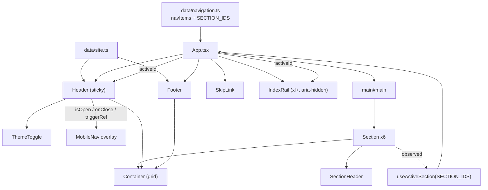

# Requirements

### Overview & Goals

Deliver **Step 4** of `.junie/plans/personal-landing-portfolio-mvp.md`: the responsive layout shell and navigation system. After this step the site is a real one-pager skeleton — sticky header, working anchor navigation, mobile overlay menu, skip link, `xl+` index rail, footer, and all six anchored sections wired up — with section *content* still arriving in Steps 5–6.

This step also replaces the current `src/App.tsx`, which is a temporary data-layer showcase page produced by Step 3.

### Scope

**In scope**
- `layout/Container` — single source of truth for max-width, responsive gutters and the `lg+` 12-column grid.
- `layout/Section` + `layout/SectionHeader` — structural backbone (mono eyebrow + index + hairline rule + `h2`) used by every section.
- `layout/Header` — sticky slim bar: name mark, anchor nav at `md+`, conditional CV action, `ThemeToggle`, hamburger below `md`.
- `layout/MobileNav` — full-screen overlay disclosure with `aria-expanded`/`aria-controls`, Escape-to-close, focus trap, focus return and body scroll lock.
- `hooks/useActiveSection` — one `IntersectionObserver` driving `aria-current` in the header and the highlight in the rail.
- `layout/IndexRail` — `xl+` fixed progress markers, `aria-hidden`, hidden below `xl`.
- `layout/SkipLink` and `layout/Footer`.
- Rewritten `App.tsx` composing the shell with six anchored sections containing temporary stub copy.
- Two new inline SVG icons (`MenuIcon`, `CloseIcon`) in `src/components/ui/icons/`.
- Synchronization of `docs/architecture.md`, `docs/decisions.md`, `docs/concerns.md` (mandatory per `AGENTS.md`).

**Out of scope**
- Real Hero, SelectedWork/ProjectCard/ProjectMedia, HowIWork, About, Technologies, Contact content — Steps 5 and 6.
- Any change to the data layer contracts in `src/data/` (content is consumed, not modified).
- New dependencies of any kind; routers, animation, state or UI libraries stay excluded.

### User Stories

- As a **visitor**, I want a slim sticky header with links that jump me to any section without the header covering the heading I landed on.
- As a **visitor on a phone**, I want a full-screen menu with large tap targets that closes when I pick a destination or press Escape.
- As a **keyboard user**, I want a skip link as the first tab stop, a visible focus ring on every stop, and focus that returns to the hamburger when the menu closes.
- As a **screen-reader user**, I want one `h1`, ordered `h2`s, labelled landmarks, and `aria-current` on the section I am reading — with the decorative index rail silent.
- As **the site owner**, I want to add or rename a section by editing `src/data/navigation.ts` only.

### Functional Requirements

**Header**
- Sticky, `top-0`, height bound to `--header-height` (`4rem`), hairline bottom border, translucent canvas background with backdrop blur.
- Name mark on the left links to `#hero`.
- At `md+`: nav list generated from `navItems` (`01`–`05`), each link showing mono index + label with an underline-reveal on hover/focus.
- Conditional CV `ActionLink`, rendered only when `siteProfile.links.cv` is non-empty (empty-string omission pattern).
- `ThemeToggle` always visible; hamburger trigger visible only below `md`.

**Mobile navigation**
- Full-screen overlay beneath the header; body scroll locked while open.
- Trigger carries `aria-expanded` and `aria-controls`; accessible label flips between "Open menu" / "Close menu".
- Escape closes, focus is trapped inside the panel while open, and returns to the trigger on close.
- Selecting a link closes the panel and lets native anchor scrolling run.
- Panel auto-closes when the viewport crosses to `md+`.
- Every target is at least 44×44px.

**Sections & anchors**
- Six sections rendered in `navigation.ts` order: `hero`, `work`, `how-i-work`, `about`, `technologies`, `contact` (matching `SECTION_IDS`).
- Each non-hero section renders `SectionHeader`: mono eyebrow `01 / SELECTED WORK` on a hairline rule plus the `h2` referenced by `aria-labelledby`.
- Section bodies contain a short mono placeholder line marked as temporary until Steps 5–6 replace it.
- `hero` renders in the plain variant (no eyebrow) and owns the single `h1` placeholder for now.

**Active-section state**
- Exactly one section is active at a time; the topmost intersecting section below the sticky header wins.
- `hero` is active at the top of the document; the last section is active when scrolled to the bottom.
- Active state drives `aria-current` on header and mobile links and the accent marker in the rail.

**Index rail**
- Visible only at `xl+`, fixed in the left margin, `aria-hidden="true"` and non-interactive.
- Shows the `01`–`05` indices from `navItems`; the active one shifts to accent with a longer rule.

**Footer & skip link**
- Footer: name, current year, and the same conditional primary links (LinkedIn always, GitHub/email/CV only when supplied).
- Skip link is the first focusable element, visually hidden until focused, and targets `#main`.

### Non-Functional Requirements

- **Responsive:** no horizontal overflow from 320px up; layouts re-compose at `md`, `lg`, `xl`; touch targets ≥ 44×44px.
- **Accessibility:** semantic `header`/`nav`/`main`/`section`/`footer`, single `h1`, ordered `h2`s, visible `:focus-visible` ring in both schemes, WCAG AA contrast.
- **Motion:** all transitions inside `@media (prefers-reduced-motion: no-preference)`; the overlay and reveals degrade to instant, fully legible states.
- **Performance:** one `IntersectionObserver` for the whole page, no scroll listeners, no new dependencies.
- **Code standards:** strict TypeScript with explicit prop interfaces, no `any`; Tailwind v4 utilities and `@theme` tokens only; Prettier (`tabWidth: 4`, `printWidth: 120`).

# Technical Design

### Current Implementation

Steps 1–3 are complete; the shell is the missing piece.

| Area | State |
|---|---|
| `src/styles/index.css` | `@theme` tokens incl. `--header-height: 4rem`, `--radius-sm`, `--spacing-section`; `[data-theme='dark']` overrides; `scroll-padding-top: var(--header-height)`; global `:focus-visible`; `.reveal` inside `@supports (animation-timeline: view())`; `reveal-in` and `hero-rise` keyframes |
| `src/hooks/useColorScheme.ts` | `data-theme` attribute + `sessionStorage`, `matchMedia` subscription, try/catch guarded |
| `src/components/layout/ThemeToggle.tsx` | Complete, `aria-pressed`, 44×44 target |
| `src/components/ui/` | `ActionLink` (primary/ghost, external `rel`/sr-only hint, `min-h-[44px]`), `Tag`, `Eyebrow`, 8 inline SVG icons |
| `src/data/` | `types.ts`, `site.ts`, `navigation.ts`, `projects.ts`, `principles.ts`, `technologies.ts`, `about.ts`, barrel `index.ts` |
| `src/App.tsx` | **Temporary data-layer showcase** (243 lines, 7 demo sections) — to be replaced |
| `src/components/layout/`, `sections/` | Only `ThemeToggle` exists; `.gitkeep` placeholders otherwise |

Two deviations from the original plan text that this step must respect:
1. Theming is **`[data-theme='dark']` + `sessionStorage`**, not a `.dark` class — components must not toggle classes themselves.
2. `navItems` holds **five** entries (`01`–`05`, hero deliberately excluded from nav), while `SECTION_IDS` holds **six** ids including `hero`. The rail and nav map over `navItems`; the observer watches `SECTION_IDS`.

### Key Decisions

| Decision | Choice | Rationale |
|---|---|---|
| Grid ownership | Shared `layout/Container` primitive | Max-width, gutters and the `lg+` 12-column grid are defined once and reused by `Header`, `Section` and `Footer`; no duplicated measurements. |
| Mobile menu | Full-screen overlay with focus trap + scroll lock | Best thumb reach and a deliberate mobile-first feel; matches the "designed for the phone" requirement. |
| Placeholder bodies | Real `SectionHeader` + short mono stub line | Anchors, scroll-padding offsets, rhythm and scroll-spy are all verifiable in Step 4 rather than deferred. |
| Active section | One `IntersectionObserver` over `SECTION_IDS` | Navigation state, not animation; no scroll listeners, no layout thrash. |
| Header offset | `rootMargin` derived from the `--header-height` custom property | Keeps `--header-height` the single source of truth shared with `scroll-padding-top` (concerns.md §2). |
| Rail semantics | `aria-hidden="true"`, non-interactive spans | It is a progress indicator; the header nav stays the one accessible navigation. |
| Icons | Add `MenuIcon`/`CloseIcon` to `src/components/ui/icons/index.tsx` | Two more inline SVGs; no icon package (AGENTS.md). |

### Proposed Changes

**`layout/Container`** — `max-w-[80rem]`, gutters `px-5 sm:px-8 lg:px-12 xl:px-16`, `mx-auto`; optional `grid` prop adds `lg:grid lg:grid-cols-12 lg:gap-x-6 xl:gap-x-8`; polymorphic `as` for `div`/`header`/`footer`/`nav`.

**`layout/SectionHeader`** — `Eyebrow` rendering `{index} / {label}` above a `border-hairline` rule, then the `h2` (`text-h2`, tight tracking) carrying the `id` used by `aria-labelledby`.

**`layout/Section`** — `<section id aria-labelledby className="reveal">` with `py-[var(--spacing-section)]` and `scroll-mt-[var(--header-height)]`; inside a grid `Container` it places the header in `lg:col-span-3` and children in `lg:col-span-8 lg:col-start-5` (the asymmetry from the design direction). A `variant="plain"` skips the header for Hero.

**`layout/Header`** — `sticky top-0 z-50 h-[var(--header-height)] border-b border-hairline bg-canvas/80 backdrop-blur-md`; grid-less `Container`; nav `hidden md:flex`; CV action rendered only when non-empty; `ThemeToggle`; hamburger `md:hidden`.

**`layout/MobileNav`** — controlled by `useState` in `Header`. Panel is `fixed inset-x-0 top-[var(--header-height)] bottom-0 z-40 bg-canvas md:hidden`, rendered only when open. Effects: `keydown` for Escape + Tab cycling over queried focusables, `document.body.style.overflow` lock with restore, `matchMedia('(min-width: 48rem)')` auto-close, focus moved to the panel on open and back to the trigger on close.

**`hooks/useActiveSection`** — signature `useActiveSection(ids: readonly string[]): string`. Reads `--header-height` once via `getComputedStyle` (fallback 64px), builds `rootMargin: \`-${headerPx}px 0px -55% 0px\``, keeps a `Set` of intersecting ids in a ref, and on each callback picks the first id of `ids` present in the set. Bottom-of-page guard selects the last id; empty set at the top keeps `ids[0]`.

**`layout/IndexRail`** — `hidden xl:flex fixed left-6 top-1/2 -translate-y-1/2 flex-col gap-4 z-30 pointer-events-none`, `aria-hidden="true"`; each marker is a mono index plus a short rule that widens and turns accent when active.

**`layout/SkipLink`** — anchor to `#main`, `sr-only focus:not-sr-only` positioned absolutely at the top-left with accent background.

**`layout/Footer`** — hairline top border, `Container`, name + `new Date().getFullYear()` on the left, conditional link set on the right; stacks below `sm`.

**`App.tsx` (rewrite)** — `SkipLink`, `Header`, `IndexRail`, `<main id="main">` containing the six `Section`s, `Footer`. The active id from `useActiveSection(SECTION_IDS)` is computed in `App` and passed to `Header` and `IndexRail`, so the observer is created once.

### Data Models / Contracts

```ts
// layout/Container.tsx
export interface ContainerProps {
    as?: 'div' | 'header' | 'footer' | 'nav' | 'section';
    grid?: boolean;
    className?: string;
    children: React.ReactNode;
}

// layout/Section.tsx
export interface SectionProps {
    id: string;
    index?: string;          // '01' - required unless variant='plain'
    label?: string;          // nav label used as the h2 text
    variant?: 'default' | 'plain';
    className?: string;
    children: React.ReactNode;
}

// layout/SectionHeader.tsx
export interface SectionHeaderProps {
    index: string;
    label: string;
    headingId: string;
}

// layout/Header.tsx
export interface HeaderProps { activeId: string }

// layout/MobileNav.tsx
export interface MobileNavProps {
    isOpen: boolean;
    onClose: () => void;
    activeId: string;
    triggerRef: React.RefObject<HTMLButtonElement | null>;
}

// layout/IndexRail.tsx
export interface IndexRailProps { activeId: string }

// hooks/useActiveSection.ts
export function useActiveSection(ids: readonly string[]): string;
```

Heading id convention: `` `${section.id}-heading` `` (e.g. `work-heading`), consistent with the existing `aria-labelledby` usage in `App.tsx`.

### Components

| Component | New/Changed | Responsibility |
|---|---|---|
| `layout/Container` | new | Max-width, gutters, optional 12-column grid |
| `layout/Section` | new | Anchored `<section>`, rhythm, `.reveal`, header/content split |
| `layout/SectionHeader` | new | Eyebrow + index + hairline + `h2` |
| `layout/Header` | new | Sticky bar, desktop nav, CV action, toggle, hamburger |
| `layout/MobileNav` | new | Full-screen disclosure, focus trap, scroll lock |
| `layout/IndexRail` | new | `xl+` decorative progress markers |
| `layout/SkipLink` | new | First tab stop to `#main` |
| `layout/Footer` | new | Name, year, conditional links |
| `layout/ThemeToggle` | unchanged | Reused as-is inside `Header` |
| `ui/icons/index.tsx` | changed | Add `MenuIcon`, `CloseIcon` |
| `hooks/useActiveSection.ts` | new | Single `IntersectionObserver` scroll-spy |
| `App.tsx` | rewritten | Composes the shell; drops the Step 3 showcase |
| `docs/*.md` | changed | Architecture, decisions and concerns synchronized |

### File Structure

```
src/
  App.tsx                              # rewritten
  components/
    layout/
      Container.tsx        (new)
      Section.tsx          (new)
      SectionHeader.tsx    (new)
      Header.tsx           (new)
      MobileNav.tsx        (new)
      IndexRail.tsx        (new)
      SkipLink.tsx         (new)
      Footer.tsx           (new)
      ThemeToggle.tsx      (unchanged)
    ui/icons/index.tsx     (add MenuIcon, CloseIcon)
  hooks/
    useActiveSection.ts    (new)
docs/architecture.md | decisions.md | concerns.md   (updated)
```

No changes to `package.json`, `vite.config.ts`, `eslint.config.js`, `index.html` or `src/styles/index.css` are expected; if the overlay needs a fade keyframe it is added to the existing reduced-motion-gated block in `index.css` rather than as an inline style.

### Architecture Diagram



### Risks

| Risk | Mitigation |
|---|---|
| Scroll-spy flickers between short adjacent sections | Deterministic resolution: first id in `SECTION_IDS` order present in the intersecting set, plus a bottom-of-page guard for the final section. |
| `--header-height` read before styles apply | Read inside `useEffect` after mount with a `64` fallback; the CSS var remains the single source for `scroll-padding-top`. |
| Body scroll lock leaking after unmount | Effect stores the previous `overflow` value and restores it in cleanup; also runs on `isOpen` transition to `false`. |
| Focus trap fighting the browser at `md+` | Panel unmounts entirely when closed and auto-closes on the `min-width: 48rem` media query change. |
| Index rail overlapping content at `xl` | Rail lives in the gutter outside `Container`'s `max-w-[80rem]`, is `pointer-events-none`, and is hidden below `xl`. |
| Sticky header covering anchor headings | `scroll-padding-top: var(--header-height)` already in `index.css`, reinforced by `scroll-mt-[var(--header-height)]` on `Section`. |
| Losing Step 3 demo coverage when `App.tsx` is replaced | Intentional — the showcase was scaffolding; the data layer stays fully exercised by Steps 5–6. |

# Testing

### Validation Approach

No test framework is added (consistent with the MVP plan). Validation is the mandated quality gates plus observable checks against the running dev server using the browser tooling.

```bash
npm run typecheck    # 0 errors
npm run lint         # 0 errors, 0 warnings
npm run format:check # clean
npm run build        # succeeds; bundle size noted
```

The dev server is then started once and the rendered page inspected via accessibility snapshots and small DOM evaluations at several viewport widths.

### Key Scenarios

1. **Anchor integrity** — every `NavItem.id` and every entry of `SECTION_IDS` resolves to exactly one element in the DOM; no duplicate ids.
2. **Heading hierarchy** — exactly one `<h1>` (hero placeholder); each non-hero section exposes an `<h2>` whose id matches its `aria-labelledby`.
3. **Anchor offset** — clicking a header link leaves the target `h2` fully below the sticky header (top edge ≥ `--header-height`).
4. **Scroll-spy** — scrolling through the page updates `aria-current` on exactly one header link at a time, follows document order, resolves to `hero` at the top and `contact` at the bottom.
5. **Mobile menu** — below `md`: hamburger toggles `aria-expanded`, the overlay traps Tab, Escape closes it, focus returns to the trigger, `document.body` regains its original `overflow`, and choosing a link closes the panel and navigates.
6. **Conditional links** — with `github`, `email` and `cv` empty in `site.ts`, the built output contains no anchor with an empty or `#`-only href in the header or footer.
7. **Theme integration** — the `ThemeToggle` still flips `data-theme` on `<html>` from inside the new header, and every shell surface (header, overlay, rail, footer) recolours correctly in both schemes.
8. **Container consistency** — header content, section content and footer content share the same left edge at `sm`, `lg` and `xl`.

### Edge Cases

- **320 / 360 / 414px** — `document.scrollingElement.scrollWidth === clientWidth`; no element exceeds the viewport; hamburger, toggle and mobile links all measure ≥ 44×44px.
- **`md` boundary** — opening the menu at 375px then widening past 768px auto-closes the overlay and restores scrolling.
- **`xl` boundary** — the index rail appears only at `xl+`, never overlaps `Container` content at 1280/1440/1920px, and is absent from the accessibility tree.
- **Reduced motion** — with `prefers-reduced-motion: reduce`, smooth scrolling and all shell transitions are off and every section is fully visible.
- **No scroll-timeline support** — with the `@supports` block unsupported, `.reveal` sections render at full opacity.
- **Keyboard-only walkthrough** — tab order is skip link → name mark → nav links → CV (when present) → theme toggle → hamburger (below `md`) → main content → footer links, with a visible focus ring at every stop in both schemes.
- **Rapid toggling** — opening and closing the menu repeatedly leaves no stale `keydown` listeners and no locked body scroll.

### Test Changes

None. Vitest + Testing Library remains the natural future addition but stays out of the MVP.

# Delivery Steps

### ✓ Step 1: Build the structural primitives: Container, Section and SectionHeader
Every section can be rendered with consistent gutters, a 12-column grid, an anchored id and an accessible eyebrow header.

- Create `src/components/layout/Container.tsx` with `ContainerProps` (`as`, `grid`, `className`, `children`): `mx-auto max-w-[80rem]`, gutters `px-5 sm:px-8 lg:px-12 xl:px-16`, and `lg:grid lg:grid-cols-12 lg:gap-x-6 xl:gap-x-8` when `grid` is set.
- Create `src/components/layout/SectionHeader.tsx` rendering the existing `ui/Eyebrow` as `{index} / {label}` above a `border-hairline` rule, followed by the `h2` (`text-h2`, tight tracking) carrying `headingId`.
- Create `src/components/layout/Section.tsx`: `<section id aria-labelledby={`${id}-heading`} className="reveal">` with `py-[var(--spacing-section)]` and `scroll-mt-[var(--header-height)]`, wrapping a grid `Container` that places the header in `lg:col-span-3` and children in `lg:col-span-8 lg:col-start-5`.
- Support `variant="plain"` on `Section` so Hero can use the same rhythm without an eyebrow header.
- Declare explicit exported prop interfaces for all three components; no `any`, Tailwind tokens only.

### ✓ Step 2: Implement useActiveSection and the sticky header with desktop navigation
The page has a working sticky header whose anchor links jump to sections and mark the section currently in view.

- Create `src/hooks/useActiveSection.ts`: one `IntersectionObserver` over the given ids, `rootMargin` computed from the `--header-height` custom property (fallback 64px) with a `-55%` bottom margin, resolving the active id as the first entry of `SECTION_IDS` present in the intersecting set.
- Add a bottom-of-page guard so the final section wins when the document is scrolled to the end, and keep `ids[0]` (`hero`) active at the top.
- Create `src/components/layout/SkipLink.tsx` targeting `#main`, `sr-only` until focused, styled with the accent token.
- Create `src/components/layout/Header.tsx`: `sticky top-0 z-50 h-[var(--header-height)]`, hairline bottom border, `bg-canvas/80 backdrop-blur-md`, using `Container`; name mark from `siteProfile.name` linking to `#hero`.
- Render the `md+` nav from `navItems` as a `<nav aria-label="Primary">` list with mono index + label, underline-reveal on hover/focus, and `aria-current` on the active link.
- Add the CV `ActionLink` rendered only when `siteProfile.links.cv` is non-empty, plus the existing `ThemeToggle`.

### ✓ Step 3: Build the full-screen mobile navigation overlay
Below `md`, a hamburger opens an accessible full-screen menu that traps focus, closes on Escape and returns focus to its trigger.

- Add `MenuIcon` and `CloseIcon` as inline SVGs to `src/components/ui/icons/index.tsx`, matching the existing `IconProps` and stroke conventions.
- Add the hamburger trigger to `Header` (`md:hidden`, ≥44×44px) with `aria-expanded`, `aria-controls="mobile-nav"` and a label that flips between "Open menu" and "Close menu"; hold open state and a `triggerRef` in `Header`.
- Create `src/components/layout/MobileNav.tsx`: `fixed inset-x-0 top-[var(--header-height)] bottom-0 z-40 bg-canvas md:hidden`, mounted only when open, containing a `<nav>` list of large mono index + label links with `aria-current`.
- Implement the focus trap: move focus into the panel on open, cycle Tab/Shift+Tab across queried focusable elements, and restore focus to the trigger on close.
- Implement Escape-to-close, close-on-link-click, and a `document.body.style.overflow` lock that restores the previous value in cleanup.
- Auto-close the panel when `matchMedia('(min-width: 48rem)')` starts matching, so rotating or resizing never strands the overlay.

### ✓ Step 4: Add the index rail and footer
At `xl+` a decorative progress rail tracks the section in view, and the page closes with a minimal footer.

- Create `src/components/layout/IndexRail.tsx`: `hidden xl:flex fixed left-6 top-1/2 -translate-y-1/2 flex-col gap-4 z-30 pointer-events-none`, `aria-hidden="true"`, receiving `activeId`.
- Render one non-interactive marker per `navItems` entry — mono index plus a short hairline rule that widens and turns accent when active, transitioning only under `prefers-reduced-motion: no-preference`.
- Create `src/components/layout/Footer.tsx` with a hairline top border and `Container`: `siteProfile.name` and `new Date().getFullYear()` on one side, the conditional link set (LinkedIn, plus GitHub/email/CV only when non-empty) on the other, stacking below `sm`.
- Reuse `ActionLink` ghost variant and the existing social icons so external links keep their `rel` and screen-reader hints.

### ✓ Step 5: Compose the shell in App.tsx and synchronize documentation
`App.tsx` renders the complete shell with six anchored placeholder sections, and `docs/` reflects the new layout architecture.

- Replace the Step 3 data-showcase `src/App.tsx` with the real shell: `SkipLink`, `Header`, `IndexRail`, `<main id="main">`, `Footer`.
- Call `useActiveSection(SECTION_IDS)` once in `App` and pass `activeId` down to `Header` and `IndexRail` so only one observer exists.
- Render the six sections in `navigation.ts` order — `hero` as `variant="plain"` holding the single `h1` placeholder, and `work`, `how-i-work`, `about`, `technologies`, `contact` with real `SectionHeader`s plus a short mono stub line marked as temporary until Steps 5–6.
- Update `docs/architecture.md`: add `Container`, `Section`, `SectionHeader`, `Header`, `MobileNav`, `IndexRail`, `SkipLink`, `Footer` and `useActiveSection` to the component hierarchy and the data-flow diagram.
- Update `docs/decisions.md` with the shared `Container` grid primitive, the full-screen overlay mobile nav, the single-`IntersectionObserver` scroll-spy keyed to `--header-height`, and the `aria-hidden` rail.
- Update `docs/concerns.md` with focus-trap/scroll-lock restoration, scroll-spy ambiguity for short sections, and rail-versus-content overlap at `xl+`.
- Run and pass `npm run typecheck`, `npm run lint`, `npm run format:check` and `npm run build`, then verify anchors, `aria-current`, keyboard order, the mobile overlay and the absence of horizontal overflow at 320/375/768/1280/1920px on the dev server.