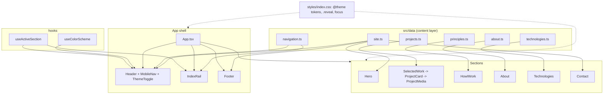

# Requirements

### Overview & Goals

Build a single-page personal landing site for **Oleksandr Misiuk, Senior Frontend Engineer** that is itself the portfolio piece: the craft of the page is the evidence. Static React + TypeScript + Vite + Tailwind CSS v4, deployable as plain files, no backend.

Success = a recruiter or engineering manager can understand who you are in 15 seconds, and an engineer looking at the page (or the repo) can tell it was built by someone who cares about typography, responsiveness, accessibility and performance.

### Scope

**In scope**
- Vite + React + TypeScript project initialised in the existing repo (currently only `Editor.md`, `skills-lock.json`, `.git`).
- Tailwind CSS v4 design-token layer: palette, fluid type scale, spacing, motion tokens.
- Self-hosted variable fonts: **Instrument Sans** (display/body) + **JetBrains Mono** (eyebrows, indices, tech labels).
- Colour scheme follows the OS by default, with a header toggle that overrides it **for the session only** (no `localStorage`, no cookie).
- Six sections: Hero, Selected Work, How I Work, About, Technologies, Contact.
- Sticky header with anchor navigation + mobile disclosure menu; skip link; footer.
- Reusable project/case-study component driven by data, with image/video placeholder support.
- Content data layer in `src/data/` so copy, links and projects change without touching JSX.
- Accessibility built in, not retrofitted.
- ESLint 9 (flat config) + Prettier + `prettier-plugin-tailwindcss`, npm scripts, README.

**Out of scope (explicitly not built)**
- Next.js, backend, database, CMS, auth, router, state-management library, UI component library, icon library, animation library.
- Deployment/CI configuration, analytics, contact form, blog, i18n, unit-test framework.
- Real screenshots, video or a CV PDF — slots exist, files come later.

### User Stories

- As a **recruiter**, I want name, title, location and a way to reach you above the fold, so I can qualify you in seconds.
- As an **engineering manager**, I want to read how you think about product and architecture, not a list of logos.
- As a **visitor on a phone**, I want a layout designed for the phone — not a shrunken desktop grid — with tap targets I can hit and no sideways scrolling.
- As a **keyboard or screen-reader user**, I want to skip to content, see where focus is, and move through a sane heading hierarchy.
- As **the site owner**, I want to add a project screenshot, a case-study link or a new role by editing one file in `src/data/`.

### Functional Requirements

**Hero**
- `h1` "Oleksandr Misiuk"; role line "Senior Frontend Engineer".
- Statement: *"I build fast, thoughtful interfaces that people enjoy using."*
- Status line: "Wrocław, Poland · open to new opportunities" (data-driven).
- Primary CTA → Selected Work; secondary links → LinkedIn, GitHub, CV.
- Restrained entrance animation on load; no decorative background.

**Selected Work**
- Exactly two entries, per the brief:
  1. **Personal product — currently building** (marked as in progress, no invented detail).
  2. **Professional project — placeholder**, clearly labelled as such.
- Each card supports: title, status badge, short description, technology tags, media slot (image *or* video *or* an intentional empty state), optional case-study link, optional external link, optional repo link.
- Any link that is empty in the data is simply not rendered — no dead links.
- The four real Zahara case studies you supplied can be dropped in later as extra array entries; no code changes required.

**How I Work**
- Four principles: Product first · Thoughtful architecture · Details matter · Ownership.
- Each with a short paragraph written in engineering-judgement terms, not a tech list.

**About**
- Two or three short paragraphs, placeholder copy in `src/data/about.ts`, clearly marked for replacement. Not a CV.

**Technologies**
- Compact inline set: TypeScript · React · React Native · Angular · JavaScript · HTML · CSS · RxJS · REST APIs · Git.
- No proficiency bars, no percentages, no logo grid.

**Contact**
- Closing line "Let's build something great." plus LinkedIn, GitHub, email, CV.

**Navigation**
- Sticky slim header: name mark, anchor links (md+), CV action, theme toggle; hamburger disclosure below md with `aria-expanded`, Escape-to-close and focus return.
- Smooth scrolling only when motion is not reduced; `scroll-padding-top` accounts for the sticky header.

### Non-Functional Requirements

- **Responsive:** designed mobile-first at 360px, then re-composed (not merely scaled) at 768, 1024, 1440 and 1920px. No horizontal overflow at 320px. Body copy stays within a 60–75 character measure. Interactive targets ≥ 44×44px.
- **Accessibility:** semantic landmarks, single `h1`, ordered headings, visible `:focus-visible` ring on every interactive element, `aria-current` on the active nav link, alt text on all imagery, WCAG AA contrast in both schemes, full `prefers-reduced-motion` support.
- **Performance:** no runtime animation library, no icon package; fonts self-hosted, `woff2`, preloaded and `font-display: swap`; images lazy-loaded with intrinsic dimensions to prevent layout shift; target JS payload well under 100 kB gzipped.
- **Maintainability:** all copy and links live in `src/data/`; components stay presentational.

### Content Handling

Real values used now: name, role, statement, location/status, LinkedIn (`linkedin.com/in/alexandr-misiuk`), technologies list.

Not yet supplied — placed in `src/data/site.ts` as empty strings with `TODO` comments, and omitted from the UI until filled: **GitHub URL, email, CV file**. Nothing about employers, metrics or achievements is invented anywhere on the page.

# Design Direction

### The direction: cool ink & cobalt

A precise, low-temperature editorial system. The page reads like a well-made product interface rather than a poster or a CV — appropriate for someone whose work is enterprise-grade web and mobile software. Boldness is spent in exactly one place (the index/eyebrow system); everything else is quiet.

### Palette

Defined as CSS custom properties in `@theme`, so both schemes share one set of semantic names.

 Token | Light | Dark |
---|---|---|
 `--color-canvas` | `#F4F5F7` | `#0D0F12` |
 `--color-surface` | `#FFFFFF` | `#14171C` |
 `--color-ink` | `#14161A` | `#E9EAEE` |
 `--color-ink-muted` | `#5A6070` | `#9AA1AE` |
 `--color-hairline` | `#DDE0E6` | `#232830` |
 `--color-accent` | `#2B4BFF` | `#7D95FF` |

The accent is used sparingly: primary CTA, link underlines on hover/focus, the active index marker, the focus ring. No gradients, no glass, no glow.

### Typography

- **Instrument Sans Variable** — display and body. Slightly condensed, engineered grotesk; set tight (`-0.02em` to `-0.035em`) and heavy at display sizes, normal and open at body sizes.
- **JetBrains Mono Variable** — utility face only: section eyebrows, section numbers, technology tags, status badges, the index rail. Uppercase, letterspaced `0.08em`, small.

Fluid scale via `clamp()` tokens (`--text-display`, `--text-h2`, `--text-h3`, `--text-lead`, `--text-body`, `--text-mono-xs`), so type is re-set per breakpoint rather than proportionally shrunk. Body measure capped with `max-w-[62ch]`.

### Structure & signature

The page is a numbered sequence, and the numbering says so:

- Every section opens with a **mono eyebrow + index** (`01 / SELECTED WORK`) sitting on a hairline rule that spans the grid.
- On `xl` and wider, a **fixed left index rail** mirrors those numbers in the outer margin and highlights the section currently in view — the persistent counterpart of the eyebrows, and the one thing the page is remembered by. It is a progress indicator, not a second navigation (`aria-hidden`, header nav remains the accessible one).

Layout is a 12-column grid at `lg+` with content deliberately off-centre in places (section headers in the left 3 columns, content in the right 8) — asymmetry does the visual work instead of decoration. Corners are near-square (`--radius-sm: 4px`); cards are defined by hairlines and space, not by rounded shadowed boxes.

### Motion

- **Scroll reveals** use native CSS scroll-driven animation (`animation-timeline: view()`), wrapped in `@supports` — where unsupported, content is simply visible from the start. Zero JavaScript, zero layout thrash.
- **Hero entrance**: one short staggered fade-and-rise on load, CSS keyframes only.
- **Hover/focus**: underline reveal on links, hairline and accent shift on project cards, subtle media scale.
- Everything above sits inside `@media (prefers-reduced-motion: no-preference)`; with reduced motion the page is fully static and fully legible.

### Deliberately avoided

Cream-and-terracotta serif revival, acid-green-on-black, newspaper hairline pastiche, 3D scenes, animated backgrounds, glassmorphism, skill bars, stock or "developer at a desk" illustrations, pill-shaped everything.

# Technical Design

### Current Implementation

The repository is effectively empty: `Editor.md` (the brief), `skills-lock.json`, `.git`, `.idea`, `.junie`, `.agents`. Node 24.18, npm 11.16. Everything below is new.

### Key Decisions

 Decision | Choice | Rationale |
---|---|---|
 Scaffold | `npm create vite@latest . -- --template react-ts` (Vite 8, React 19, ESLint 9 flat config) | Standard, minimal, already ships a TS + ESLint baseline. Falls back to Vite 7 if any plugin proves incompatible. |
 Tailwind | v4 (`tailwindcss` + `@tailwindcss/vite`), CSS-first `@theme` | No `tailwind.config.js`, no PostCSS chain; tokens live next to the styles that use them. |
 Dark mode | `@custom-variant dark (&:where(.dark, .dark *))` + a 6-line inline script in `index.html` | System preference applied before first paint (no flash); React only handles the manual override. |
 Theme persistence | React state only, no storage | Explicitly requested: session-scoped override, reverts to system on reload. |
 Motion | Native `animation-timeline: view()` behind `@supports` | No animation dependency; runs off the main thread; degrades to "always visible". |
 Active-section highlight | One small `IntersectionObserver` hook | This is navigation state, not animation — the only JS observer on the page. |
 Fonts | `@fontsource-variable/instrument-sans` + `@fontsource-variable/jetbrains-mono` (5.3.0) | Self-hosted woff2, hashed and cached by Vite; no third-party request, no CLS surprise. |
 Icons | Hand-written inline SVG components | Three icons needed; a package would be pure weight. |
 Content | Typed TS modules in `src/data/` | Type-safe, tree-shaken, editable without touching components — cheaper than JSON + parsing. |

### Proposed Changes

**Styling layer — `src/styles/index.css`**

```css
@import 'tailwindcss';
@custom-variant dark (&:where(.dark, .dark *));

@theme {
  --color-canvas: #f4f5f7;
  --color-ink: #14161a;
  --color-accent: #2b4bff;
  --font-sans: 'Instrument Sans Variable', system-ui, sans-serif;
  --font-mono: 'JetBrains Mono Variable', ui-monospace, monospace;
  --text-display: clamp(2.75rem, 1.6rem + 5.2vw, 6.5rem);
  --text-h2: clamp(1.75rem, 1.2rem + 2.2vw, 3rem);
  --spacing-section: clamp(5rem, 3rem + 8vw, 10rem);
}

.dark { --color-canvas: #0d0f12; --color-ink: #e9eaee; --color-accent: #7d95ff; }

@layer base {
  html { scroll-padding-top: var(--header-height); }
  body { @apply bg-canvas text-ink font-sans antialiased; }
  :focus-visible { outline: 2px solid var(--color-accent); outline-offset: 3px; }
}

@media (prefers-reduced-motion: no-preference) {
  html { scroll-behavior: smooth; }
  @supports (animation-timeline: view()) {
    .reveal {
      animation: reveal-in linear both;
      animation-timeline: view();
      animation-range: entry 8% cover 26%;
    }
  }
}
@keyframes reveal-in { from { opacity: 0; transform: translateY(1.25rem); } to { opacity: 1; transform: none; } }
```

**Theme handling**

`index.html` (before paint):
```html
<script>
  if (matchMedia('(prefers-color-scheme: dark)').matches)
    document.documentElement.classList.add('dark');
</script>
```

`src/hooks/useColorScheme.ts` — returns `{ scheme, toggle }`; keeps following `matchMedia` changes until the user toggles, then stops for the rest of the session. No writes to storage.

**Navigation state** — `src/hooks/useActiveSection.ts`: one `IntersectionObserver` over the six section ids, returns the active id for `aria-current` on the header links and the highlight in the index rail.

### Data Models / Contracts

`src/data/types.ts`
```ts
export type ProjectStatus = 'building' | 'shipped' | 'placeholder';

export interface ProjectMedia {
  kind: 'image' | 'video';
  src: string;
  alt: string;       // required for images; describes the video for 'video'
  poster?: string;
  width: number;
  height: number;    // intrinsic size -> no layout shift
}

export interface Project {
  id: string;
  title: string;
  status: ProjectStatus;
  summary: string;
  technologies: string[];
  media?: ProjectMedia;      // absent -> intentional empty media state
  caseStudyUrl?: string;
  externalUrl?: string;
  repoUrl?: string;
}

export interface Principle { id: string; title: string; body: string }
export interface NavItem { id: string; label: string; index: string }

export interface SiteProfile {
  name: string; role: string; statement: string; status: string;
  links: { linkedin: string; github: string; email: string; cv: string }; // '' -> not rendered
}
```

Data modules: `site.ts`, `navigation.ts`, `projects.ts`, `principles.ts`, `technologies.ts`, `about.ts`. Each unfilled value carries a `// TODO: replace` comment, and `src/data/README.md` explains what to edit for each kind of update.

### Components

 Component | Responsibility |
---|---|
 `layout/SkipLink` | "Skip to content", visible on focus |
 `layout/Header` | Sticky bar, name mark, anchor nav (`aria-current`), CV action, `ThemeToggle`, mobile disclosure |
 `layout/MobileNav` | Disclosure panel: `aria-expanded`/`aria-controls`, Escape closes, focus returns to trigger, body scroll locked |
 `layout/ThemeToggle` | Session-scoped light/dark override, `aria-pressed` + accessible label |
 `layout/IndexRail` | `xl+` fixed progress rail, `aria-hidden` |
 `layout/Section` | `<section id aria-labelledby>` + vertical rhythm + `.reveal` |
 `layout/SectionHeader` | Mono eyebrow + index + hairline + `h2` |
 `layout/Footer` | Minimal: name, year, repeat of primary links |
 `sections/Hero` | `h1`, statement, status, CTA cluster, staggered entrance |
 `sections/SelectedWork` | Maps `projects` → `ProjectCard` |
 `sections/ProjectCard` | One entry: title, status badge, summary, tags, media, conditional links |
 `sections/ProjectMedia` | `` / `<video>` / empty state with mono caption |
 `sections/HowIWork` | Four principles, asymmetric grid |
 `sections/About` | Short prose, `max-w-[62ch]` |
 `sections/Technologies` | Inline mono list separated by `·`, semantic `<ul>` |
 `sections/Contact` | Closing statement + link set |
 `ui/ActionLink` | Anchor styled as primary/ghost action, external-link semantics (`rel`, `target`, sr-only hint) |
 `ui/Tag`, `ui/Eyebrow`, `ui/icons` | Small primitives, inline SVGs |

### File Structure

```
index.html                  vite.config.ts       eslint.config.js
package.json                tsconfig*.json       .prettierrc.json / .prettierignore
.gitignore                  README.md
public/favicon.svg          public/cv/.gitkeep
src/
  main.tsx  App.tsx  vite-env.d.ts
  styles/index.css
  components/layout/   Header MobileNav ThemeToggle SkipLink IndexRail Section SectionHeader Footer
  components/sections/ Hero SelectedWork ProjectCard ProjectMedia HowIWork About Technologies Contact
  components/ui/       ActionLink Tag Eyebrow icons
  hooks/               useColorScheme useActiveSection
  data/                types site navigation projects principles technologies about README.md
  assets/              (placeholder SVG for empty project media)
```

`vite.config.ts` stays deliberately small: `react()`, `tailwindcss()`, `@` → `./src` alias, `build.target: 'baseline-widely-available'`. No manual chunking — a single-page site has nothing worth splitting.

### Architecture Diagram



### Risks

 Risk | Mitigation |
---|---|
 `animation-timeline: view()` unsupported (older Safari/Firefox) | Reveal styles live only inside `@supports`; default state is fully visible and styled. |
 Elements already in view on load could start mid-range | Hero uses a load-triggered keyframe, not a scroll timeline; first section's range starts at `entry 8%`. |
 Sticky header hiding anchor targets | `scroll-padding-top: var(--header-height)`; the variable is the single source of truth for both. |
 Cobalt accent contrast in dark mode | Accent lightens to `#7D95FF` in `.dark`; all pairs checked against WCAG AA. |
 Vite 8 (Rolldown) plugin friction | Verified `@tailwindcss/vite` 4.3.3 and `@vitejs/plugin-react` support it; downgrade to Vite 7 only if the build fails. |
 Placeholder links shipping as dead `#` hrefs | Empty strings in `site.ts` cause the link not to render at all. |

# Testing

### Validation Approach

No test framework is added — that would be overengineering for an MVP one-pager. Validation is toolchain gates plus scripted, observable checks the agent can actually perform.

**Gates run after every stage:**
```bash
npm run typecheck   # tsc -b --noEmit, zero errors
npm run lint        # eslint 9 flat config, zero errors and zero warnings
npm run format:check
npm run build       # must succeed; bundle size reported
npm run preview     # served, then fetched to confirm the document renders
```

The dev server is started once at the end and the served HTML fetched to confirm a clean boot with no overlay error.

### Key Scenarios

1. **Build & boot** — `npm run dev` starts, `npm run build` produces `dist/` with hashed JS, CSS and woff2 assets; total JS under 100 kB gzipped.
2. **Section anchors** — every `NavItem.id` in `navigation.ts` has exactly one matching `id` on a `<section>`; verified by grep across `src/`.
3. **Heading hierarchy** — exactly one `<h1>` in the built HTML; each section exposes an `<h2>` referenced by its `aria-labelledby`.
4. **Data-driven rendering** — adding a third entry to `projects.ts` renders a third card with no component change; adding a `media` object swaps the empty state for an ``. Verified by a temporary edit, then reverted.
5. **Conditional links** — with `github`/`email`/`cv` empty in `site.ts`, no anchor with an empty or `#` href exists in the built output.
6. **Colour scheme** — the pre-paint script sets `.dark` from `prefers-color-scheme`; the toggle flips the class and stops following the system; a reload returns to the system value and nothing is written to `localStorage`/`sessionStorage`.

### Edge Cases

- **320px width** — no element exceeds the viewport; checked by inspecting the rendered page at 320, 360 and 414px and confirming `document.scrollingElement.scrollWidth === clientWidth`.
- **Reduced motion** — with `prefers-reduced-motion: reduce`, no reveal or entrance animation runs and all content is visible and legible.
- **No scroll-timeline support** — with the `@supports` block disabled, every section still renders at full opacity.
- **Keyboard only** — Tab order is skip link → header nav → theme toggle → hero CTAs → sections in document order; the mobile menu traps nothing it shouldn't, closes on Escape and returns focus to its trigger; the focus ring is visible on every stop in both schemes.
- **Contrast** — each foreground/background pair in both schemes computed against WCAG AA (4.5:1 body, 3:1 large text and UI borders).
- **Missing media** — a project with no `media` renders the designed empty state, never a broken image.
- **Long content** — a deliberately long project title and a 300-character summary wrap without breaking the grid.

### Test Changes

None. If you later want regression coverage, Vitest + Testing Library is the natural addition, but it is intentionally excluded from this MVP.

# Delivery Steps

### ✓ Step 1: Scaffold the Vite project and wire up the toolchain
`npm run dev`, `npm run build`, `npm run lint` and `npm run typecheck` all succeed on a bare page inside the existing git repo.

- Scaffold in place with `npm create vite@latest . -- --template react-ts` (Vite 8 / React 19 / TypeScript), preserving `Editor.md`, `skills-lock.json` and `.git`.
- Install and register Tailwind CSS v4 via `@tailwindcss/vite` in `vite.config.ts`; no `tailwind.config.js`, no PostCSS chain.
- Add the `@` → `./src` path alias in both `vite.config.ts` and `tsconfig.app.json`; set `build.target: 'baseline-widely-available'`.
- Add Prettier + `eslint-config-prettier` + `prettier-plugin-tailwindcss`; write `.prettierrc.json` and `.prettierignore`; extend the generated flat `eslint.config.js` with the Prettier compatibility layer and `jsx-a11y` rules.
- Add npm scripts: `dev`, `build`, `preview`, `lint`, `format`, `format:check`, `typecheck`.
- Write `.gitignore` and a README covering the stack, scripts and where content is edited.
- Strip the Vite demo boilerplate (counter, logos, `App.css`, default `index.css`) down to an empty shell.

### ✓ Step 2: Build the design token layer, typography system and theme switching
The cool ink & cobalt design system exists as CSS tokens, fonts render, and light/dark switching works without a flash.

- Install `@fontsource-variable/instrument-sans` and `@fontsource-variable/jetbrains-mono`; import them in `main.tsx` and preload the primary weights.
- Write `src/styles/index.css`: `@import 'tailwindcss'`, `@custom-variant dark`, and an `@theme` block defining the palette (`--color-canvas/surface/ink/ink-muted/hairline/accent`), the fluid `clamp()` type scale, spacing rhythm, `--radius-sm` and `--header-height`.
- Add the `.dark` override block with the dark palette, including the lightened `#7D95FF` accent.
- Write the `@layer base` rules: body defaults, `scroll-padding-top`, global `:focus-visible` ring, hairline defaults, `text-wrap: balance` on headings.
- Add the motion layer: `@keyframes reveal-in` and hero entrance keyframes, the `.reveal` utility inside `@supports (animation-timeline: view())`, all nested in `@media (prefers-reduced-motion: no-preference)`.
- Add the pre-paint colour-scheme script to `index.html`; implement `src/hooks/useColorScheme.ts` (follows `matchMedia`, stops following after a manual toggle, writes to no storage) and the `ThemeToggle` component with `aria-pressed`.
- Build the shared primitives: `ui/ActionLink` (primary/ghost variants, external-link semantics), `ui/Tag`, `ui/Eyebrow`, `ui/icons` (LinkedIn, GitHub, arrow, mail, sun/moon as inline SVG).

###   Step 3: Create the typed content data layer
Every piece of copy, link and project on the site is editable from `src/data/` without touching a component.

- Write `src/data/types.ts` with `SiteProfile`, `Project`, `ProjectMedia`, `ProjectStatus`, `Principle` and `NavItem`.
- Write `site.ts` with the real values (name "Oleksandr Misiuk", role "Senior Frontend Engineer", the statement, "Wrocław, Poland · open to new opportunities", the LinkedIn URL) and empty `''` + `// TODO: replace` for GitHub, email and CV.
- Write `navigation.ts` with the six sections and their `01`–`06` indices — the single source for the header nav, the index rail and the section headers.
- Write `projects.ts` with exactly two entries: the in-progress personal product and a clearly-labelled professional placeholder, neither inventing any detail; include commented-out shape examples for adding media and case-study links later.
- Write `principles.ts` (Product first, Thoughtful architecture, Details matter, Ownership — each with senior-level engineering-judgement copy), `technologies.ts` (the ten supplied technologies) and `about.ts` (placeholder prose marked for replacement).
- Add `src/data/README.md` mapping each common update ("add a screenshot", "add a case study", "change the status line") to the exact file and field.

###   Step 4: Assemble the responsive layout shell and navigation
The page has a working sticky header, mobile menu, skip link, index rail and footer, with all six empty sections wired to anchors.

- Build `layout/Section` (`<section id aria-labelledby>`, vertical rhythm, `.reveal`) and `layout/SectionHeader` (mono eyebrow + index + hairline rule + `h2`) as the structural backbone used by every section.
- Build `layout/Header`: sticky slim bar with the name mark, anchor nav from `navigation.ts` at `md+`, CV action and theme toggle; height bound to `--header-height`.
- Build `layout/MobileNav`: disclosure below `md` with `aria-expanded`/`aria-controls`, Escape to close, focus return to the trigger, body scroll lock and 44px minimum targets.
- Implement `hooks/useActiveSection.ts` with a single `IntersectionObserver`; drive `aria-current` on header links and the highlight in the rail.
- Build `layout/IndexRail`: fixed left-margin progress markers at `xl+` only, `aria-hidden`, hidden entirely below `xl`.
- Build `layout/SkipLink` and `layout/Footer`, and compose everything in `App.tsx` with the 12-column grid container, responsive gutters and `main` landmark.

###   Step 5: Implement Hero and the reusable Selected Work component
The top of the page is complete: a typographic hero and two data-driven project cards with working media and link slots.

- Build `sections/Hero`: single `h1`, role line, the statement set at display scale with tight tracking, the status line in mono, and the CTA cluster (Selected Work primary; LinkedIn, GitHub, CV as ghost actions rendered only when the URL is non-empty).
- Add the staggered load-in entrance using CSS keyframes with per-element delays, gated by `prefers-reduced-motion`.
- Build `sections/ProjectMedia`: renders `` with intrinsic `width`/`height`, or `<video>` with a poster, or the designed empty state (aspect-ratio box, hairline border, mono caption) when `media` is absent.
- Build `sections/ProjectCard`: title, mono status badge, summary, technology tags, media, and conditional case-study / external / repo links with correct `rel` and screen-reader hints for new tabs; hairline-defined, alternating asymmetric layout at `lg+`.
- Build `sections/SelectedWork` mapping over `projects.ts`, and verify a third entry appears with no component change before reverting the test edit.

###   Step 6: Implement the remaining sections and run the responsive, accessibility and performance pass
All six sections are complete and the site passes build, lint, type, responsive, a11y and motion checks.

- Build `sections/HowIWork`: the four principles in an asymmetric grid with mono indices, headline and short body each.
- Build `sections/About`: short prose constrained to `max-w-[62ch]`, driven entirely by `about.ts`.
- Build `sections/Technologies`: compact semantic `<ul>` of mono tags separated by `·`, wrapping cleanly at every width — no bars, no percentages, no logos.
- Build `sections/Contact`: the "Let's build something great." closing statement plus LinkedIn, GitHub, email and CV actions, each rendered only when present in `site.ts`.
- Responsive pass at 320, 360, 768, 1024, 1440 and 1920px: confirm no horizontal overflow, re-composed (not scaled) layouts, readable measure and 44px touch targets.
- Accessibility pass: single `h1` and ordered headings, landmarks, keyboard-only walkthrough, visible focus in both schemes, `aria-current` correctness, alt text, and WCAG AA contrast for every foreground/background pair.
- Motion pass: verify reduced-motion renders the page fully static, and that disabling the `@supports` block leaves all content visible.
- Final gates: `npm run typecheck`, `npm run lint`, `npm run format:check`, `npm run build`, then `npm run dev` boot check and a bundle-size report.