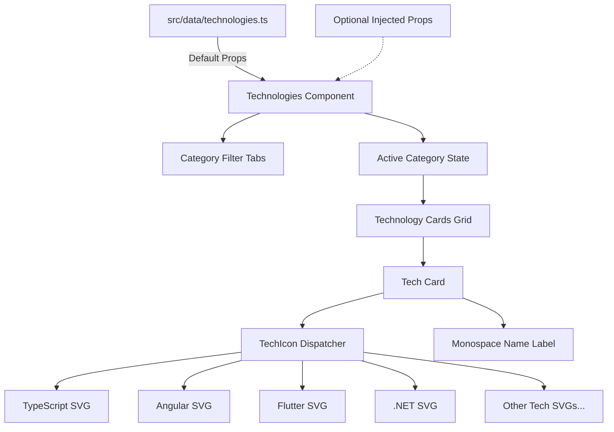

# Requirements

### Overview & Goals
Transform the **Technologies** section from a plain text tag list into an engaging, interactive visual showcase inspired by the reference layout in `img.png`. This update maximizes visual utility and employer engagement by pairing authentic technology brand iconography with structured category filtering tabs, while ensuring complete consistency between `src/data/technologies.ts` and the projects in `src/data/projects.ts`.

### Scope
- **In Scope**:
  - Synchronize the technology list in `src/data/technologies.ts` with all technologies utilized across project case studies in `src/data/projects.ts`.
  - Introduce rich data typing (`TechnologyItem`, `TechnologyCategory`, `TechnologyCategoryOption`) in `src/data/types.ts`.
  - Implement self-contained, authentic multi-color SVG icon primitives for all technologies without adding third-party icon libraries.
  - Re-architect `src/components/sections/Technologies.tsx` to render interactive category filter pills (`All`, `Frontend`, `Mobile`, `Backend`, `Real-Time & APIs`) and a responsive grid of dark-styled technology cards.
  - Maintain 100% unit test coverage across lines, statements, functions, and branches in Vitest.
  - Synchronize documentation across `docs/architecture.md`, `docs/decisions.md`, `docs/concerns.md`, and `src/data/README.md`.
- **Out of Scope**:
  - Introducing third-party UI/icon/animation libraries (e.g. Lucide, FontAwesome, Framer Motion, Radix).
  - Modifying the underlying layout grid container or global section vertical rhythm in `src/components/layout/Section.tsx`.

### User Stories
- **As a prospective client or technical recruiter**, I want to quickly explore Oleksandr's technology stack with clear visual cues and categorized filters so that I can immediately assess his technical capabilities and stack fit.
- **As a portfolio visitor on mobile or desktop**, I want to filter technologies by domain (Frontend, Mobile, Backend, Real-Time & APIs) with immediate responsive feedback and smooth interaction.
- **As a keyboard or screen-reader user**, I want full accessibility support with semantic button controls, clear focus rings, and proper ARIA states.

### Functional Requirements
1. **Data Consistency**: `src/data/technologies.ts` must include all unique technologies referenced in `src/data/projects.ts` (TypeScript, Angular, RxJS, NgRx, Angular Material, Expo, React Native, REST APIs, .NET, C#, NSwag, SignalR, WebSocket, Flutter, Dart, Android, iOS, SQLite, Firebase, Node.js, WebRTC) mapped to appropriate category tags.
2. **Category Filter Tabs**:
   - Filter pills displayed above the grid: `All`, `Frontend`, `Mobile`, `Backend`, `Real-Time & APIs`.
   - Active pill highlighted with clear visual indicator and high contrast.
   - Clicking a filter pill immediately updates the card grid.
   - Keyboard accessible via `Enter`/`Space` with visible focus rings.
3. **Visual Technology Cards**:
   - Responsive multi-column grid (`grid-cols-2 sm:grid-cols-3 md:grid-cols-4 lg:grid-cols-5 xl:grid-cols-6`).
   - Each card displays a centered, authentic multi-color SVG technology logo and the technology name in monospace font.
   - Micro-interaction: subtle hover translation and border accent highlight.
4. **Resilient Fallbacks**:
   - Render an accessible empty state message if no technologies match or if an empty array is passed.
   - Render a reliable fallback icon if an unmapped technology ID is encountered.

### Non-Functional Requirements
- **Zero External Dependencies**: All icons must be pure inline SVG components respecting the KISS architecture.
- **Performance & CLS**: Static inline SVGs with explicit viewBox/dimensions to prevent layout shifts.
- **Accessibility**: WCAG 2.1 AA compliance, decorative icons marked `aria-hidden="true"`, accessible filter controls.
- **Strict Quality Gates**: 100% unit test coverage via `npm run test:coverage` and zero ESLint/TypeScript errors.

# Technical Design

### Current Implementation
- `src/data/technologies.ts` exports a flat `readonly string[]` of 10 generic technology names.
- `src/components/sections/Technologies.tsx` renders a basic flex-wrap list of `Tag` text chips without icons or categories.
- `src/data/projects.ts` contains 21 distinct technologies across 3 projects (Zahara, Family Budget, Browser Calls) that are out of sync with `technologies.ts`.

### Key Decisions
1. **Rich Technology Contract with Category Taxonomy**:
   - *Decision*: Extend `src/data/types.ts` with `TechnologyItem` containing `id`, `name`, `category`, and `icon`.
   - *Rationale*: Organizes technologies into meaningful engineering domains (`frontend`, `mobile`, `backend`, `realtime-apis`) matching the filter tabs in `img.png` while remaining strictly type-safe.
2. **Self-Contained Branded SVG Primitives**:
   - *Decision*: Create pure React SVG components with authentic brand colors (React cyan, Angular crimson, TypeScript blue, Flutter sky, etc.) in `src/components/ui/icons/tech/`.
   - *Rationale*: Eliminates third-party icon bundle overhead, guarantees zero runtime network requests, and satisfies the zero-external-library architectural boundary.
3. **Client-Side State with Native React Hooks**:
   - *Decision*: Manage active category filtering via standard `useState<'all' | TechnologyCategory>('all')`.
   - *Rationale*: Zero state management libraries required; fast, synchronous client-side filtering with negligible memory footprint.
4. **Presentational Decoupling with Default Data Injections**:
   - *Decision*: Allow `Technologies` component to accept optional `technologies?: readonly TechnologyItem[]` and `categories?: readonly TechnologyCategoryOption[]` props defaulted to `@/data/technologies`.
   - *Rationale*: Preserves atomic presentational purity and enables 100% hermetic unit testing without relying on static runtime data imports.

### Proposed Changes
- **`src/data/types.ts`**: Add `TechnologyCategory`, `TechnologyItem`, `TechnologyCategoryOption` interfaces.
- **`src/data/technologies.ts`**: Update dataset with structured technology items synchronized with `src/data/projects.ts` and define category filter list.
- **`src/components/ui/icons/tech/`**: Create branded SVG icon primitives and a `TechIcon` dispatcher component.
- **`src/components/sections/Technologies.tsx`**: Replace plain tag list with category filter pills and responsive card grid.
- **`docs/`**: Update architectural and decision records.

### Data Models / Contracts
```typescript
export type TechnologyCategory = 'frontend' | 'mobile' | 'backend' | 'realtime-apis';

export interface TechnologyItem {
    readonly id: string;
    readonly name: string;
    readonly category: TechnologyCategory;
    readonly icon: string;
}

export interface TechnologyCategoryOption {
    readonly id: 'all' | TechnologyCategory;
    readonly label: string;
}
```

### Components
- `Technologies` (`src/components/sections/Technologies.tsx`): Main section component managing filter state, rendering category pills and technology card grid.
- `TechIcon` (`src/components/ui/icons/TechIcon.tsx`): Type-safe SVG dispatcher mapping `icon` keys to authentic SVG primitives with fallback.
- `TechCard` (internal or co-located sub-component): Renders an individual card with icon, title, hover states, and accessibility attributes.

### Architecture Diagram


### File Structure
```
src/
├── components/
│   ├── sections/
│   │   ├── Technologies.tsx        # Refactored interactive visual section
│   │   └── Technologies.test.tsx   # 100% coverage test suite
│   └── ui/
│       └── icons/
│           ├── tech/               # Branded SVG tech icon primitives
│           │   ├── TypeScriptIcon.tsx
│           │   ├── AngularIcon.tsx
│           │   ├── ReactIcon.tsx
│           │   ├── FlutterIcon.tsx
│           │   ├── DotNetIcon.tsx
│           │   ├── ...
│           │   └── index.ts
│           ├── TechIcon.tsx        # Icon dispatcher component
│           └── techIcons.test.tsx  # Icon suite unit tests
├── data/
│   ├── types.ts                    # Updated contracts
│   ├── technologies.ts             # Synchronized rich dataset
│   └── README.md                   # Updated maintainer documentation
```

### Risks & Mitigations
- **Risk**: Missing SVG icon key for a dynamic or future technology item.
  - *Mitigation*: Provide a generic code/terminal fallback SVG primitive so unmapped items render gracefully without runtime exceptions.
- **Risk**: Low contrast of branded SVG colors on light/dark card backgrounds.
  - *Mitigation*: Wrap icons in dedicated contrast-safe containers and test against both `[data-theme="dark"]` and light theme backgrounds to ensure WCAG AA compliance.

# Testing

### Validation Approach
Verification follows strict Test-Driven Development (TDD): write unit and component tests first, verify red failure states, implement changes to reach green, and validate quality gates including the 100% coverage threshold.

### Key Scenarios
1. **Default Rendering**: Verify `Technologies` renders all technology cards and category filter pills when no props are provided.
2. **Category Filtering**: Verify clicking a filter pill (e.g. "Frontend", "Mobile", "Backend") dynamically filters the visible technology cards to only those matching the selected category.
3. **Filter Switching back to 'All'**: Verify clicking "All" restores the full list of technology cards.
4. **Keyboard Accessibility**: Verify filter tabs are navigable and activatable via keyboard (`Tab`, `Space`, `Enter`).
5. **Icon Dispatching**: Verify `TechIcon` accurately resolves each technology icon identifier to its corresponding SVG primitive.
6. **Fallback Icon Resolution**: Verify `TechIcon` falls back gracefully to a generic icon when provided with an unknown icon identifier.

### Edge Cases
- **Empty Dataset**: Verify rendering when `technologies={[]}` is passed, ensuring the accessible fallback message is shown and no list container is rendered.
- **Empty Category Match**: Verify graceful UI behavior when a category contains zero items.
- **Custom Technologies Injection**: Verify isolated unit tests can inject custom technology arrays without depending on data layer contents.
- **Extreme Viewport Resizing**: Verify grid wrapping down to 320px viewport without horizontal overflow.

### Test Changes
- `src/components/sections/Technologies.test.tsx`: Comprehensive unit tests covering filter interactions, keyboard events, prop injections, and empty states.
- `src/components/ui/icons/techIcons.test.tsx`: Unit tests verifying all icon primitives and dispatcher fallback paths.
- `e2e/navigation.spec.ts` & `e2e/a11y.spec.ts`: E2E verification of heading hierarchy, section navigation, and zero axe accessibility violations.

# Delivery Steps

### ✓ Step 1: Extend Data Contracts & Synchronize Technology Dataset
The data contracts and technology dataset are updated to support categorized technologies matching all projects with icon identifiers.

- Extend `src/data/types.ts` with `TechnologyCategory`, `TechnologyItem`, and `TechnologyCategoryOption` interfaces.
- Update `src/data/technologies.ts` with all technologies represented in `src/data/projects.ts` (TypeScript, Angular, RxJS, NgRx, Angular Material, Expo, React Native, REST APIs, .NET, C#, NSwag, SignalR, WebSocket, Flutter, Dart, Android, iOS, SQLite, Firebase, Node.js, WebRTC), structured with IDs, display names, categories (`frontend`, `mobile`, `backend`, `realtime-apis`), and icon keys.
- Define `TECHNOLOGY_CATEGORIES` list (`All`, `Frontend`, `Mobile`, `Backend`, `Real-Time & APIs`) for filter controls.
- Export new types and data structures from `src/data/index.ts`.

### ✓ Step 2: Implement Branded SVG Technology Icons & Resolver
A complete suite of handcrafted, self-contained SVG technology icons with authentic brand colors is available for rendering.

- Implement branded SVG icon primitives in `src/components/ui/icons/tech/` or `src/components/ui/icons/` for all technologies in the dataset (Angular, TypeScript, React, Flutter, Dart, RxJS, .NET, Node.js, Firebase, SQLite, WebRTC, WebSocket, SignalR, Android, iOS, Expo, etc.).
- Implement a type-safe `TechIcon` resolver component that renders the matching SVG primitive with fallback support.
- Ensure all SVG icons include `aria-hidden="true"`, responsive dimensions, and authentic brand palettes matching the visual reference.
- Add comprehensive unit tests in `src/components/ui/icons/techIcons.test.tsx` verifying all icon keys and fallback rendering with 100% branch and line coverage.

### ✓ Step 3: Build Interactive Category Filter Tabs & Visual Card Grid
The Technologies section is transformed into an interactive visual showcase with category filter pills and responsive technology cards.

- Refactor `src/components/sections/Technologies.tsx` to maintain active category filter state (`useState`) with accessible filter pills (`role="tablist"` / `role="tab"` or button group with `aria-pressed`).
- Render a responsive grid (`grid-cols-2 sm:grid-cols-3 md:grid-cols-4 lg:grid-cols-5 xl:grid-cols-6`) of dark-styled cards featuring centered SVG icons, monospace technology titles, subtle borders, and smooth hover micro-interactions.
- Implement accessible empty-state fallback when no technologies match the active filter or when an empty list is passed via props.
- Ensure strict adherence to WCAG AA contrast tokens (`--color-surface`, `--color-ink`, `--color-hairline`, `--color-accent`) across light and dark themes.

### ✓ Step 4: Achieve 100% Test Coverage, E2E Verification & Documentation Sync
All quality gates pass with 100% test coverage, accessible e2e validation, and updated project documentation.

- Update `src/components/sections/Technologies.test.tsx` to achieve 100% unit coverage covering tab filtering, keyboard interaction, custom prop injection, and empty state rendering.
- Update Playwright e2e specs (`e2e/navigation.spec.ts`, `e2e/a11y.spec.ts`, `e2e/responsive.spec.ts`) to validate technology filtering, keyboard navigation, and zero axe-core accessibility violations.
- Update documentation in `docs/architecture.md`, `docs/decisions.md`, `docs/concerns.md`, and `src/data/README.md` to reflect the new technology card grid and interactive category architecture.
- Run and verify the full test pipeline (`npm run typecheck`, `npm run lint`, `npm run format:check`, `npm run test:coverage`, `npm run build`, `npm run test:e2e`).