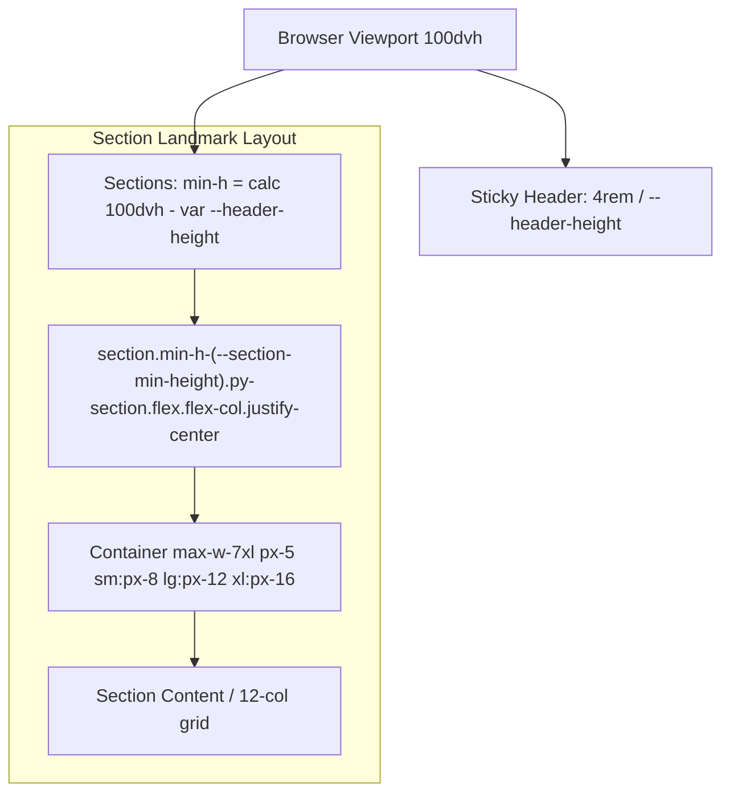

# Requirements

### Overview & Goals
The goal is to refine the vertical rhythm of the portfolio landing page by:
1. **Thinner Section Padding**: Reducing `--spacing-section` from `clamp(5rem, 3rem + 8vw, 10rem)` to a tighter fluid clamp scale with a maximum of `5rem` (e.g. `clamp(2.5rem, 1.5rem + 3.5vw, 5rem)`), creating a more compact and elegant layout.
2. **Full-Viewport Section Minimum Height**: Setting the minimum height of all `<section>` elements to equal the full viewport height minus the header bar (`calc(100dvh - var(--header-height))`), ensuring each section occupies at least a full screen view on desktop/tablet while centering content vertically.

### Scope
- **In Scope**:
  - Updating `@theme` spacing tokens in `src/styles/index.css` (`--spacing-section` and `--section-min-height`).
  - Updating `src/components/layout/Section.tsx` to apply `min-h-(--section-min-height)` and `flex flex-col justify-center`.
  - Streamlining `src/components/sections/Hero.tsx` to remove redundant inner padding (`py-12 sm:py-20 lg:py-28`) in favor of the section-level vertical rhythm.
  - Updating unit tests in `src/components/layout/Section.test.tsx` and `src/components/sections/Hero.test.tsx`.
  - Updating Playwright E2E tests in `e2e/responsive.spec.ts` and `e2e/navigation.spec.ts` across 320px, 768px, and 1440px viewports.
  - Updating project documentation in `docs/architecture.md`, `docs/decisions.md`, and `docs/concerns.md`.
- **Out of Scope**:
  - Introducing external CSS frameworks or UI component libraries.
  - Modifying the navigation link contracts or section IDs in `src/data/navigation.ts`.
  - Modifying the header height or mobile navigation overlay functionality.

### User Stories
- **As a visitor**, I want each section of the portfolio to feel intentional and fill the viewport without excessive empty padding, so that I can focus on the content and case studies easily.
- **As a visitor on different devices (mobile, tablet, desktop)**, I want sections to scale smoothly and avoid awkward vertical overflows on standard laptop screens.

### Functional Requirements
1. **Thinner Section Vertical Padding**:
   - `--spacing-section` token must have a maximum value of `5rem` (80px) on large screens and scale down smoothly to `2.5rem` (40px) on mobile viewports.
   - All sections must utilize `py-section` deriving from `--spacing-section`.
2. **Viewport-Aware Minimum Height**:
   - Each `<section>` landmark must have a minimum height equal to `calc(100dvh - var(--header-height))`.
   - Content within shorter sections (e.g., Hero, About, Technologies, Contact) must be vertically centered.
   - Sections with taller content (e.g., SelectedWork, HowIWork) must expand naturally beyond the minimum height without clipping.
3. **Streamlined Hero Inner Padding**:
   - The `Hero` component must eliminate its extra `py-12 sm:py-20 lg:py-28` inner padding so that it aligns with the global section rhythm and avoids overflowing standard laptop displays.

### Non-Functional Requirements
- **Fluid Responsiveness**: Seamless transitions across 320px (mobile), 768px (tablet), and 1440px (desktop) viewports with zero horizontal scrollbar or overflow.
- **Accessibility (WCAG AA)**: Maintain heading hierarchy, landmarks, skip link, and scroll-to-anchor alignment with `scroll-mt-(--header-height)`.
- **100% Test Coverage**: Maintain 100% statement, branch, function, and line unit test coverage enforced by Vitest and all Playwright E2E specs passing.

# Technical Design

### Current Implementation
- `src/styles/index.css` declares `--spacing-section: clamp(5rem, 3rem + 8vw, 10rem);` and `--header-height: 4rem;`.
- `Section` (`src/components/layout/Section.tsx`) applies `reveal py-section scroll-mt-(--header-height) ${className}` to `<section>`.
- `Hero` (`src/components/sections/Hero.tsx`) has inner padding `py-12 sm:py-20 lg:py-28`.
- Sections currently do not declare a minimum height, allowing short sections (About, Technologies, Contact) to appear compact while padding alone drives vertical spacing.

### Key Decisions
1. **Fluid Section Padding Scale with 5rem Max**:
   - *Choice*: Update `--spacing-section` in `@theme` to `clamp(2.5rem, 1.5rem + 3.5vw, 5rem)`.
   - *Rationale*: Replaces the large 10rem desktop padding with a 5rem ceiling while maintaining proportional fluid scaling down to 2.5rem on small mobile screens.
2. **Dedicated `--section-min-height` Token**:
   - *Choice*: Add `--section-min-height: calc(100dvh - var(--header-height));` to `@theme` in `src/styles/index.css`.
   - *Rationale*: Aligns with the existing `--mobile-nav-height` pattern, leverages Tailwind CSS v4 CSS-first token compilation, and centralizes the formula for viewport-relative section heights.
3. **Flex Column Centering inside `Section`**:
   - *Choice*: Apply `min-h-(--section-min-height) flex flex-col justify-center` on the `<section>` landmark in `Section.tsx`.
   - *Rationale*: When section content is shorter than the viewport minus header, it is vertically centered cleanly; when content exceeds the viewport, `min-height` allows the element to expand naturally with `py-section` padding preserved.
4. **Remove Hero Inner Vertical Padding**:
   - *Choice*: Strip `py-12 sm:py-20 lg:py-28` from `Hero.tsx`.
   - *Rationale*: Eliminates redundant padding stacking so Hero fits cleanly within the initial above-the-fold viewport height on standard displays.

### Proposed Changes

#### 1. Stylesheet (`src/styles/index.css`)
```css
@theme {
    /* ... color and typography tokens ... */

    /* Spacing & Sizing */
    --spacing-section: clamp(2.5rem, 1.5rem + 3.5vw, 5rem);
    --header-height: 4rem;
    --section-min-height: calc(100dvh - var(--header-height));
    --mobile-nav-height: calc(100dvh - var(--header-height));
    --radius-sm: 10px;
}
```

#### 2. Section Primitive (`src/components/layout/Section.tsx`)
```tsx
export function Section({ id, label, variant = 'default', background, className = '', children }: SectionProps) {
    const isPlain = variant === 'plain';
    const sectionClass =
        `${background ? 'relative isolate ' : ''}reveal min-h-(--section-min-height) flex flex-col justify-center py-section scroll-mt-(--header-height) ${className}`.trim();

    return (
        <section id={id} aria-labelledby={!isPlain ? `${id}-heading` : undefined} className={sectionClass}>
            {background ? (
                <div aria-hidden="true" className="pointer-events-none absolute inset-0 -z-10 overflow-hidden">
                    {background}
                </div>
            ) : null}
            {isPlain ? (
                <Container>{children}</Container>
            ) : (
                <Container grid>
                    <div className="mb-8 lg:col-span-3 lg:mb-0">
                        {label && <SectionHeader label={label} headingId={`${id}-heading`} />}
                    </div>
                    <div className="lg:col-span-8 lg:col-start-5">{children}</div>
                </Container>
            )}
        </section>
    );
}
```

#### 3. Hero Section (`src/components/sections/Hero.tsx`)
```tsx
export function Hero({ profile = defaultSiteProfile, className = '' }: HeroProps) {
    const prompt = profile.role ? `alex@${profile.role} ~ %` : 'alex ~ %';

    return (
        <div
            className={`flex animate-[hero-rise_0.6s_ease-out_both] flex-col gap-6 motion-reduce:animate-none ${className}`.trim()}
        >
            {/* H1, StatusPill, TerminalWindow, CTA links */}
        </div>
    );
}
```

### Components
- `src/styles/index.css`: Declares `--spacing-section` and `--section-min-height` `@theme` tokens.
- `src/components/layout/Section.tsx`: Applies `min-h-(--section-min-height)` and `flex flex-col justify-center`.
- `src/components/sections/Hero.tsx`: Removes inner `py-12 sm:py-20 lg:py-28` to delegate vertical spacing to `Section`.
- `docs/architecture.md`, `docs/decisions.md`, `docs/concerns.md`: Documentation synchronization.

### Architecture Diagram



### Risks & Mitigations
- **Risk**: Tall content sections (e.g. `SelectedWork`) might feel constrained or clipped.
  - *Mitigation*: Using `min-height` rather than fixed `height` ensures sections freely expand when content exceeds viewport height.
- **Risk**: Scroll-spy intersection observer might exhibit flutter if multiple sections intersect.
  - *Mitigation*: `useActiveSection` evaluates intersections in document order and incorporates top root margin offset (`-${headerPx}px`) and bottom margin (`-55%`), ensuring smooth active section tracking.

# Testing

### Validation Approach
Development follows strict Test-Driven Development (TDD). Tests will verify:
1. Unit component contracts and class composition for `Section` and `Hero`.
2. Playwright E2E verification of computed section minimum heights and smooth anchor navigation across all viewport tiers (320px, 768px, 1440px).
3. 100% code coverage across all statements, branches, functions, and lines.

### Key Scenarios
1. **Section Minimum Height Calculation**:
   - Verify that all `<section>` elements render with a computed minimum height matching `calc(100dvh - 4rem)`.
2. **Content Centering in Short Sections**:
   - Verify that shorter sections (`#hero`, `#about`, `#technologies`, `#contact`) center their content vertically within the viewport.
3. **Expansion for Long Sections**:
   - Verify that sections with substantial content (`#work`, `#how-i-work`) expand naturally beyond the minimum height.
4. **Anchor Navigation & Header Offset**:
   - Verify desktop navigation clicks scroll accurately to section headings without header overlap (`scroll-mt-(--header-height)`).
5. **Horizontal Overflow & Tap Targets**:
   - Verify zero horizontal scrolling (`scrollWidth <= clientWidth`) across 320px, 768px, and 1440px viewports.

### Test Changes
- `src/components/layout/Section.test.tsx`:
  - Assert that `Section` elements include `min-h-(--section-min-height)` and `flex flex-col justify-center` classes.
- `src/components/sections/Hero.test.tsx`:
  - Update any layout class assertions if present.
- `e2e/responsive.spec.ts`:
  - Add a test verifying all `<section>` elements satisfy `min-height >= viewportHeight - headerHeight`.
- `npm run verify` & `npm run test:e2e`:
  - Execute full gate validation to confirm 0 TypeScript errors, 0 ESLint errors/warnings, clean formatting, 100% unit coverage, and all Playwright tests passing.

# Delivery Steps

### ✓ Step 1: Update design tokens in src/styles/index.css for fluid section padding and section min-height
`src/styles/index.css` defines the reduced `--spacing-section` fluid token with a 5rem maximum and introduces the `--section-min-height` token in the `@theme` block.

- Update `--spacing-section` in `src/styles/index.css` `@theme` block from `clamp(5rem, 3rem + 8vw, 10rem)` to `clamp(2.5rem, 1.5rem + 3.5vw, 5rem)`.
- Define `--section-min-height: calc(100dvh - var(--header-height));` in the `@theme` block of `src/styles/index.css`.
- Ensure Tailwind CSS v4 compiles the updated `@theme` definitions into `py-section` and `min-h-(--section-min-height)` utilities.

### ✓ Step 2: Update Section and Hero components with min-height and adjusted vertical rhythm
All `<section>` landmarks enforce a minimum height of full viewport minus header bar, with streamlined inner padding across section components.

- Update `src/components/layout/Section.tsx` to include `min-h-(--section-min-height)` and `flex flex-col justify-center` in the `sectionClass` string.
- Update `src/components/sections/Hero.tsx` to remove the redundant `py-12 sm:py-20 lg:py-28` inner vertical padding, allowing `Section`'s `py-section` and viewport min-height flex centering to manage vertical rhythm cleanly.
- Verify that landmark semantics, ARIA labelledby bindings, container layout grids, and full-bleed background slots remain fully intact.

### ✓ Step 3: Add unit and e2e regression tests for section padding and viewport min-height
Unit tests and Playwright E2E specs validate section min-height, padding, and responsive layout behavior while preserving 100% test coverage.

- Update `src/components/layout/Section.test.tsx` to assert on the updated `min-h-(--section-min-height)` and flex centering class composition.
- Update `src/components/sections/Hero.test.tsx` if needed to assert on the updated Hero layout styling.
- Add/update Playwright tests in `e2e/responsive.spec.ts` and `e2e/navigation.spec.ts` to verify section elements satisfy `min-height: calc(100dvh - var(--header-height))` across mobile (320px), tablet (768px), and desktop (1440px) viewports without horizontal overflow.
- Run `npm run verify` and `npm run test:e2e` to confirm all linting, typechecking, formatting, 100% unit coverage, build, and E2E gates pass cleanly.

### ✓ Step 4: Synchronize architectural and technical documentation in docs/
Architecture, architectural decision records, and technical concerns in `docs/` reflect the new section spacing and sizing contracts.

- Update `docs/architecture.md` to document the updated `--spacing-section` token and the `--section-min-height` layout primitive.
- Add Decision 41 in `docs/decisions.md` capturing the design rationale for thinner fluid section padding (5rem max) and full-viewport section min-height.
- Update `docs/concerns.md` with responsive considerations for short viewports, scroll-spy intersection observers, and vertical centering.