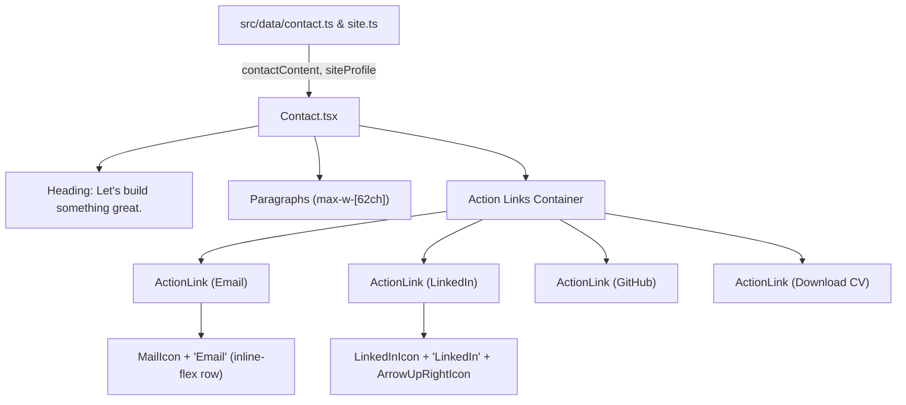

# Requirements

### Overview & Goals
The goal is to modernize and enrich the **Contact** section of the portfolio website. We will:
1. Remove the redundant `profile.status` snippet (`{profile.status ? <p className="text-body text-ink-muted">{profile.status}</p> : null}`) from the Contact section.
2. Replace it with four well-crafted prose paragraphs that invite conversation and collaboration, styled with the same readable measure and typography as the `About` section (`max-w-[62ch] space-y-4 leading-relaxed sm:space-y-6`).
3. Fix the layout of action links (`ActionLink` / Contact buttons) so that SVG icons and text labels sit on a single, well-aligned horizontal line with proper spacing (`inline-flex items-center gap-2`), eliminating awkward vertical stacking.
4. Maintain a fully decoupled data layer by placing the contact text in `src/data/contact.ts`.

### Scope
- **In Scope**:
  - Creating `src/data/contact.ts` and `ContactContent` type in `src/data/types.ts`.
  - Updating `src/components/sections/Contact.tsx` to render the four paragraphs and consume `contactContent`.
  - Fixing `src/components/ui/ActionLink.tsx` to ensure child icons and text align horizontally in one line.
  - Updating unit tests (`Contact.test.tsx`, `ActionLink.test.tsx`) with 100% test coverage.
  - Updating documentation in `docs/` (`architecture.md`, `decisions.md`, `src/data/README.md`).
- **Out of Scope**:
  - Modifying the `Hero` section's use of `profile.status` for the availability status pill (it remains part of `siteProfile` for the hero badge).
  - Introducing any external UI or icon libraries.

### User Stories
- **As a portfolio visitor**, I want to read a friendly, clear, and encouraging closing note in the Contact section so that I feel welcome to reach out for questions, projects, or collaborations.
- **As a portfolio visitor**, I want the contact action links (Email, LinkedIn, GitHub, CV) to be visually polished with icons and labels horizontally aligned on a single line so that the UI looks professional and intuitive.

### Functional Requirements
1. **Contact Copy**:
   - The Contact section must render four structured paragraphs:
     - *Paragraph 1*: "Thanks for making it this far and taking the time to look through my work."
     - *Paragraph 2*: "Maybe you have a question. Maybe you have an idea. Maybe you don't have either yet — and that's okay."
     - *Paragraph 3*: "If you're looking for someone to help build a product, solve a difficult problem, improve an existing system, or simply explore an idea, I'd be happy to talk."
     - *Paragraph 4*: "I'm open to new opportunities and interesting collaborations. If you think there might be something worth building together, let's talk."
   - Paragraphs must be stored in `src/data/contact.ts` and passed as a default prop `content?: ContactContent`.
2. **Status Removal**:
   - The Contact component must no longer display `profile.status`.
3. **Action Link Layout**:
   - Action links must display the leading SVG icon and label text side-by-side on the same horizontal line with vertical centering and 8px (`gap-2`) spacing.
   - External links (LinkedIn, GitHub) must continue to show the `ArrowUpRightIcon` indicator and `(opens in a new tab)` screen-reader text.
   - Unsupplied links must continue to be omitted cleanly without empty anchor elements.

### Non-Functional Requirements
- **Design Consistency**: Paragraph layout and typography must match the `About` section (`text-body text-ink-muted max-w-[62ch] space-y-4 leading-relaxed sm:space-y-6`).
- **Strict Accessibility**: WCAG AA compliance, semantic markup, and min 44px touch targets.
- **Strict Type Safety**: Strict TypeScript mode with explicit interfaces.
- **100% Test Coverage**: Full branch and line coverage in Vitest and green Playwright E2E suites.

# Technical Design

### Current Implementation
- `src/components/sections/Contact.tsx` renders a heading `"Let's build something great."`, followed by `{profile.status ? <p className="text-body text-ink-muted">{profile.status}</p> : null}` and action links for Email, LinkedIn, GitHub, and CV.
- `src/components/ui/ActionLink.tsx` wraps `{children}` in a plain `<span>{children}</span>` inside `<a>` / `<button>`. Because Tailwind's preflight applies `display: block` to `<svg>` elements and the wrapper `<span>` is inline without flex properties, passing `<MailIcon ... /><span>Email</span>` inside `{children}` causes the SVG icon to break onto its own line above the text.

### Key Decisions
1. **Decoupled Contact Content (`src/data/contact.ts`)**:
   - *Decision*: Store the four contact paragraphs in `src/data/contact.ts` with a `ContactContent` interface in `src/data/types.ts`, following the exact pattern of `aboutContent` in `src/data/about.ts`.
   - *Rationale*: Adheres to the core project architecture rule that UI components must remain presentational and decoupled from content copy.
2. **ActionLink Inline Flow**:
   - *Decision*: Remove the unstyled wrapper `<span>` around `{children}` in `ActionLink.tsx` (or ensure `inline-flex items-center gap-2`), letting the parent `inline-flex items-center gap-2` on `<a>`/`<button>` arrange leading icons, text, and trailing external arrows in a unified flex row.
   - *Rationale*: Solves the vertical stacking issue cleanly without needing bespoke wrapper classes in consumer components.
3. **Typography & Measure Alignment with About**:
   - *Decision*: Use `className="text-body text-ink-muted max-w-[62ch] space-y-4 leading-relaxed sm:space-y-6"` for the paragraph container in `Contact.tsx`.
   - *Rationale*: Creates visual harmony across content sections (`About` and `Contact`).

### Proposed Changes

#### 1. Data Layer (`src/data/`)
- `src/data/types.ts`:
  ```typescript
  export interface ContactContent {
      paragraphs: readonly string[];
  }
  ```
- `src/data/contact.ts`:
  ```typescript
  import type { ContactContent } from './types';

  export const contactContent: ContactContent = {
      paragraphs: [
          'Thanks for making it this far and taking the time to look through my work.',
          "Maybe you have a question. Maybe you have an idea. Maybe you don't have either yet — and that's okay.",
          "If you're looking for someone to help build a product, solve a difficult problem, improve an existing system, or simply explore an idea, I'd be happy to talk.",
          "I'm open to new opportunities and interesting collaborations. If you think there might be something worth building together, let's talk.",
      ],
  };
  ```
- `src/data/index.ts`: export `contactContent` and `ContactContent`.

#### 2. UI Primitives (`src/components/ui/ActionLink.tsx`)
- Render `{children}` directly inside `<a>` and `<button>` so that children are direct flex items of the container which already has `items-center justify-center gap-2`.

#### 3. Section Component (`src/components/sections/Contact.tsx`)
- Accept `content?: ContactContent` prop (defaulting to `contactContent`).
- Replace `profile.status` with the four paragraphs mapped inside the `max-w-[62ch]` container.
- Retain the action link list (Email, LinkedIn, GitHub, CV) with clean horizontal alignment.

### Architecture Diagram



### File Structure
- `src/data/types.ts` (modified: add `ContactContent`)
- `src/data/contact.ts` (new: export `contactContent`)
- `src/data/index.ts` (modified: re-export `contact.ts`)
- `src/data/README.md` (modified: update documentation)
- `src/components/ui/ActionLink.tsx` (modified: fix children layout)
- `src/components/ui/ActionLink.test.tsx` (modified: update/add tests)
- `src/components/sections/Contact.tsx` (modified: render paragraphs & updated links)
- `src/components/sections/Contact.test.tsx` (modified: test paragraphs, status removal, links)
- `docs/architecture.md` (modified: synchronize documentation)
- `docs/decisions.md` (modified: record ADR)

# Testing

### Validation Approach
Following mandatory Test-Driven Development (TDD), tests will be written first to capture the new requirements, verified to fail (red), then implementation code added to satisfy them (green) with 100% unit test coverage.

### Key Scenarios
1. **Paragraphs Rendering**:
   - Verify that all four paragraphs from `contactContent` are rendered in `Contact.tsx`.
   - Verify that a custom `content` prop overrides default paragraphs correctly.
2. **Status Property Removal**:
   - Verify that `profile.status` is no longer rendered in the Contact section even if present on `profile`.
3. **ActionLink Alignment & Rendering**:
   - Verify that `ActionLink` correctly renders icon and text children in an accessible manner.
   - Verify that external links (LinkedIn, GitHub) include the external icon affordance and `(opens in a new tab)` text.
   - Verify that `mailto:` and `download` links maintain correct attributes.
   - Verify that empty link strings are omitted without creating empty `#` links.

### Edge Cases
- **Empty Paragraphs**: If `content.paragraphs` is empty or undefined, the paragraphs container is omitted gracefully without crashing.
- **Empty Links**: When all `profile.links` are empty strings, no action links are rendered.
- **Partial Links**: When only some links (e.g. Email and LinkedIn) are provided, only those links are rendered.

### Test Changes
- `src/components/sections/Contact.test.tsx`:
  - Add tests for default four paragraphs.
  - Add test for custom paragraphs prop.
  - Update tests to verify absence of `profile.status`.
  - Retain and expand tests for link omission and action link attributes.
- `src/components/ui/ActionLink.test.tsx`:
  - Add test asserting proper rendering when passed compound children (e.g. SVG icon and text).
- `npm run verify` and `npm run test:e2e` for holistic validation.

# Delivery Steps

### ✓ Step 1: Define Contact content data layer and TypeScript types
Contact copy and contracts are decoupled and strongly typed in `src/data/contact.ts` with barrel export.

- Add the `ContactContent` interface to `src/data/types.ts` defining `paragraphs: readonly string[]`.
- Create `src/data/contact.ts` containing the four contact prose paragraphs provided by the user.
- Export `contactContent` and `ContactContent` from `src/data/index.ts`.
- Update `src/data/README.md` to document the new data module and its role in the decoupled data layer.

### ✓ Step 2: Fix ActionLink inline layout for icon and text alignment
ActionLink renders icons and text labels horizontally inline with vertical centering and proper spacing.

- Modify `src/components/ui/ActionLink.tsx` to remove the unstyled wrapping `<span>` around `{children}` (or ensure inline-flex alignment), allowing direct flex alignment (`inline-flex items-center gap-2`) across SVG icons, text nodes, and external indicators.
- Update `src/components/ui/ActionLink.test.tsx` to verify inline icon and text rendering as well as button and link variants.
- Ensure 100% unit test coverage for `ActionLink.tsx`.

### ✓ Step 3: Refactor Contact component to render paragraphs and updated links
Contact section renders the 4 biographical/call-to-action paragraphs, removes `profile.status`, and presents aligned action links.

- Update `src/components/sections/Contact.test.tsx` following TDD: write tests for paragraph rendering from default and custom `content` prop, verify absence of `profile.status`, and check conditional link omission.
- Update `src/components/sections/Contact.tsx` to accept optional `content?: ContactContent` (defaulting to `contactContent`), remove `{profile.status ? ... : null}`, render paragraphs in a `max-w-[62ch]` container styled consistently with `About.tsx`, and render the action link buttons.
- Ensure 100% unit test coverage for `Contact.tsx`.

### ✓ Step 4: Synchronize documentation and run quality gates
Project documentation in `docs/` is updated and all verification suites pass with zero errors.

- Update `docs/architecture.md` and `docs/decisions.md` to reflect the `src/data/contact.ts` module, updated `Contact` component structure, and `ActionLink` layout fix.
- Run `npm run verify` (`npm run typecheck`, `npm run lint`, `npm run format:check`, `npm run test:coverage`, `npm run build`) to ensure all unit tests pass with 100% code coverage.
- Run `npm run test:e2e` to verify full end-to-end responsiveness and accessibility compliance.