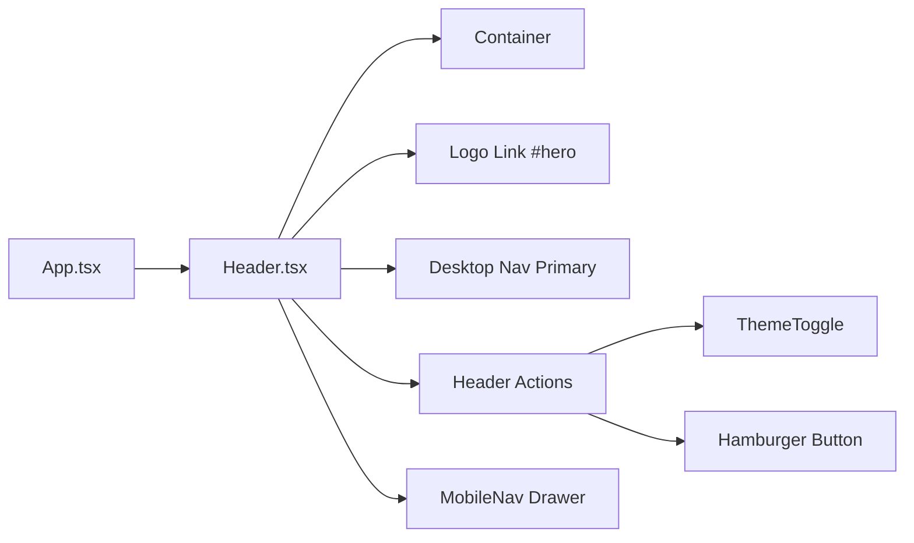

# Requirements

### Overview & Goals
The objective of this task is to remove the desktop CV `ActionLink` from the sticky `Header` component (`src/components/layout/Header.tsx`). This streamlines the top header action area to only feature the site theme toggle (`ThemeToggle`) and the mobile menu trigger button on smaller screens, avoiding redundant CV download triggers in the primary navigation header while keeping CV links in appropriate dedicated sections (`Contact`, `Footer`, and `MobileNav`).

### Scope
- **In Scope**:
  - Remove the conditional CV `ActionLink` element from `src/components/layout/Header.tsx`.
  - Remove the unused `ActionLink` import in `src/components/layout/Header.tsx`.
  - Update `src/components/layout/Header.test.tsx` to reflect the removal of the CV action link from `Header` while maintaining 100% unit test coverage.
  - Review and synchronize documentation in `docs/` as required by project governance.
  - Verify all automated quality gates (`npm run verify` and `npm run test:e2e`).
- **Out of Scope**:
  - Modifying CV actions in `Contact.tsx`, `Footer.tsx`, or `MobileNav.tsx`.
  - Modifying the data layer schema or `SiteProfile.links.cv` property in `src/data/types.ts` or `src/data/site.ts`.
  - Changing visual styling or layouts of other navigation elements.

### User Stories
- **As a site visitor**, I want a clean, focused header bar so that navigation between sections and theme switching are prominent without unnecessary clutter.
- **As a recruiter or collaborator**, I can still access and download the CV from dedicated contact points (`MobileNav`, `Contact` section, and `Footer`).

### Functional Requirements
- The sticky header must no longer render a "CV" `ActionLink` button/link on desktop or tablet viewports.
- The header actions container must continue to render:
  - `ThemeToggle` button for switching between dark and light themes.
  - Hamburger toggle button (`MenuIcon` / `CloseIcon`) for opening and closing `MobileNav` on mobile viewports (`md:hidden`).
- The logo link to `#hero` and desktop primary navigation (`<nav aria-label="Primary">`) must remain unchanged.
- `profile` prop must still be accepted by `Header` to supply `profile.name` for the brand mark and to forward to `MobileNav`.

### Non-Functional Requirements
- **Performance**: Zero overhead; removes an unused component import from `Header.tsx`.
- **Accessibility**: Preserves valid landmark structures, tab ordering, and accessible buttons.
- **Code Quality**: 100% test coverage across lines, statements, functions, and branches enforced by Vitest V8 coverage.
- **TDD Compliance**: Red -> Green -> Refactor cycle followed strictly.

# Technical Design

### Current Implementation
`src/components/layout/Header.tsx` currently imports `ActionLink` and renders a conditional ghost button link when `profile.links.cv` is truthy:

```tsx
{/* Header actions: CV + ThemeToggle + Hamburger */}
<div className="flex items-center gap-2 sm:gap-3">
    {profile.links.cv ? (
        <ActionLink
            href={profile.links.cv}
            variant="ghost"
            download
            className="hidden min-h-9 px-3 py-1.5 font-mono text-xs sm:inline-flex"
        >
            CV
        </ActionLink>
    ) : null}
    <ThemeToggle />
    <button
        ref={triggerRef}
        type="button"
        onClick={toggleMenu}
        aria-expanded={isMenuOpen}
        aria-controls="mobile-nav"
        aria-label={isMenuOpen ? 'Close menu' : 'Open menu'}
        className="text-ink-muted hover:border-hairline hover:bg-surface hover:text-ink focus-visible:outline-accent inline-flex min-h-11 min-w-11 items-center justify-center rounded-sm border border-transparent p-2.5 transition-colors focus-visible:outline-2 focus-visible:outline-offset-2 md:hidden"
    >
        {isMenuOpen ? <CloseIcon size={20} /> : <MenuIcon size={20} />}
    </button>
</div>
```

`src/components/layout/Header.test.tsx` includes tests explicitly asserting that the CV link is rendered when `profile.links.cv` is provided and omitted when it is empty.

### Key Decisions
1. **Retain `profile` Prop on `Header`**:
   - *Chosen Approach*: Keep `profile?: SiteProfile` in `HeaderProps` (defaulting to `defaultProfile`).
   - *Rationale*: `Header` uses `profile.name` for the `#hero` home mark, and forwards `profile` to `MobileNav` which still offers the CV download in its mobile drawer.
2. **Remove Unused `ActionLink` Import**:
   - *Chosen Approach*: Delete `import { ActionLink } from '@/components/ui/ActionLink';` from `Header.tsx`.
   - *Rationale*: Keeps imports clean and prevents unused variable/import lint warnings.
3. **Assert Absence in Unit Tests**:
   - *Chosen Approach*: Update `Header.test.tsx` to assert that `screen.queryByRole('link', { name: 'CV' })` is not present even when a profile with a valid `links.cv` is passed.
   - *Rationale*: Prevents regressions and maintains comprehensive test coverage.

### Proposed Changes
- **`src/components/layout/Header.tsx`**:
  - Remove `import { ActionLink } from '@/components/ui/ActionLink';`.
  - Remove `{profile.links.cv ? <ActionLink ...>CV</ActionLink> : null}` block.
  - Update actions section comment.
- **`src/components/layout/Header.test.tsx`**:
  - Remove obsolete tests: `omits the CV action when the cv link is empty` and `renders the CV action when a cv link is provided`.
  - Add test: `does not render a CV action link even when a cv link is provided`.

### Components
- `Header` (`src/components/layout/Header.tsx`): Modified to omit the CV `ActionLink`.
- `MobileNav` (`src/components/layout/MobileNav.tsx`): Unchanged.
- `ThemeToggle` (`src/components/layout/ThemeToggle.tsx`): Unchanged.

### File Structure
```
src/
├── components/
│   └── layout/
│       ├── Header.tsx            # MODIFIED: Remove ActionLink & CV render
│       ├── Header.test.tsx       # MODIFIED: Update unit tests for CV absence
│       └── MobileNav.tsx         # UNCHANGED
```

### Architecture Diagram


### Risks
- **Test Coverage Drop**: Removing code branches without adjusting tests could cause threshold checks to fail. *Mitigation*: Adjust test suite according to TDD principles and run `npm run test:coverage` to confirm 100% threshold compliance.

# Testing

### Validation Approach
Verification follows strict Test-Driven Development (TDD) using Vitest + jsdom + React Testing Library for unit tests, followed by the complete `npm run verify` pipeline and Playwright E2E testing.

### Key Scenarios
1. **CV Link Absence in Desktop Header**:
   - Render `Header` with a complete `SiteProfile` containing a non-empty `links.cv` string.
   - Query for `getByRole('link', { name: 'CV' })` or `queryByRole('link', { name: /cv/i })` and verify it is not in the document.
2. **Primary Navigation Integrity**:
   - Verify all primary nav links (`Selected Work`, `How I Work`, `About`, `Technologies`, `Contact`) continue to render with correct attributes and `aria-current` state.
3. **Theme Toggle and Mobile Menu Interactivity**:
   - Verify `ThemeToggle` renders and functions.
   - Verify mobile hamburger button toggles `MobileNav` dialog and `aria-expanded` state.
4. **Default Props Rendering**:
   - Verify `<Header activeId="work" />` renders without crashing.

### Edge Cases
- Pass profile with empty `cv: ''` and populated `cv: '/cv/test.pdf'`: both should render identical header actions (ThemeToggle + Hamburger button only).
- Verify no orphaned DOM elements or extra gap spacing in the header actions container.

### Test Changes
- **`src/components/layout/Header.test.tsx`**:
  - Replace `renders the CV action when a cv link is provided` and `omits the CV action when the cv link is empty` with a test confirming CV link is not rendered.
- **Coverage**:
  - Validate 100% coverage on lines, statements, functions, and branches for `src/components/layout/Header.tsx`.

# Delivery Steps

### ✓ Step 1: Update Header unit tests to reflect CV ActionLink removal (TDD Red)
`src/components/layout/Header.test.tsx` is updated to assert the absence of the CV ActionLink from Header desktop actions, failing against current implementation (Red phase).

- Update `src/components/layout/Header.test.tsx` to remove obsolete test cases (`renders the CV action when a cv link is provided` and `omits the CV action when the cv link is empty`).
- Add/update assertions in `Header.test.tsx` ensuring that rendering `Header` with full `profile` links does not render any link or button for CV in the desktop header action bar.
- Run `npm test` to verify that the test suite enters the expected Red state before component modifications.

### ✓ Step 2: Remove CV ActionLink and unused imports from Header component (TDD Green)
`src/components/layout/Header.tsx` has the CV ActionLink and unused `ActionLink` import removed, and all unit tests pass at 100% coverage (Green phase).

- Remove the unused `ActionLink` import (`import { ActionLink } from '@/components/ui/ActionLink';`) from `src/components/layout/Header.tsx`.
- Remove the conditional rendering block `{profile.links.cv ? <ActionLink ...>CV</ActionLink> : null}` from the header actions container in `src/components/layout/Header.tsx`.
- Update the JSX comment from `{/* Header actions: CV + ThemeToggle + Hamburger */}` to `{/* Header actions: ThemeToggle + Hamburger */}`.
- Preserve the `profile` prop and its forwarding to `MobileNav` and `#hero` logo branding.
- Run `npm run test:coverage` to confirm all unit tests pass with 100% line, statement, function, and branch coverage.

### ✓ Step 3: Synchronize documentation and run quality gates
Project documentation in `docs/` is reviewed and synchronized, and all project verification gates pass with zero warnings/errors.

- Review `docs/architecture.md`, `docs/decisions.md`, `docs/concerns.md`, and `docs/testing.md` to ensure docs remain strictly synchronized with the component structure.
- Run `npm run verify` (typecheck, lint, format:check, test:coverage at 100%, and production build).
- Run `npm run test:e2e` across all Playwright viewport projects (desktop-1440, tablet-768, mobile-320) and accessibility sweeps.