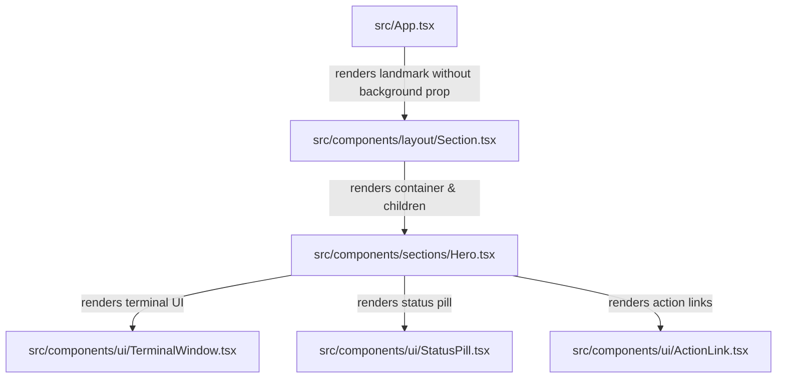

# Requirements

### Overview & Goals
Remove the decorative full-bleed background images (`hero-light.jpeg` and `hero-dark.jpeg`) and `SectionBackground` composition from the Hero section in `src/App.tsx`. This simplifies the hero presentation, streamlines visual focus directly onto the name, status pill, and interactive terminal window, and eliminates approximately ~1.37MB of uncompressed raster image assets from the build output.

### Scope
#### In Scope
- Remove `heroLightBg`, `heroDarkBg`, and `SectionBackground` imports from `src/App.tsx`.
- Remove the `background` prop from `<Section id="hero" variant="plain">` in `src/App.tsx`.
- Remove unused image assets `src/assets/hero-light.jpeg` and `src/assets/hero-dark.jpeg`.
- Update `e2e/theme.spec.ts` to remove obsolete hero background image visibility tests.
- Update project documentation in `docs/architecture.md`, `docs/decisions.md`, and `docs/concerns.md` in accordance with mandatory documentation governance.
- Verify that all quality gates (`npm run verify` and `npm run test:e2e`) pass with 100% unit test coverage.

#### Out of Scope
- Modifying the internal presentation or props of `Hero.tsx` or `TerminalWindow.tsx`.
- Deleting the reusable layout primitives `Section.tsx` or `SectionBackground.tsx` (the layout system retains background slot capabilities for other sections if needed).
- Changing color schemes, typography, layout spacing, or navigation structure.

### User Stories
- As a visitor, I want a clean, distraction-free hero section with immediate focus on the terminal and profile details without heavy background imagery.
- As a site owner, I want faster above-the-fold load times and smaller production bundle sizes.

### Functional Requirements
- The `#hero` section landmark must render `Hero` inside `Container` with standard padding and layout alignment.
- The `#hero` section must not render any `aria-hidden` background wrapper or raster image elements.
- Light and dark theme transitions must remain fully functional across all UI elements and text tokens.
- All primary navigation links and scroll anchors (`#hero`, `#work`, `#how-i-work`, `#about`, `#technologies`, `#contact`) must remain intact.

### Non-Functional Requirements
- **Performance**: Eliminates ~1.37MB of image assets from the production bundle, improving Largest Contentful Paint (LCP) and reducing network overhead.
- **Accessibility**: Preserves single `<h1>` hierarchy, WCAG AA contrast compliance in light and dark modes, and full keyboard navigation.
- **Test Coverage**: Maintains 100% unit test coverage across lines, statements, functions, and branches.

# Technical Design

### Current Implementation
In `src/App.tsx`, the Hero section is composed as:
```tsx
import heroLightBg from '@/assets/hero-light.jpeg';
import heroDarkBg from '@/assets/hero-dark.jpeg';
...
import { SectionBackground } from '@/components/layout/SectionBackground';
...
{/* 00 / Hero */}
<Section
    id="hero"
    variant="plain"
    background={<SectionBackground light={heroLightBg} dark={heroDarkBg} priority />}
>
    <Hero />
</Section>
```
When rendered, `Section` inspects `background` and renders a decorative full-bleed `<div aria-hidden="true" className="pointer-events-none absolute inset-0 -z-10 overflow-hidden">` with the `SectionBackground` component containing light and dark mode images and a gradient scrim overlay.

### Key Decisions
- **Clean Section Composition in `App.tsx`**: Render `<Section id="hero" variant="plain"><Hero /></Section>` without the `background` prop. `Section` conditionally omits the background wrapper when `background` is undefined.
- **Preserve Reusable Layout Primitives (`SectionBackground.tsx` & `Section.tsx`)**: Keep `SectionBackground` and `Section`'s `background?: React.ReactNode` prop in `src/components/layout/` as reusable layout system capabilities with their existing 100% unit test suites.
- **Remove Obsolete Raster Assets**: Delete `src/assets/hero-light.jpeg` and `src/assets/hero-dark.jpeg` to avoid dead asset bloat.
- **Update E2E Theme Specs**: Remove tests in `e2e/theme.spec.ts` that specifically query `#hero [aria-hidden="true"] img`, while retaining comprehensive theme switching, `data-theme` attribute, and `sessionStorage` validation.
- **Documentation Governance**: Update `docs/architecture.md`, `docs/decisions.md` (Decision 39), and `docs/concerns.md` (Concern 19) to reflect the removal of hero background artwork.

### Proposed Changes
1. **`src/App.tsx`**:
   - Remove imports for `heroLightBg`, `heroDarkBg`, and `SectionBackground`.
   - Update Hero `<Section>` to `<Section id="hero" variant="plain"><Hero /></Section>`.
2. **`src/assets/`**:
   - Delete `hero-light.jpeg` and `hero-dark.jpeg`.
3. **`e2e/theme.spec.ts`**:
   - Remove `hero section switches background image visibility on theme toggle` test.
   - Remove `displays dark hero background image on first paint in dark scheme` test.
4. **`docs/`**:
   - Update `docs/architecture.md` presentation summary.
   - Add Decision 39 in `docs/decisions.md`.
   - Update Concern 19 in `docs/concerns.md`.

### Components
- `App` (`src/App.tsx`): Root layout composition — modified to remove `SectionBackground` from the Hero section.
- `Hero` (`src/components/sections/Hero.tsx`): Presentational hero component — unmodified.
- `Section` (`src/components/layout/Section.tsx`): Section landmark primitive — unmodified (automatically omits background wrapper when prop is absent).
- `SectionBackground` (`src/components/layout/SectionBackground.tsx`): Layout helper primitive — retained with existing test suite.

### File Structure
```
src/
├── App.tsx                       # (modified: remove hero background prop & imports)
├── assets/
│   ├── brand-logo.svg
│   ├── hero-dark.jpeg            # (deleted)
│   └── hero-light.jpeg           # (deleted)
├── components/
│   ├── layout/
│   │   ├── Section.tsx           # (unmodified)
│   │   ├── Section.test.tsx      # (unmodified)
│   │   ├── SectionBackground.tsx # (unmodified)
│   │   └── SectionBackground.test.tsx # (unmodified)
│   └── sections/
│       ├── Hero.tsx              # (unmodified)
│       └── Hero.test.tsx         # (unmodified)
e2e/
└── theme.spec.ts                 # (modified: remove hero background image checks)
docs/
├── architecture.md               # (modified: update Hero presentation notes)
├── decisions.md                  # (modified: add Decision 39)
└── concerns.md                   # (modified: update Concern 19)
```

### Architecture Diagram


### Risks
- **E2E Regressions**: Removing hero background images causes selectors querying `#hero [aria-hidden="true"] img` in `e2e/theme.spec.ts` to fail if not updated. *Mitigation*: Update `e2e/theme.spec.ts` in the same change and verify via `npm run test:e2e`.
- **Documentation Drift**: Missing updates to `docs/` violates mandatory governance rules. *Mitigation*: Update `docs/architecture.md`, `docs/decisions.md`, and `docs/concerns.md` as part of the plan.

# Testing

### Validation Approach
Verify behavior through existing unit tests, updated E2E specifications, and the full project verification pipeline (`npm run verify` and `npm run test:e2e`).

### Key Scenarios
1. **Hero Section Rendering**:
   - Verify `<Section id="hero" variant="plain">` renders `<Hero />` with single `<h1>`, status pill, terminal window, and CTA buttons.
   - Verify no `aria-hidden` background container or image elements are rendered in `#hero`.
2. **Layout & Alignment**:
   - Verify `#hero` maintains uniform horizontal padding and vertical spacing via `Container` and `py-section`.
3. **Theme Toggling**:
   - Verify toggling between light and dark themes transitions text, borders, and canvas background tokens correctly without image-switching overhead.
4. **Pre-Paint Theme Script**:
   - Verify pre-paint dark preference initializes `data-theme="dark"` without visual flash.

### Edge Cases
- **Mobile Viewports (320px)**: Ensure removing background does not alter hero layout, responsiveness, or cause horizontal overflow.
- **Reduced Motion**: Verify hero entry animations respect `prefers-reduced-motion` settings.

### Test Changes
- `e2e/theme.spec.ts`:
  - Remove `hero section switches background image visibility on theme toggle`.
  - Remove `displays dark hero background image on first paint in dark scheme`.
  - Keep all other theme switching and pre-paint tests intact.
- Unit test suites (`src/App.test.tsx`, `src/components/sections/Hero.test.tsx`, `src/components/layout/Section.test.tsx`, `src/components/layout/SectionBackground.test.tsx`):
  - Ensure all 27 unit test suites continue to pass with 100% statement, branch, function, and line coverage.

# Delivery Steps

### ✓ Step 1: Remove Hero section background from App.tsx and clean up unused assets
Hero `<Section>` in `src/App.tsx` renders without background imagery and unused hero background assets are removed.

- Remove `heroLightBg`, `heroDarkBg`, and `SectionBackground` imports from `src/App.tsx`.
- Update `<Section id="hero" variant="plain" background={<SectionBackground ... />}>` in `src/App.tsx` to `<Section id="hero" variant="plain">` omitting the `background` prop.
- Delete unused image assets `src/assets/hero-light.jpeg` and `src/assets/hero-dark.jpeg` to reduce repository and production bundle size.

### ✓ Step 2: Update E2E theme test suite
Playwright theme tests run cleanly without failing on removed hero background image selectors.

- Remove the image visibility assertions in `e2e/theme.spec.ts` (`hero section switches background image visibility on theme toggle` and `displays dark hero background image on first paint in dark scheme`).
- Verify that theme toggle tests continue to validate `data-theme` DOM attribute transitions, `sessionStorage` persistence, and `aria-pressed` states.

### ✓ Step 3: Synchronize documentation and run quality gates
All project documentation in `docs/` is synchronized and every quality gate passes with zero errors and 100% unit test coverage.

- Update `docs/architecture.md` to reflect that the `Hero` section is rendered as a clean, plain section without full-bleed background artwork.
- Add Decision 39 in `docs/decisions.md` documenting the decision to remove the Hero section background image in favor of a clean monospace aesthetic, noting bundle size savings and visual focus.
- Update Concern 19 in `docs/concerns.md` to reflect that the Hero section no longer loads above-the-fold background images.
- Execute full quality verification suite: `npm run verify` (`typecheck`, `lint`, `format:check`, `test:coverage`, `build`) and `npm run test:e2e`.