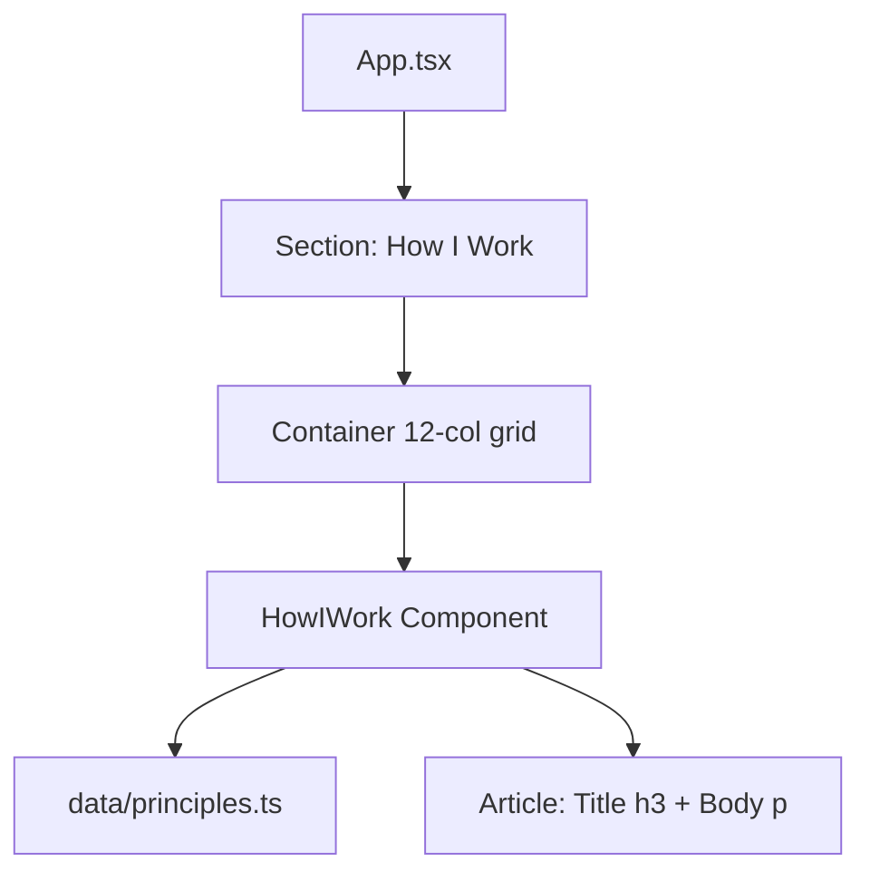

# Requirements

### Overview & Goals

Remove the numeric mono index badges (`01`, `02`, etc.) rendered inside each principle card in `HowIWork.tsx`. This change streamlines the card layout to focus directly on principle titles and descriptions, aligning with earlier removals of numeric section/navigation indexing across the portfolio.

### Scope

#### In Scope
- **`HowIWork` Component (`src/components/sections/HowIWork.tsx`)**:
  - Remove the index `<span>` element:
    ```tsx
    <span className="text-mono-xs text-ink-muted font-mono tracking-wider" aria-hidden="true">
        {String(index + 1).padStart(2, '0')}
    </span>
    ```
  - Clean up the `.map()` parameter signature from `(principle, index)` to `(principle)`.
- **Unit Testing (`src/components/sections/HowIWork.test.tsx`)**:
  - Update the test suite following mandatory TDD (Red/Green/Refactor).
  - Replace index existence assertions (`expect(screen.getByText('01')).toBeInTheDocument()`) with negative assertions (`expect(screen.queryByText('01')).not.toBeInTheDocument()`).
  - Maintain 100% unit test coverage across lines, statements, functions, and branches.
- **Documentation Governance (`docs/decisions.md`)**:
  - Record Architectural Decision 43 documenting the rationale for removing principle card index numbers.

#### Out of Scope
- Modifying `src/data/principles.ts` data structures or `Principle` TypeScript interfaces.
- Changing other section components (`SelectedWork`, `About`, `Technologies`, `Contact`, `Hero`).
- Altering the asymmetric grid layout classes or typographic clamp tokens in `HowIWork`.

### User Stories

- As a visitor viewing the "How I Work" section, I want each principle card to display a clean card layout starting directly with the principle title and body description without redundant index numbering.
- As a project maintainer, I want `HowIWork.tsx` to remain clean, fully typed, tested with 100% unit coverage, and documented in `docs/decisions.md`.

### Functional Requirements

- Each principle card rendered in `HowIWork` must display only the `<h3>` title and `<p>` body inside the `<article>` element.
- The component must continue to support custom `principles` and `className` props.
- The component must retain its empty-state fallback ("Principles will be published soon.") when `principles.length === 0`.
- Layout structure (`grid grid-cols-1 gap-8 md:grid-cols-2 lg:gap-10`) and article accessibility semantics (`aria-labelledby={`${principle.id}-title`}`) must remain intact.

### Non-Functional Requirements

- **100% Unit Test Coverage**: Strictly maintain 100% lines, statements, functions, and branches in `vitest run --coverage`.
- **Accessibility & Contrast**: Preserve WCAG 2.1 AA compliance and valid heading hierarchy without regressions.
- **Quality Gates**: Pass all verification scripts (`npm run verify` and `npm run test:e2e`) with zero errors or warnings.

# Technical Design

### Current Implementation

In `src/components/sections/HowIWork.tsx`, the component maps over `principles` with `(principle, index)`:
```tsx
<article
    key={principle.id}
    aria-labelledby={`${principle.id}-title`}
    className="border-hairline bg-surface flex flex-col gap-3 rounded-sm border p-6 transition-colors sm:p-8"
>
    <span className="text-mono-xs text-ink-muted font-mono tracking-wider" aria-hidden="true">
        {String(index + 1).padStart(2, '0')}
    </span>
    <h3 id={`${principle.id}-title`} className="text-h3 text-ink font-semibold tracking-tight">
        {principle.title}
    </h3>
    <p className="text-body text-ink-muted leading-relaxed">{principle.body}</p>
</article>
```

In `src/components/sections/HowIWork.test.tsx`, tests currently assert the presence of `'01'` and `'02'`.

### Key Decisions

1. **Removal of Decorative Index Span**:
   - *Chosen Approach*: Drop the `<span className="text-mono-xs text-ink-muted font-mono tracking-wider" aria-hidden="true">...</span>` node and simplify the mapping callback to `principles.map((principle) => ...)`.
   - *Rationale*: Eliminates unnecessary DOM nodes and visual clutter, streamlining card contents to the title and body.
2. **Strict TDD and Documentation Sync**:
   - *Chosen Approach*: Update `HowIWork.test.tsx` first to assert the absence of numeric index badges and verify that headings/bodies render, observe test failure, update the component to pass, and document Decision 43 in `docs/decisions.md`.
   - *Rationale*: Complies with strict project guidelines on 100% test coverage and documentation governance.

### Proposed Changes

#### 1. `src/components/sections/HowIWork.tsx`
- Remove the `<span>` element containing `{String(index + 1).padStart(2, '0')}`.
- Update `principles.map((principle, index) => ...)` to `principles.map((principle) => ...)`.

#### 2. `src/components/sections/HowIWork.test.tsx`
- Remove `expect(screen.getByText('01')).toBeInTheDocument()` and `expect(screen.getByText('02')).toBeInTheDocument()`.
- Add `expect(screen.queryByText('01')).not.toBeInTheDocument()` and `expect(screen.queryByText('02')).not.toBeInTheDocument()`.

#### 3. `docs/decisions.md`
- Add Decision 43:
  - **Decision**: Remove numeric index badges (`'01'`, `'02'`, etc.) from principle cards in `HowIWork.tsx`.
  - **Rationale**: Creates a consistent, uncluttered editorial aesthetic across portfolio cards and sections.

### Data Models / Contracts

No changes to `Principle` interface (`src/data/types.ts`) or `HowIWorkProps` contract:
```typescript
export interface HowIWorkProps {
    principles?: readonly Principle[];
    className?: string;
}
```

### Components

- `HowIWork` (`src/components/sections/HowIWork.tsx`): Streamlines card rendering by removing the index badge.

### File Structure

- `src/components/sections/HowIWork.tsx` (modified)
- `src/components/sections/HowIWork.test.tsx` (modified)
- `docs/decisions.md` (modified)

### Architecture Diagram



### Risks & Mitigations

- **Risk**: Missing 100% branch or statement coverage threshold.
  - *Mitigation*: The change simplifies the code path by eliminating an unused variable (`index`) and a JSX branch. Coverage will be verified via `npm run test:coverage`.
- **Risk**: Unsynchronized documentation causing documentation governance violation.
  - *Mitigation*: Update `docs/decisions.md` with Decision 43 as part of the implementation.

# Testing

### Validation Approach

Testing will follow the mandatory TDD workflow:
1. **Red**: Update `src/components/sections/HowIWork.test.tsx` to assert that numeric indices are not rendered in the DOM (`queryByText('01')` is null). Run test to confirm failure against the current implementation.
2. **Green**: Remove the index element and unused `index` variable in `src/components/sections/HowIWork.tsx`. Confirm all unit tests pass with 100% coverage.
3. **Refactor & Verify**: Execute `npm run verify` and `npm run test:e2e` to ensure all quality gates (type checking, linting, formatting, bundle build, and e2e accessibility) succeed without issues.

### Key Scenarios

- **Custom Principles Rendering**: Verify that custom `principles` prop passed to `<HowIWork />` renders each principle's `<h3>` heading and body text, with no numeric index spans present.
- **Default Principles Rendering**: Verify that `<HowIWork />` with no props renders default principles without crashing and without numeric indices.
- **Empty State Fallback**: Verify that `principles={[]}` renders the empty state container with `"Principles will be published soon."` and zero `<article>` elements.
- **Custom Class Names**: Verify custom `className` is correctly merged on both standard grid container and empty state container.

### Edge Cases

- Empty array `principles={[]}` renders clean empty fallback without error.
- Single item array `principles={[item]}` renders clean article without index numbering.

### Test Changes

- `src/components/sections/HowIWork.test.tsx`:
  - Replace:
    ```tsx
    expect(screen.getByText('01')).toBeInTheDocument();
    expect(screen.getByText('02')).toBeInTheDocument();
    ```
  - With:
    ```tsx
    expect(screen.queryByText('01')).not.toBeInTheDocument();
    expect(screen.queryByText('02')).not.toBeInTheDocument();
    ```

# Delivery Steps

### ✓ Step 1: Update unit test suite for HowIWork (Red phase)
HowIWork.test.tsx verifies that numeric index badges are not rendered while all principle cards and content remain intact.

- Update `src/components/sections/HowIWork.test.tsx` to replace `getByText('01')` and `getByText('02')` assertions with negative assertions (`expect(screen.queryByText('01')).not.toBeInTheDocument()`).
- Verify that `<h3>` headings, body descriptions, and `<article>` elements continue to be asserted for all provided principles.
- Run `npm test` to confirm the test suite fails as expected against the existing component (Red phase).

### ✓ Step 2: Remove index badges from HowIWork component and update documentation (Green phase)
HowIWork.tsx renders principle cards without index numbers and documentation reflects the design decision.

- Remove the `<span className="text-mono-xs text-ink-muted font-mono tracking-wider" aria-hidden="true">{String(index + 1).padStart(2, '0')}</span>` element from `src/components/sections/HowIWork.tsx`.
- Remove the unused `index` parameter from `principles.map((principle) => ...)`.
- Add Decision 43 to `docs/decisions.md` documenting the rationale for removing numeric card indexing in `HowIWork`.
- Run unit tests to confirm the test suite passes with 100% branch, statement, function, and line coverage (Green phase).

### ✓ Step 3: Execute full quality gates verification and e2e suite
All project quality gates (typecheck, lint, formatting, 100% coverage, build, and e2e tests) pass with zero errors.

- Run `npm run verify` to execute TypeScript type checking (`tsc -b --noEmit`), ESLint linting (`eslint .`), Prettier formatting check (`prettier --check .`), 100% Vitest coverage enforcement (`vitest run --coverage`), and production bundle build (`vite build`).
- Run `npm run test:e2e` to execute the full Playwright end-to-end test suite and axe-core accessibility checks.