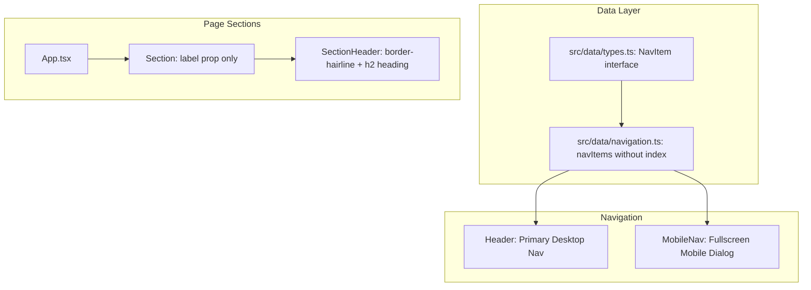

# Requirements

### Overview & Goals
The portfolio currently renders numeric section indexes (e.g., `01`, `02`, `01 / Selected Work`) across the sticky desktop header, full-screen mobile navigation, section headers, and section containers. This numeric prefixing creates redundant visual repetition (e.g., rendering `01 / Selected Work` directly above `Selected Work` in `SectionHeader`) and adds unnecessary visual noise.

The goal is to remove numeric indexing across the application while preserving semantic HTML landmarks, accessible ARIA labels, responsive styling, and 100% unit test coverage.

### Scope
- **In Scope**:
  - Removing `index: string` from the `NavItem` type in `src/data/types.ts`.
  - Removing `index` properties (`'01'`, `'02'`, `'03'`, `'04'`, `'05'`) from `navItems` in `src/data/navigation.ts`.
  - Removing the numeric index `<span>` elements from `Header` (`src/components/layout/Header.tsx`) and `MobileNav` (`src/components/layout/MobileNav.tsx`).
  - Removing `index` prop from `SectionHeader` (`src/components/layout/SectionHeader.tsx`) and removing the duplicate `<Eyebrow>{index} / {label}</Eyebrow>` display.
  - Removing `index?: string` from `SectionProps` in `src/components/layout/Section.tsx`, rendering `SectionHeader` when `label` is provided.
  - Updating all `<Section>` usages in `src/App.tsx` to omit `index` (e.g., `<Section id="work" label="Selected Work">`).
  - Updating unit test suites for `Header`, `MobileNav`, `Section`, `SectionHeader`, and `App` to maintain 100% test coverage.
  - Updating documentation in `docs/architecture.md`, `docs/decisions.md`, and `docs/concerns.md`.
- **Out of Scope**:
  - Modifying the principle card ordering numbers inside `HowIWork` (e.g., `01`, `02` for principles).
  - Removing or changing section IDs (`#work`, `#how-i-work`, `#about`, `#technologies`, `#contact`) or scroll-spy logic.
  - Modifying the atomic `Eyebrow` UI primitive in `src/components/ui/Eyebrow.tsx`.

### User Stories
- As a site visitor, I want clean, elegant section headings and navigation labels without redundant index numbers so that the typography feels modern and editorial.
- As a developer, I want a simplified `Section` component API where passing `label="Selected Work"` automatically renders the section heading without needing to manually synchronize numeric index strings.

### Functional Requirements
1. **Navigation Links**:
   - Desktop navigation in `Header` displays only the section `label` (with active indicator underline and color transitions) without leading numeric indexes.
   - Mobile navigation in `MobileNav` displays only the section `label` without leading numeric indexes.
2. **Section Headers**:
   - `SectionHeader` renders a top hairline separator (`border-hairline border-t`) and the `<h2>` heading with the given `label` and `headingId`.
   - The redundant `<Eyebrow>` rendering `${index} / ${label}` is removed from `SectionHeader`.
3. **Section Container**:
   - `Section` renders `SectionHeader` when `label` is provided (e.g., `label && <SectionHeader label={label} headingId={`${id}-heading`} />`), removing reliance on `index`.
   - `App.tsx` composes sections cleanly without `index` props (e.g., `<Section id="work" label="Selected Work">`).

### Non-Functional Requirements
- **Accessibility**: Maintain semantic `<section>` landmark regions with `aria-labelledby` linked to `<h2>` headings, valid heading hierarchy (`<h1>` in Hero, `<h2>` in SectionHeader, `<h3>` in cards/principles).
- **Test Coverage**: 100% branch, statement, function, and line coverage maintained across all unit test suites.
- **Documentation**: All architectural documents in `docs/` synchronized with the simplified component contracts.

# Technical Design

### Current Implementation
Currently, section indexing is threaded through multiple layers:
1. `src/data/types.ts`: `NavItem` declares `index: string`.
2. `src/data/navigation.ts`: `navItems` defines `{ id: 'work', label: 'Selected Work', index: '01' }`, etc.
3. `src/components/layout/Header.tsx`: Renders `<span className="text-mono-xs mr-1.5 font-mono ...">{item.index}</span>`.
4. `src/components/layout/MobileNav.tsx`: Renders `<span className="text-mono-xs font-mono">{item.index}</span>`.
5. `src/components/layout/SectionHeader.tsx`: Requires `index: string` and renders `<Eyebrow as="p">{index} / {label}</Eyebrow>` followed by `<h2 id={headingId}>{label}</h2>`.
6. `src/components/layout/Section.tsx`: Checks `{index && label && <SectionHeader index={index} label={label} ... />}`.
7. `src/App.tsx`: Passes `index="01"`, `index="02"`, etc. to each `<Section>`.

### Key Decisions
1. **Remove `index` from `NavItem` and Navigation Components**:
   - *Decision*: Strip `index` from `NavItem` interface and remove the numeric span elements in `Header` and `MobileNav`.
   - *Rationale*: Keeps navigation items focused purely on route ID and label, eliminating data clutter and visual noise.
2. **Streamline `SectionHeader` to Hairline Divider + Heading**:
   - *Decision*: Remove `index` prop and the duplicate `Eyebrow` text from `SectionHeader`. Retain the top hairline divider (`border-hairline border-t`) and the `<h2>` heading.
   - *Rationale*: Resolves the awkward repetition where "01 / Selected Work" sat immediately above "Selected Work", preserving clean visual spacing and landmark hierarchy.
3. **Trigger `SectionHeader` on `label` Presence in `Section`**:
   - *Decision*: Update `Section` so that `label && <SectionHeader label={label} headingId={`${id}-heading`} />` renders whenever `label` is passed.
   - *Rationale*: Simplifies the component API and matches the user's desired usage: `<Section id="work" label="Selected Work">`.

### Proposed Changes

#### Data Layer (`src/data/types.ts` & `src/data/navigation.ts`)
```typescript
// src/data/types.ts
export interface NavItem {
    id: string;
    label: string;
}

// src/data/navigation.ts
export const navItems: readonly NavItem[] = [
    { id: 'work', label: 'Selected Work' },
    { id: 'how-i-work', label: 'How I Work' },
    { id: 'about', label: 'About' },
    { id: 'technologies', label: 'Technologies' },
    { id: 'contact', label: 'Contact' },
] as const;
```

#### Navigation Components (`src/components/layout/Header.tsx` & `MobileNav.tsx`)
In `Header.tsx`:
```tsx
<a
    href={`#${item.id}`}
    aria-current={isActive ? 'true' : undefined}
    className={`group relative py-1 text-sm font-medium transition-colors ${
        isActive ? 'text-ink font-semibold' : 'text-ink-muted hover:text-ink'
    }`}
>
    <span>{item.label}</span>
    <span
        className={`absolute inset-x-0 -bottom-1 h-0.5 rounded-full transition-all duration-200 ${
            isActive
                ? 'bg-accent scale-x-100 opacity-100'
                : 'bg-ink/30 group-hover:scale-x-100 group-hover:opacity-100 group-focus-visible:scale-x-100 group-focus-visible:opacity-100'
        }`}
    />
</a>
```

In `MobileNav.tsx`:
```tsx
<a
    href={`#${item.id}`}
    onClick={onClose}
    aria-current={isActive ? 'true' : undefined}
    className={`flex min-h-11 items-center text-[32px] transition-colors ${
        isActive ? 'text-accent font-semibold' : 'text-ink-muted hover:text-ink'
    }`}
>
    <span>{item.label}</span>
</a>
```

#### Layout Components (`src/components/layout/SectionHeader.tsx` & `Section.tsx`)
In `SectionHeader.tsx`:
```tsx
export interface SectionHeaderProps {
    label: string;
    headingId: string;
    className?: string;
}

export function SectionHeader({ label, headingId, className = '' }: SectionHeaderProps) {
    return (
        <header className={`flex flex-col gap-3 ${className}`.trim()}>
            <div className="border-hairline border-t" />
            <h2 id={headingId} className="text-h2 text-ink font-semibold tracking-tight">
                {label}
            </h2>
        </header>
    );
}
```

In `Section.tsx`:
```tsx
export interface SectionProps {
    id: string;
    label?: string;
    variant?: 'default' | 'plain';
    background?: React.ReactNode;
    className?: string;
    children: React.ReactNode;
}

export function Section({ id, label, variant = 'default', background, className = '', children }: SectionProps) {
    const isPlain = variant === 'plain';
    const sectionClass =
        `${background ? 'relative isolate ' : ''}reveal py-section scroll-mt-(--header-height) ${className}`.trim();

    return (
        <section id={id} aria-labelledby={!isPlain ? `${id}-heading` : undefined} className={sectionClass}>
            {background ? (
                <div aria-hidden="true" className="pointer-events-none absolute inset-0 -z-10 overflow-hidden">
                    {background}
                </div>
            ) : null}
            {isPlain ? (
                <Container>{children}</Container>
            ) : (
                <Container grid>
                    <div className="mb-8 lg:col-span-3 lg:mb-0">
                        {label && <SectionHeader label={label} headingId={`${id}-heading`} />}
                    </div>
                    <div className="lg:col-span-8 lg:col-start-5">{children}</div>
                </Container>
            )}
        </section>
    );
}
```

#### Application Root (`src/App.tsx`)
```tsx
{/* Hero */}
<Section id="hero" variant="plain">
    <Hero />
</Section>

{/* Selected Work */}
<Section id="work" label="Selected Work">
    <SelectedWork />
</Section>

{/* How I Work */}
<Section id="how-i-work" label="How I Work">
    <HowIWork />
</Section>

{/* About */}
<Section id="about" label="About">
    <About />
</Section>

{/* Technologies */}
<Section id="technologies" label="Technologies">
    <Technologies />
</Section>

{/* Contact */}
<Section id="contact" label="Contact">
    <Contact />
</Section>
```

### Architecture Diagram


### File Structure Changes
- Modified:
  - `src/data/types.ts`
  - `src/data/navigation.ts`
  - `src/components/layout/Header.tsx`
  - `src/components/layout/MobileNav.tsx`
  - `src/components/layout/SectionHeader.tsx`
  - `src/components/layout/Section.tsx`
  - `src/App.tsx`
  - `src/components/layout/Header.test.tsx`
  - `src/components/layout/MobileNav.test.tsx`
  - `src/components/layout/SectionHeader.test.tsx`
  - `src/components/layout/Section.test.tsx`
  - `src/App.test.tsx`
  - `docs/architecture.md`
  - `docs/decisions.md`
  - `docs/concerns.md`

# Testing

### Validation Approach
Following mandatory Test-Driven Development (TDD) guidelines, all component and layout changes are validated with unit tests in Vitest and end-to-end tests in Playwright. 100% test coverage (lines, statements, branches, functions) is enforced.

### Key Scenarios
1. **Header Navigation Rendering**:
   - `Header.test.tsx`: Validates that desktop links render section labels without index numbers and properly apply active states.
2. **Mobile Navigation Rendering**:
   - `MobileNav.test.tsx`: Validates that mobile links render section labels without index numbers and maintain dialog accessibility.
3. **Section Header Component**:
   - `SectionHeader.test.tsx`: Validates that `SectionHeader` renders `<h2>` heading with the provided `label` and `headingId`, without index or font-sans overrides.
4. **Section Layout Component**:
   - `Section.test.tsx`: Validates that `<Section id="work" label="Selected Work">` sets `aria-labelledby="work-heading"` and renders the `SectionHeader`, while omitting the header when `label` is omitted.
5. **Application Composition**:
   - `App.test.tsx`: Validates that all 5 section headers render `<h2>` headings, the heading hierarchy remains valid, and navigation scroll-spy continues to function.
6. **E2E & Accessibility**:
   - Playwright test suite (`npm run test:e2e`) runs across desktop, tablet, and mobile viewports with zero a11y or navigation regressions.

### Test Changes
- `src/components/layout/Header.test.tsx`: Update `mockNavItems` fixture to match new `NavItem` type.
- `src/components/layout/MobileNav.test.tsx`: Update `mockNavItems` fixture to match new `NavItem` type.
- `src/components/layout/SectionHeader.test.tsx`: Remove checks for `'01 / Selected Work'`, assert `<h2>` heading with `label`.
- `src/components/layout/Section.test.tsx`: Remove `index="01"` from render calls, assert header renders when `label` is present and is omitted when `label` is absent.
- `src/App.test.tsx`: Confirm heading count and hierarchy with updated section props.

# Delivery Steps

### ✓ Step 1: Update navigation data contracts and layout navigation components
Section indexes are removed from the data contract and all navigation surfaces.

- Update `NavItem` in `src/data/types.ts` to remove the `index: string` property.
- Update `navItems` in `src/data/navigation.ts` to remove `index` values (`'01'`, `'02'`, `'03'`, `'04'`, `'05'`).
- Update `src/components/layout/Header.tsx` to remove the index `<span>` from desktop navigation links.
- Update `src/components/layout/MobileNav.tsx` to remove the index `<span>` from mobile navigation dialog links.
- Update `src/components/layout/Header.test.tsx` and `src/components/layout/MobileNav.test.tsx` mock fixtures and assertions.
- Maintain 100% unit test coverage for navigation components.

### ✓ Step 2: Refactor Section and SectionHeader layout components and integrate in App
The Section and SectionHeader components no longer require or display index numbers, and App.tsx passes only section labels.

- Refactor `SectionHeaderProps` and `SectionHeader` in `src/components/layout/SectionHeader.tsx` to remove the `index` property and the `Eyebrow` component rendering `${index} / ${label}`.
- Refactor `SectionProps` and `Section` in `src/components/layout/Section.tsx` to remove the `index` prop and evaluate header rendering based on `Boolean(label)`.
- Update `src/App.tsx` section instances to pass only `id` and `label` (e.g., `<Section id="work" label="Selected Work">`), updating comment annotations.
- Update `src/components/layout/SectionHeader.test.tsx`, `src/components/layout/Section.test.tsx`, and `src/App.test.tsx` to reflect the simplified header structure.
- Maintain 100% unit test coverage across all modified layout components.

### ✓ Step 3: Synchronize project documentation and verify all quality gates
Project documentation is fully synchronized with the architectural change and all quality gates pass cleanly.

- Update `docs/architecture.md` to reflect un-indexed `NavItem` contracts and simplified `SectionHeader` layout structure.
- Add Decision 40 in `docs/decisions.md` documenting the rationale for removing numeric section prefixes in favor of cleaner typography and navigation hierarchy.
- Update `docs/concerns.md` to revise section heading and document structure references.
- Execute full quality gate suite (`npm run typecheck`, `npm run lint`, `npm run format:check`, `npm run test:coverage`, `npm run build`, `npm run test:e2e`) verifying 100% unit coverage and zero regressions.