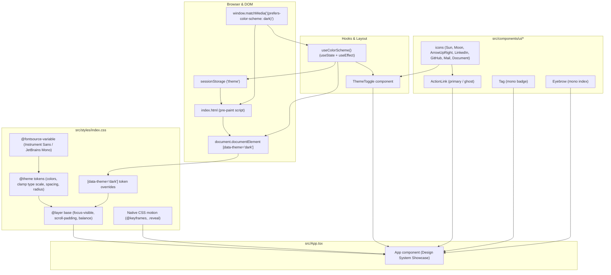

# Requirements

### Overview & Goals
The objective of this task is to deliver **Step 2** of the personal landing portfolio roadmap (`.junie/plans/personal-landing-portfolio-mvp.md`): building the **cool ink & cobalt design token layer**, self-hosted variable typography system, zero-flash `sessionStorage`-backed light/dark mode switching using semantic `data-theme` attributes, a simple KISS `useColorScheme` hook, inline SVG icon primitives, and foundational atomic UI components (`ActionLink`, `Tag`, `Eyebrow`).

This establishes the visual and functional design system used across all subsequent sections (Hero, Selected Work, How I Work, About, Technologies, Contact).

---

### Scope

#### In Scope (Step 2)
- Installing self-hosted variable fonts `@fontsource-variable/instrument-sans` and `@fontsource-variable/jetbrains-mono` (with zero external state libraries or heavy dependencies).
- Configuring Tailwind CSS v4 CSS-first design tokens in `src/styles/index.css` via `@theme` (cool ink & cobalt palette, fluid `clamp()` type scale, spacing rhythm, `--radius-sm`, `--header-height`).
- Configuring `@custom-variant dark (&:where([data-theme="dark"], [data-theme="dark"] *))` and the `[data-theme="dark"]` attribute token overrides (avoiding `.dark` class on the root element).
- Writing `@layer base` rules: body defaults, `scroll-padding-top`, global `:focus-visible` rings, hairline defaults, and heading text wrapping (`text-wrap: balance`).
- Implementing the motion layer: `@keyframes reveal-in`, `@keyframes hero-rise`, and `.reveal` scroll timeline utilities under `@supports (animation-timeline: view())` inside `@media (prefers-reduced-motion: no-preference)`.
- Adding the pre-paint color scheme inline script to `index.html` to inspect `sessionStorage.getItem('theme')` (with fallback to `window.matchMedia('(prefers-color-scheme: dark)')`) and set `data-theme` on `<html>` before first paint, eliminating theme flashes.
- Creating a clean, lightweight, KISS `src/hooks/useColorScheme.ts` hook:
  - Uses standard React built-in hooks (`useState` with lazy initializer function and `useEffect` for media query subscription).
  - Reads initial theme synchronously on initial render with zero mount-time `setState` calls and zero extra re-renders.
  - Subscribes to OS `matchMedia` change events in `useEffect` with proper event listener cleanup.
  - Persists manual user theme overrides in `sessionStorage` (retained across page reloads in the same tab, while new tabs/windows start fresh with system defaults).
  - Updates `document.documentElement.setAttribute('data-theme', theme)` on toggle without setting classes on `<html>`.
  - Zero external state or streaming libraries (100% standard React, fully compliant with KISS and project architectural constraints).
- Implementing `src/components/layout/ThemeToggle.tsx` with `aria-pressed`, `aria-label`, visible focus indicator, and minimum 44×44px tap targets.
- Creating self-contained SVG icon primitives in `src/components/ui/icons/` (`LinkedInIcon`, `GitHubIcon`, `ArrowUpRightIcon`, `ArrowRightIcon`, `MailIcon`, `SunIcon`, `MoonIcon`, `DocumentIcon`).
- Implementing foundational atomic UI components:
  - `src/components/ui/ActionLink.tsx` (primary and ghost variants, external link security & screen-reader hints).
  - `src/components/ui/Tag.tsx` (mono technology tags/badges).
  - `src/components/ui/Eyebrow.tsx` (mono numbered section headers).
- Creating a showcase in `src/App.tsx` verifying design tokens, fonts, theme switching, and UI primitives.
- Updating documentation in `docs/architecture.md`, `docs/decisions.md`, and `docs/concerns.md`.
- Passing all quality gates (`npm run typecheck`, `npm run lint`, `npm run format:check`, `npm run build`).

#### Out of Scope (Deferred to Later Steps)
- Content data layer files in `src/data/` (Step 3).
- Responsive layout shell (Sticky Header, Mobile Nav disclosure, Index Rail, Skip Link, Footer) (Step 4).
- Section implementations: Hero, Selected Work, ProjectCard, How I Work, About, Technologies, Contact (Steps 5 & 6).
- External UI component libraries (MUI, Radix, shadcn) or external icon libraries (Lucide, FontAwesome).
- Persistent cross-tab or cross-session storage in `localStorage` / cookies (explicitly restricted to per-tab `sessionStorage`).

---

### User Stories
- As a **visitor**, I want the site to immediately match my OS color scheme on initial load without flashing or jumping so that reading is comfortable right away.
- As a **visitor**, I want to manually toggle between light and dark modes during my browsing session and have my choice stay active across page reloads in the same tab.
- As a **visitor opening a new tab or window**, I want the site to open with my system default color scheme rather than carrying over manual session overrides from other tabs.
- As a **keyboard or screen-reader user**, I want distinct `:focus-visible` focus rings, semantic icons, and clear accessibility attributes on all interactive controls.
- As an **engineer building subsequent sections**, I want semantic design tokens, fluid typography classes, simple and robust theme state, and reusable UI primitives (`ActionLink`, `Tag`, `Eyebrow`) so that building sections in Steps 3–6 is rapid and consistent.

---

### Functional Requirements
- **Pre-paint Theme Script**:
  - An inline script in `index.html` `<head>` reads `sessionStorage.getItem('theme')`.
  - If a saved session preference exists (`'dark'` or `'light'`), it applies `document.documentElement.setAttribute('data-theme', sessionTheme)`.
  - If no session preference exists, it evaluates `window.matchMedia('(prefers-color-scheme: dark)').matches` and applies `data-theme="dark"` (or defaults to light without classes) before first paint.
- **KISS Theme Hook (`useColorScheme`)**:
  - Initializes state lazily via `useState(resolveInitialTheme)` to read initial theme synchronously during first render with zero mount-time `setState` calls.
  - Subscribes to `change` events on `window.matchMedia('(prefers-color-scheme: dark)')` in `useEffect` and cleans up the listener on unmount.
  - Automatically updates theme on OS change as long as no manual override is saved in `sessionStorage`.
  - Exposes `toggle()` and `setTheme()` functions that update `document.documentElement`, write to `sessionStorage`, and update React state.
  - Minimal, lightweight, and 100% idiomatic React without external state libraries.
- **ThemeToggle Component**:
  - Renders a semantic `<button>` with `aria-pressed`, `aria-label="Toggle color scheme"`, visible `:focus-visible` ring, and minimum 44×44px interactive target.
  - Displays `SunIcon` when dark mode is active and `MoonIcon` when light mode is active.
- **ActionLink Component**:
  - Supports `variant="primary"` (solid cobalt button style) and `variant="ghost"` (understated hairline/border style).
  - When `isExternal` or `href` starts with `http`/`https`, automatically renders `target="_blank"`, `rel="noopener noreferrer"`, trailing `ArrowUpRightIcon`, and visually hidden `<span className="sr-only">(opens in a new tab)</span>`.
  - Can render as `<a>` or `<button>`.
- **Tag Component**:
  - Renders compact mono tags with subtle border (`border-hairline`), background (`bg-surface`), and uppercase mono typography (`font-mono text-mono-xs`).
- **Eyebrow Component**:
  - Renders uppercase mono section markers (`01 / SELECTED WORK`) with letterspacing (`tracking-[0.08em]`).
- **SVG Icons**:
  - Hand-crafted SVG primitives using `fill="none"`, `stroke="currentColor"`, and `aria-hidden="true"`.

---

### Non-Functional Requirements
- **Typography & Font Loading**: Self-hosted variable fonts `@fontsource-variable/instrument-sans` and `@fontsource-variable/jetbrains-mono` bundled via Vite, avoiding external CDN requests and layout shifts.
- **Accessibility & Contrast**:
  - All light and dark mode color pairs meet WCAG AA standards (≥ 4.5:1 for body copy, ≥ 3:1 for large headings and UI borders).
  - All interactive elements have a visible `outline: 2px solid var(--color-accent)` with `outline-offset: 3px`.
  - Tap targets meet the 44×44px minimum sizing guideline.
- **Motion Accessibility**:
  - All scroll animations, transitions, and keyframes are gated inside `@media (prefers-reduced-motion: no-preference)`.
- **Code Quality**:
  - TypeScript strict mode with zero `any` types.
  - Zero ESLint errors or warnings with `jsx-a11y` enabled.
  - 100% Prettier formatting compliance with Tailwind class sorting.

# Technical Design

### Current Implementation
The repository contains the toolchain configured in Step 1 (Vite 8, React 19, TypeScript, Tailwind CSS v4 with `@tailwindcss/vite`, ESLint 9 flat config with `jsx-a11y`, Prettier).
- `src/styles/index.css` currently contains only `@import 'tailwindcss';`.
- `index.html` has standard metadata but lacks the pre-paint dark mode script.
- No fonts, design tokens, hooks, or UI primitives are currently implemented.

---

### Key Decisions

| Decision | Choice | Rationale |
|---|---|---|
| **Design Token Layer** | Tailwind CSS v4 `@theme` in `src/styles/index.css` | Native CSS custom properties, zero `tailwind.config.js` overhead, instant Vite compilation, and unified token names across light/dark modes. |
| **Theme Strategy** | Semantic `data-theme="dark"` attribute on `document.documentElement` | Keeps `class` list completely clean of styling toggles, aligns with modern design token architectures, and allows clean CSS attribute targeting. |
| **Tailwind Variant** | `@custom-variant dark (&:where([data-theme="dark"], [data-theme="dark"] *))` | Enables standard Tailwind `dark:` utility classes targeting the `[data-theme="dark"]` DOM attribute. |
| **Theme Persistence** | `sessionStorage` per-tab storage | Retains the user's manual selection across page reloads in the active tab, while ensuring any newly opened tab or window defaults cleanly to OS system settings. |
| **Theme Hook Architecture (KISS)** | Idiomatic React hook (`useState(resolveInitialTheme)` + `useEffect` media listener) | Adheres strictly to KISS (Keep It Simple, Stupid) and project guidelines (zero external state libraries). Lazy initial state reads DOM/session synchronously on first render with zero mount-time `setState` or double renders, while `useEffect` cleanly manages OS `matchMedia` change listeners and teardown. |
| **Zero-Flash Theming** | Inline `<script>` in `<head>` | Synchronously inspects `sessionStorage` and `matchMedia` before initial paint and applies `data-theme="dark"` / `data-theme="light"` immediately, preventing FOUC (flash of unstyled content). |
| **Self-Hosted Variable Fonts** | `@fontsource-variable/instrument-sans` + `@fontsource-variable/jetbrains-mono` | Zero external network calls, fast local hashing by Vite, zero layout shifts, and full variable weight flexibility. |
| **Zero External UI / Icon Libraries** | Bespoke inline SVG icons & atomic React components | Eliminates heavy dependency weight (Lucide, Radix, MUI) while delivering pixel-perfect accessible primitives tailored to the editorial design. |
| **CSS-Driven Scroll Reveals** | Native `animation-timeline: view()` guarded by `@supports` | Runs animations off the main thread with zero JS animation library cost, gracefully degrading to static visibility. |

---

### Proposed Changes & Token Specifications

#### 1. Variable Font Registration (`src/main.tsx`)
```tsx
import { StrictMode } from 'react';
import { createRoot } from 'react-dom/client';
import '@fontsource-variable/instrument-sans';
import '@fontsource-variable/jetbrains-mono';
import '@/styles/index.css';
import App from '@/App';

createRoot(document.getElementById('root')!).render(
    <StrictMode>
        <App />
    </StrictMode>,
);
```

#### 2. Pre-Paint Script in `index.html`
```html
<script>
    (function () {
        try {
            var theme = sessionStorage.getItem('theme');
            if (theme === 'dark' || (!theme && window.matchMedia('(prefers-color-scheme: dark)').matches)) {
                document.documentElement.setAttribute('data-theme', 'dark');
            } else if (theme === 'light') {
                document.documentElement.setAttribute('data-theme', 'light');
            }
        } catch (_) {
            if (window.matchMedia('(prefers-color-scheme: dark)').matches) {
                document.documentElement.setAttribute('data-theme', 'dark');
            }
        }
    })();
</script>
```

#### 3. Styling & Token Definition (`src/styles/index.css`)
```css
@import 'tailwindcss';

@custom-variant dark (&:where([data-theme='dark'], [data-theme='dark'] *));

@theme {
    /* Color Palette - Light Default */
    --color-canvas: #f4f5f7;
    --color-surface: #ffffff;
    --color-ink: #14161a;
    --color-ink-muted: #5a6070;
    --color-hairline: #dde0e6;
    --color-accent: #2b4bff;
    --color-accent-hover: #1e3ce0;

    /* Typography */
    --font-sans: 'Instrument Sans Variable', system-ui, -apple-system, sans-serif;
    --font-mono: 'JetBrains Mono Variable', ui-monospace, monospace;

    /* Fluid Type Scale */
    --text-display: clamp(2.75rem, 1.6rem + 5.2vw, 6.5rem);
    --text-h2: clamp(1.75rem, 1.2rem + 2.2vw, 3rem);
    --text-h3: clamp(1.25rem, 1.05rem + 0.8vw, 1.75rem);
    --text-lead: clamp(1.125rem, 1rem + 0.4vw, 1.375rem);
    --text-body: clamp(0.9375rem, 0.9rem + 0.15vw, 1.0625rem);
    --text-mono-xs: 0.75rem;

    /* Spacing & Sizing */
    --spacing-section: clamp(5rem, 3rem + 8vw, 10rem);
    --header-height: 4rem;
    --radius-sm: 4px;
}

/* Dark Mode Token Overrides via Data Attribute */
[data-theme='dark'] {
    --color-canvas: #0d0f12;
    --color-surface: #14171c;
    --color-ink: #e9eaee;
    --color-ink-muted: #9aa1ae;
    --color-hairline: #232830;
    --color-accent: #7d95ff;
    --color-accent-hover: #9bb0ff;
}

/* Base Layer Defaults */
@layer base {
    html {
        scroll-padding-top: var(--header-height);
    }

    body {
        @apply bg-canvas text-ink font-sans antialiased;
        min-height: 100vh;
    }

    h1,
    h2,
    h3 {
        text-wrap: balance;
    }

    :focus-visible {
        outline: 2px solid var(--color-accent);
        outline-offset: 3px;
    }
}

/* Motion & Animation */
@media (prefers-reduced-motion: no-preference) {
    html {
        scroll-behavior: smooth;
    }

    @supports (animation-timeline: view()) {
        .reveal {
            animation: reveal-in linear both;
            animation-timeline: view();
            animation-range: entry 8% cover 26%;
        }
    }
}

@keyframes reveal-in {
    from {
        opacity: 0;
        transform: translateY(1.25rem);
    }
    to {
        opacity: 1;
        transform: none;
    }
}

@keyframes hero-rise {
    from {
        opacity: 0;
        transform: translateY(1rem);
    }
    to {
        opacity: 1;
        transform: none;
    }
}
```

#### 4. KISS Color Scheme Hook (`src/hooks/useColorScheme.ts`)
```tsx
import { useEffect, useState } from 'react';

export type ColorScheme = 'light' | 'dark';

export const THEME_STORAGE_KEY = 'theme';

function resolveInitialTheme(): ColorScheme {
    if (typeof window === 'undefined') return 'light';
    try {
        const stored = sessionStorage.getItem(THEME_STORAGE_KEY);
        if (stored === 'dark' || stored === 'light') {
            return stored;
        }
    } catch (_) {}

    const domTheme = document.documentElement.getAttribute('data-theme');
    if (domTheme === 'dark' || domTheme === 'light') {
        return domTheme;
    }

    return window.matchMedia('(prefers-color-scheme: dark)').matches ? 'dark' : 'light';
}

export function useColorScheme() {
    const [theme, setThemeState] = useState<ColorScheme>(resolveInitialTheme);

    useEffect(() => {
        const mediaQuery = window.matchMedia('(prefers-color-scheme: dark)');

        const handleMediaChange = (e: MediaQueryListEvent) => {
            let hasSessionOverride = false;
            try {
                hasSessionOverride = sessionStorage.getItem(THEME_STORAGE_KEY) !== null;
            } catch (_) {}

            if (!hasSessionOverride) {
                const nextTheme: ColorScheme = e.matches ? 'dark' : 'light';
                document.documentElement.setAttribute('data-theme', nextTheme);
                setThemeState(nextTheme);
            }
        };

        mediaQuery.addEventListener('change', handleMediaChange);
        return () => mediaQuery.removeEventListener('change', handleMediaChange);
    }, []);

    const setTheme = (nextTheme: ColorScheme) => {
        setThemeState(nextTheme);
        document.documentElement.setAttribute('data-theme', nextTheme);
        try {
            sessionStorage.setItem(THEME_STORAGE_KEY, nextTheme);
        } catch (_) {}
    };

    const toggle = () => {
        setTheme(theme === 'dark' ? 'light' : 'dark');
    };

    return {
        theme,
        toggle,
        setTheme,
        isDark: theme === 'dark',
    };
}
```

#### 5. ThemeToggle Component (`src/components/layout/ThemeToggle.tsx`)
- Renders an accessible `<button>` toggling between light and dark modes with `aria-pressed={isDark}`, `aria-label="Toggle color scheme"`, visible `:focus-visible` styling, and minimum 44×44px hit area.
- Swaps between `SunIcon` (when dark mode is active) and `MoonIcon` (when light mode is active).

#### 6. UI Primitives
- `src/components/ui/ActionLink.tsx`:
  - Props: `href`, `children`, `variant?: 'primary' | 'ghost'`, `isExternal?: boolean`, `download?: boolean | string`, `className?: string`, `onClick?: () => void`.
  - Accessible anchor/button rendering with auto-appended `ArrowUpRightIcon` and `<span className="sr-only">(opens in a new tab)</span>`.
- `src/components/ui/Tag.tsx`:
  - Renders inline technology badge with `font-mono text-mono-xs uppercase tracking-wider bg-surface border border-hairline px-2.5 py-1 rounded-[var(--radius-sm)]`.
- `src/components/ui/Eyebrow.tsx`:
  - Renders mono numbered eyebrow (`01 / SECTION`) with `font-mono text-mono-xs uppercase tracking-[0.08em] text-ink-muted`.
- `src/components/ui/icons/index.tsx`:
  - SVG components: `LinkedInIcon`, `GitHubIcon`, `ArrowUpRightIcon`, `ArrowRightIcon`, `MailIcon`, `SunIcon`, `MoonIcon`, `DocumentIcon`.

---

### File Structure
```
index.html                  # Pre-paint theme detection script (sessionStorage + matchMedia -> data-theme)
docs/
  architecture.md           # Synchronized with tokens, data-theme, sessionStorage & UI primitives
  decisions.md              # Synchronized with data-theme & session-scoped storage decision
  concerns.md               # Synchronized with contrast & reduced-motion guards
src/
  main.tsx                  # Font imports & React root mount
  App.tsx                   # Showcase container verifying design tokens & UI components
  styles/
    index.css               # Tailwind v4 @theme, [data-theme="dark"] overrides, @layer base, motion keyframes
  hooks/
    useColorScheme.ts       # sessionStorage-backed data-theme hook
  components/
    layout/
      ThemeToggle.tsx       # Accessible theme switch button
    ui/
      ActionLink.tsx        # Primary/ghost button & external link component
      Tag.tsx               # Mono tag primitive
      Eyebrow.tsx           # Mono numbered section eyebrow primitive
      icons/
        index.tsx           # Handcrafted SVG icons
```

---

### Architecture Diagram



---

### Risks & Mitigations

| Risk | Mitigation |
|---|---|
| **Accent contrast ratio in dark mode** | The primary cobalt accent `#2B4BFF` shifts to lightened `#7D95FF` under `[data-theme="dark"]`, guaranteeing WCAG AA compliance (≥ 4.5:1 against canvas/surface). |
| **Theme flash before JavaScript hydration** | The synchronous pre-paint script in `index.html` checks `sessionStorage` and `prefers-color-scheme` to set `data-theme` on `<html>` before any DOM nodes render. |
| **Mount-time state synchronization & useEffect anti-patterns** | Lazy initial state `useState(resolveInitialTheme)` reads the current theme synchronously on first render. `useEffect` is solely used for event subscription (`matchMedia.addEventListener('change')`) and cleanup, completely avoiding mount-time `setState` calls, double renders, and hydration flashing. |
| **Storage unavailability in restricted iframe or private mode** | All `sessionStorage` accesses are wrapped in `try/catch` blocks with seamless fallback to DOM attribute and `matchMedia`. |
| **Cross-tab contamination of theme preferences** | Using `sessionStorage` guarantees per-tab isolation — newly opened tabs and windows start with empty storage and cleanly resolve to system defaults. |
| **Motion discomfort or vestibular triggers** | All animation keyframes, transitions, and scroll timeline rules are strictly encapsulated inside `@media (prefers-reduced-motion: no-preference)`. |
| **Missing external link hints for screen readers** | `ActionLink` automatically injects `<span className="sr-only">(opens in a new tab)</span>` whenever `isExternal` is set. |
| **Touch target sizing on mobile devices** | `ThemeToggle` and `ActionLink` enforce `min-h-[44px] min-w-[44px]` touch target sizing. |

# Testing

### Validation Approach
Verification relies on toolchain quality gates, automated TypeScript and lint checks, and interactive visual confirmation of the design system showcase rendered by `src/App.tsx`.

---

### Quality Gates Run During Validation
```bash
npm run typecheck      # tsc -b --noEmit (0 TypeScript errors)
npm run lint           # eslint . (0 errors, 0 warnings, jsx-a11y passing)
npm run format:check   # prettier --check . (clean formatting)
npm run build          # vite build (successful production bundle)
```

---

### Key Scenarios

1. **Pre-Paint Color Scheme Detection & Zero-Flash**:
   - Verify that loading the page with OS dark mode immediately applies `data-theme="dark"` to `document.documentElement` before first paint without flashing light styles.
2. **Session Persistence on Page Reload**:
   - Click `ThemeToggle` to toggle the active theme.
   - Verify `sessionStorage.getItem('theme')` contains the selected value and `document.documentElement.getAttribute('data-theme')` updates.
   - Reload the page in the same tab: verify the selected theme persists without resetting to system defaults and without flashing.
3. **New Tab / Window System Default Isolation**:
   - Verify that opening a new tab or window does not inherit the previous tab's `sessionStorage` override and initializes using the OS system preference.
4. **Dynamic OS Theme Updates**:
   - Verify that prior to any manual toggle in the session, changing the operating system color scheme dynamically updates the webpage theme in real time.
5. **Interactive Controls & Accessibility**:
   - Verify `ThemeToggle` toggles `aria-pressed`, swaps `SunIcon`/`MoonIcon`, and retains visible focus rings when navigated via keyboard (`Tab` / `Shift+Tab`).
6. **Typography, ActionLink, Tag, Eyebrow Showcase**:
   - Verify all typography scales, `Tag`, `Eyebrow`, and `ActionLink` render properly in both light and dark (`[data-theme="dark"]`) modes in `src/App.tsx`.

---

### Edge Cases
- **`sessionStorage` Disabled / Restricted**: Verify that if storage throws an exception (e.g. strict privacy sandboxing), the theme hook gracefully falls back to memory state and `matchMedia` without crashing.
- **`prefers-reduced-motion: reduce`**: Verify that with reduced motion enabled, all scroll animations and entrance keyframes are disabled and elements remain fully visible.
- **Narrow 320px Viewport**: Confirm all primitives and showcase components fit within 320px viewport without causing horizontal scrolling (`scrollWidth === clientWidth`).

# Delivery Steps

### ✓ Step 1: Install font packages, import variable typography, and configure HTML pre-paint theme script
Install `@fontsource-variable/instrument-sans` and `@fontsource-variable/jetbrains-mono` as project dependencies, import them in `src/main.tsx`, and add the pre-paint `data-theme` and `sessionStorage` script to `index.html`.

- Run `npm install @fontsource-variable/instrument-sans @fontsource-variable/jetbrains-mono` to install self-hosted variable font packages.
- Import `@fontsource-variable/instrument-sans` and `@fontsource-variable/jetbrains-mono` in `src/main.tsx`.
- Update `index.html` `<head>` with an inline pre-paint script that inspects `sessionStorage.getItem('theme')` (with fallback to `window.matchMedia('(prefers-color-scheme: dark)').matches`) and applies `data-theme="dark"` or `data-theme="light"` to `document.documentElement` before first paint.

### ✓ Step 2: Implement Tailwind CSS v4 design tokens, fluid typography, data-theme dark overrides, and base motion layer
Define the full cool ink & cobalt palette, fluid typography clamp scales, spacing rhythm, radius, `[data-theme="dark"]` attribute variants, and native CSS motion layer in `src/styles/index.css`.

- Configure `@custom-variant dark (&:where([data-theme="dark"], [data-theme="dark"] *));` in `src/styles/index.css` for Tailwind CSS v4 data-attribute theming.
- Add the `@theme` block defining semantic color tokens (`--color-canvas: #F4F5F7`, `--color-surface: #FFFFFF`, `--color-ink: #14161A`, `--color-ink-muted: #5A6070`, `--color-hairline: #DDE0E6`, `--color-accent: #2B4BFF`), font families (`--font-sans: 'Instrument Sans Variable', system-ui, sans-serif` and `--font-mono: 'JetBrains Mono Variable', ui-monospace, monospace`), fluid type scales (`--text-display`, `--text-h2`, `--text-h3`, `--text-lead`, `--text-body`, `--text-mono-xs`), layout spacing (`--spacing-section: clamp(5rem, 3rem + 8vw, 10rem)`, `--header-height: 4rem`), and radius (`--radius-sm: 4px`).
- Add the `[data-theme="dark"]` selector block with dark palette token overrides (`--color-canvas: #0D0F12`, `--color-surface: #14171C`, `--color-ink: #E9EAEE`, `--color-ink-muted: #9AA1AE`, `--color-hairline: #232830`, `--color-accent: #7D95FF`).
- Configure `@layer base` styles for `html` (`scroll-padding-top: var(--header-height)`), `body` (`@apply bg-canvas text-ink font-sans antialiased`), heading balancing (`text-wrap: balance`), and global `:focus-visible` rings (`outline: 2px solid var(--color-accent); outline-offset: 3px`).
- Implement the motion layer inside `@media (prefers-reduced-motion: no-preference)` with `smooth` scroll behavior, `@keyframes reveal-in`, `@keyframes hero-rise`, and `.reveal` inside `@supports (animation-timeline: view())`.

### ✓ Step 3: Implement KISS useColorScheme hook and ThemeToggle component
`useColorScheme` hook and `ThemeToggle` component provide zero-flash, `sessionStorage`-persisted light/dark mode toggling using `data-theme` and an idiomatic, lightweight React implementation (`useState` lazy initialization + `useEffect` media query listener).

- Implement `src/hooks/useColorScheme.ts` using `useState(resolveInitialTheme)` to read initial theme synchronously from `sessionStorage`/DOM/`matchMedia` on first render without mount-time `setState` calls.
- Set up OS `matchMedia` listener in `useEffect` with clean `removeEventListener` cleanup on unmount, automatically reflecting system theme changes when no session override exists.
- Implement `setTheme` and `toggle` functions to update `document.documentElement.setAttribute('data-theme', nextTheme)`, persist the selection to `sessionStorage`, and update React state.
- Implement `src/components/layout/ThemeToggle.tsx` rendering an accessible button with `aria-pressed`, `aria-label`, visible `:focus-visible` focus ring, minimum 44×44px interactive tap target, and sun/moon icon toggle indicator.

### ✓ Step 4: Create shared SVG icon primitives and foundational atomic UI components with showcase
Atomic UI components (`ActionLink`, `Tag`, `Eyebrow`) and self-contained SVG icon primitives are implemented with full accessibility and previewed in `src/App.tsx`.

- Create inline SVG icon primitives in `src/components/ui/icons/index.tsx`: `LinkedInIcon`, `GitHubIcon`, `ArrowUpRightIcon`, `ArrowRightIcon`, `MailIcon`, `SunIcon`, `MoonIcon`, `DocumentIcon`, with `aria-hidden="true"`, `fill="none"`, `stroke="currentColor"`, and configurable `size` and `className`.
- Create `src/components/ui/ActionLink.tsx` supporting `primary` and `ghost` visual variants, button vs anchor element rendering, secure external link attributes (`target="_blank"`, `rel="noopener noreferrer"`), and visually hidden screen-reader notifications (`sr-only`).
- Create `src/components/ui/Tag.tsx` for mono tags and badges with subtle hairline borders and background styling.
- Create `src/components/ui/Eyebrow.tsx` for mono section headers (`01 / SECTION`) with letterspaced uppercase styling.
- Update `src/App.tsx` with a clean showcase container exercising all newly created design tokens, typography styles, data-theme toggling, icons, and UI primitives.

### ✓ Step 5: Synchronize project documentation in docs/ and verify quality gates
Project documentation in `docs/` is updated to reflect all Step 2 changes, and all project quality gates pass with zero errors and zero warnings.

- Update `docs/architecture.md`, `docs/decisions.md`, and `docs/concerns.md` with descriptions of the `@theme` token structure, `data-theme` attribute theming, `sessionStorage` per-tab persistence, KISS React theme hook, fluid type scale, variable font loading, SVG icons, and UI primitives.
- Execute and verify all quality gates: `npm run typecheck`, `npm run lint`, `npm run format:check`, and `npm run build`.