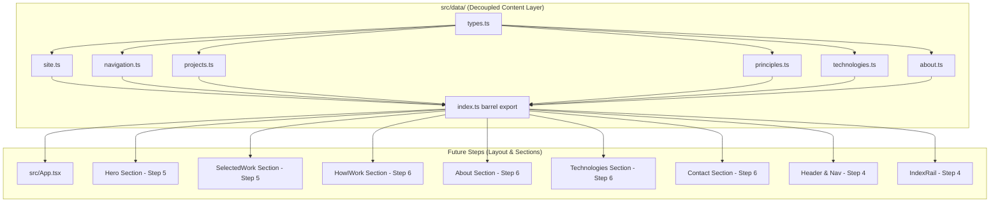

# Requirements

### Overview & Goals

The objective of Step 3 is to build a **strictly typed, decoupled content data layer** inside `src/data/` for Oleksandr Misiuk's portfolio website. 

By centralizing all personal details, navigation definitions, project case studies, engineering principles, technology lists, and biographical copy into strongly typed TypeScript modules:
1. **Zero JSX Content Coupling**: Any copy, link, project, or principle can be added, updated, or reordered by modifying a single file in `src/data/` without touching UI components.
2. **Compile-Time Type Safety**: Full TypeScript schema validation prevents typos, broken contracts, or missing required attributes at build time.
3. **Graceful Placeholder Handling**: Unsupplied personal details (GitHub, email, CV) and media slots use strict empty strings and optional properties so the UI never renders dead `#` links or broken media.

---

### Scope

#### In Scope (Step 3)
- **TypeScript Data Contracts (`src/data/types.ts`)**:
  - `SiteProfile`: Personal details, role, status line, and social/contact links.
  - `NavItem`: Navigation items with section IDs, display labels, and mono index markers (`'01'`, `'02'`, etc.).
  - `ProjectStatus`: Union type `'building' | 'shipped' | 'placeholder'`.
  - `ProjectMedia`: Intrinsic dimensioned media slot (`kind`, `src`, `alt`, `width`, `height`, `poster`) to prevent Cumulative Layout Shift (CLS).
  - `Project`: Project showcase model with status, technology tags, optional media, and optional external/repo/case-study links.
  - `Principle`: Core engineering philosophy item (`id`, `title`, `body`).
  - `AboutContent`: Biographical prose model (`paragraphs: string[]`).
- **Data Modules**:
  - `src/data/site.ts`: Real profile values (name "Oleksandr Misiuk", role "Senior Frontend Engineer", statement "I build fast, thoughtful interfaces that people enjoy using.", status line "Wrocław, Poland · open to new opportunities", LinkedIn URL) and empty strings with `// TODO: replace` comments for GitHub, email, and CV.
  - `src/data/navigation.ts`: Single source of truth for the five indexed sections (`01 / Selected Work`, `02 / How I Work`, `03 / About`, `04 / Technologies`, `05 / Contact`) and the section ID list for active section tracking.
  - `src/data/projects.ts`: Two initial entries (the in-progress personal product with status `'building'`, and the professional enterprise platform placeholder with status `'placeholder'`), complete with commented-out schema templates for dropping in future Zahara case studies and media.
  - `src/data/principles.ts`: Four engineering principles (`Product first`, `Thoughtful architecture`, `Details matter`, `Ownership`) with senior-level, high-judgement engineering copy.
  - `src/data/technologies.ts`: The 10 specified core technologies (`TypeScript`, `React`, `React Native`, `Angular`, `JavaScript`, `HTML`, `CSS`, `RxJS`, `REST APIs`, `Git`).
  - `src/data/about.ts`: Two to three concise placeholder paragraphs focused on frontend craft, performance, and architecture.
  - `src/data/index.ts`: Barrel export consolidating all data modules and types.
- **Maintainer Documentation (`src/data/README.md`)**: Field-by-field guide detailing how to update copy, add projects/screenshots, and modify links.
- **Showcase Integration (`src/App.tsx`)**: Update showcase to verify seamless consumption of typed data modules.
- **Documentation Governance**: Update `docs/architecture.md`, `docs/decisions.md`, and `docs/concerns.md`.

#### Out of Scope (Deferred to Steps 4–6)
- Section UI components (Hero, SelectedWork, ProjectCard, HowIWork, About, Technologies, Contact) — implemented in Steps 5 & 6.
- Application layout shell (Header, MobileNav disclosure, IndexRail, Footer) — implemented in Step 4.
- Runtime CMS or external backend APIs (strictly static TypeScript modules per architectural boundary).

---

### User Stories

- As a **site owner**, I want to update my location, bio, or social links by editing a single TypeScript file in `src/data/` without modifying JSX markup.
- As a **site owner**, I want to add a new project case study with screenshots by adding an object to `src/data/projects.ts`, guided by clear comments and TypeScript type checks.
- As a **developer reviewing the codebase**, I want clear data models and zero `any` types so that the application contracts are immediately obvious and self-documenting.
- As a **visitor**, I want never to encounter broken `#` links or layout-shifting images because missing data is handled gracefully by design.

---

### Functional Requirements

1. **Profile & Contact Data (`site.ts`)**:
   - `name`: `'Oleksandr Misiuk'`.
   - `role`: `'Senior Frontend Engineer'`.
   - `statement`: `'I build fast, thoughtful interfaces that people enjoy using.'`.
   - `status`: `'Wrocław, Poland · open to new opportunities'`.
   - `links.linkedin`: `'https://linkedin.com/in/alexandr-misiuk'`.
   - `links.github`: `''` (with `// TODO: replace with real GitHub profile URL`).
   - `links.email`: `''` (with `// TODO: replace with real contact email address`).
   - `links.cv`: `''` (with `// TODO: replace with path to CV file, e.g. '/cv/Oleksandr_Misiuk_CV.pdf'`).

2. **Navigation Anchors (`navigation.ts`)**:
   - `navItems`: Array of 5 sections:
     - `{ id: 'work', label: 'Selected Work', index: '01' }`
     - `{ id: 'how-i-work', label: 'How I Work', index: '02' }`
     - `{ id: 'about', label: 'About', index: '03' }`
     - `{ id: 'technologies', label: 'Technologies', index: '04' }`
     - `{ id: 'contact', label: 'Contact', index: '05' }`
   - `SECTION_IDS`: `['hero', 'work', 'how-i-work', 'about', 'technologies', 'contact']` for the upcoming `useActiveSection` IntersectionObserver hook.

3. **Projects Model (`projects.ts`)**:
   - Exactly two initial entries:
     1. In-progress personal product (`id: 'personal-product'`, `status: 'building'`).
     2. Professional enterprise project placeholder (`id: 'professional-case-study'`, `status: 'placeholder'`).
   - Media contract must support both `image` and `video` with required `width` and `height` to enforce zero Cumulative Layout Shift (CLS).
   - Commented-out examples showing how to configure image media and case study URLs for future Zahara case studies.

4. **Engineering Principles (`principles.ts`)**:
   - Exactly 4 principles written in senior engineering terms:
     1. `Product first`: Focus on user workflows, business velocity, and delivering tangible user value over premature optimization.
     2. `Thoughtful architecture`: Clean separation of concerns, explicit contracts, minimal external dependencies, and maintainable component boundaries.
     3. `Details matter`: Sub-millisecond responsiveness, typographic precision, layout stability, keyboard navigation, and WCAG AA accessibility.
     4. `Ownership`: End-to-end accountability from technical discovery and design to deployment, observability, and long-term maintenance.

5. **Technologies (`technologies.ts`)**:
   - Exactly 10 supplied technologies: `'TypeScript'`, `'React'`, `'React Native'`, `'Angular'`, `'JavaScript'`, `'HTML'`, `'CSS'`, `'RxJS'`, `'REST APIs'`, `'Git'`.

6. **About Copy (`about.ts`)**:
   - Two to three concise, professional paragraphs highlighting senior frontend capabilities, engineering discipline, and focus on web performance.

7. **Documentation (`src/data/README.md`)**:
   - Clear task-based guide for editing each data file and field.

---

### Non-Functional Requirements

- **Type Safety**: TypeScript strict mode enabled with 100% explicit types and zero `any`.
- **Bundle Optimization**: Pure ES modules with tree-shakable exports and no runtime overhead.
- **Zero Dead Links**: Unsupplied URLs are empty strings (`''`) to allow UI components to conditionally omit anchor tags rather than rendering `#`.
- **Layout Stability**: Explicit intrinsic dimensions (`width`, `height`) on all media contracts.
- **Quality Gates**: Zero TypeScript errors (`npm run typecheck`), zero ESLint errors/warnings (`npm run lint`), clean Prettier formatting (`npm run format:check`), and successful Vite build (`npm run build`).


# Technical Design

### Current Implementation

The project toolchain and design system foundations are complete:
- **Design Tokens & Typography**: Configured in `src/styles/index.css` with Tailwind CSS v4 `@theme`, `@custom-variant dark`, fluid clamp scales, and self-hosted variable fonts (`Instrument Sans` and `JetBrains Mono`).
- **UI Primitives**: Atomic components in `src/components/ui/` (`ActionLink`, `Tag`, `Eyebrow`, SVG icons) and `ThemeToggle`.
- **Current State of `src/data/`**: Empty directory with `.gitkeep`. `src/App.tsx` currently contains hardcoded showcase content from Step 2.

---

### Key Decisions

| Decision | Choice | Rationale |
|---|---|---|
| **Data Architecture** | Strongly typed TypeScript modules (`src/data/*.ts`) | Eliminates JSON parsing runtime overhead, provides instant compile-time verification, allows rich inline comments/type hints for maintainers, and enables automated tree-shaking. |
| **Unset Link Representation** | Empty string (`''`) with `// TODO: replace` comments | Distinguishes intentional empty states from optional undefined values; makes finding unpopulated fields trivial via grep, and gives UI components a straightforward `Boolean(link)` guard to omit dead links. |
| **Media Layout Stability** | Required `width` and `height` in `ProjectMedia` | Forces all project imagery to declare intrinsic dimensions, preventing Cumulative Layout Shift (CLS) when images load lazily. |
| **Unified Data Re-export** | Barrel export `src/data/index.ts` | Allows clean imports from `@/data` or `src/data` across layout and section components in subsequent steps. |
| **Maintainer Guide** | Dedicated `src/data/README.md` | Provides clear step-by-step instructions for non-code-centric content edits (adding projects, updating bio, replacing CV). |

---

### Proposed Changes

#### 1. TypeScript Types & Contracts (`src/data/types.ts`)

```typescript
export type ProjectStatus = 'building' | 'shipped' | 'placeholder';

export interface ProjectMedia {
    kind: 'image' | 'video';
    src: string;
    alt: string;
    poster?: string;
    width: number;
    height: number;
}

export interface Project {
    id: string;
    title: string;
    status: ProjectStatus;
    summary: string;
    technologies: readonly string[];
    media?: ProjectMedia;
    caseStudyUrl?: string;
    externalUrl?: string;
    repoUrl?: string;
}

export interface Principle {
    id: string;
    title: string;
    body: string;
}

export interface NavItem {
    id: string;
    label: string;
    index: string;
}

export interface SiteProfile {
    name: string;
    role: string;
    statement: string;
    status: string;
    links: {
        linkedin: string;
        github: string;
        email: string;
        cv: string;
    };
}

export interface AboutContent {
    paragraphs: readonly string[];
}
```

#### 2. Site Profile (`src/data/site.ts`)

```typescript
import type { SiteProfile } from './types';

export const siteProfile: SiteProfile = {
    name: 'Oleksandr Misiuk',
    role: 'Senior Frontend Engineer',
    statement: 'I build fast, thoughtful interfaces that people enjoy using.',
    status: 'Wrocław, Poland · open to new opportunities',
    links: {
        linkedin: 'https://linkedin.com/in/alexandr-misiuk',
        github: '', // TODO: replace with real GitHub profile URL
        email: '',  // TODO: replace with real contact email address
        cv: '',     // TODO: replace with path to CV file (e.g. '/cv/Oleksandr_Misiuk_CV.pdf')
    },
};
```

#### 3. Navigation (`src/data/navigation.ts`)

```typescript
import type { NavItem } from './types';

export const navItems: readonly NavItem[] = [
    { id: 'work', label: 'Selected Work', index: '01' },
    { id: 'how-i-work', label: 'How I Work', index: '02' },
    { id: 'about', label: 'About', index: '03' },
    { id: 'technologies', label: 'Technologies', index: '04' },
    { id: 'contact', label: 'Contact', index: '05' },
] as const;

export const SECTION_IDS = ['hero', 'work', 'how-i-work', 'about', 'technologies', 'contact'] as const;
```

#### 4. Projects (`src/data/projects.ts`)

```typescript
import type { Project } from './types';

export const projects: readonly Project[] = [
    {
        id: 'personal-product',
        title: 'Personal Product',
        status: 'building',
        summary:
            'A modern web application built with a focus on performance, intuitive developer ergonomics, and fluid user interactions.',
        technologies: ['TypeScript', 'React', 'Tailwind CSS', 'Vite'],
        // media: {
        //     kind: 'image',
        //     src: '/projects/personal-product.webp',
        //     alt: 'Personal product dashboard preview',
        //     width: 1200,
        //     height: 750,
        // },
        // externalUrl: 'https://example.com',
        // repoUrl: 'https://github.com/example/repo',
    },
    {
        id: 'enterprise-web-platform',
        title: 'Enterprise Web Platform',
        status: 'placeholder',
        summary:
            'Architecture and frontend implementation for high-throughput enterprise SaaS applications, managing complex state and asynchronous workflows.',
        technologies: ['React', 'TypeScript', 'RxJS', 'REST APIs'],
        // media: {
        //     kind: 'image',
        //     src: '/projects/enterprise-platform.webp',
        //     alt: 'Enterprise platform case study preview',
        //     width: 1200,
        //     height: 750,
        // },
        // caseStudyUrl: '/work/enterprise-platform',
    },
] as const;
```

#### 5. Principles (`src/data/principles.ts`)

```typescript
import type { Principle } from './types';

export const principles: readonly Principle[] = [
    {
        id: 'product-first',
        title: 'Product first',
        body: 'Technology serves the user and the business. I prioritize user workflows, delivery velocity, and measurable outcomes before optimizing architecture.',
    },
    {
        id: 'thoughtful-architecture',
        title: 'Thoughtful architecture',
        body: 'Simple abstractions, explicit contracts, and minimal dependencies outlive complex frameworks. I design maintainable systems that teams can evolve with confidence.',
    },
    {
        id: 'details-matter',
        title: 'Details matter',
        body: 'Polish is not an afterthought. Typography rhythm, layout stability, sub-millisecond interaction feedback, and WCAG AA accessibility define software quality.',
    },
    {
        id: 'ownership',
        title: 'Ownership',
        body: 'Senior engineering means end-to-end accountability — from early product discovery and architectural trade-offs to production monitoring and clear documentation.',
    },
] as const;
```

#### 6. Technologies (`src/data/technologies.ts`)

```typescript
export const technologies: readonly string[] = [
    'TypeScript',
    'React',
    'React Native',
    'Angular',
    'JavaScript',
    'HTML',
    'CSS',
    'RxJS',
    'REST APIs',
    'Git',
] as const;
```

#### 7. About (`src/data/about.ts`)

```typescript
import type { AboutContent } from './types';

export const aboutContent: AboutContent = {
    paragraphs: [
        'Senior Frontend Engineer with deep experience architecting responsive, high-performance web applications and design systems using React and TypeScript.',
        'Focused on building accessible, resilient user interfaces with rigorous attention to typography, fluid layouts, and minimal runtime overhead.',
        'Experienced across the full development lifecycle — from system design and state management to performance profiling and cross-functional leadership.',
    ],
};
```

#### 8. Barrel Export (`src/data/index.ts`)

```typescript
export * from './types';
export * from './site';
export * from './navigation';
export * from './projects';
export * from './principles';
export * from './technologies';
export * from './about';
```

---

### File Structure

```
src/
├── data/
│   ├── types.ts          # TypeScript interfaces and union types
│   ├── site.ts           # Personal info, role, statement, status, links
│   ├── navigation.ts     # 5 indexed sections (01-05) and section IDs
│   ├── projects.ts       # In-progress personal product & placeholder project
│   ├── principles.ts     # 4 senior engineering principles
│   ├── technologies.ts   # 10 core technologies list
│   ├── about.ts          # Biographical copy paragraphs
│   ├── index.ts          # Barrel export re-exporting all data modules
│   └── README.md         # Maintainer content editing guide
```

---

### Architecture Diagram



---

### Risks & Mitigations

| Risk | Mitigation |
|---|---|
| **Empty or Missing Links Rendering as `#`** | Unpopulated links are set to `''`. UI components check `Boolean(link)` before rendering action links. |
| **Cumulative Layout Shift from Project Media** | `ProjectMedia` contract mandates explicit `width` and `height` properties so containers preserve aspect ratios before images load. |
| **Schema Drift between Data and Future Components** | Strict TypeScript interfaces in `types.ts` are exported through the barrel file and enforced across all consumer components. |


# Testing

### Validation Approach

Validation for the data layer relies on TypeScript compiler checks, ESLint verification, Prettier formatting compliance, production build verification, and live integration testing in `src/App.tsx`.

---

### Key Scenarios

1. **Type Contract Verification**:
   - `npm run typecheck` runs `tsc -b --noEmit` to ensure all data objects strictly adhere to their respective interfaces with zero type errors.
   - All optional fields (`media`, `caseStudyUrl`, `externalUrl`, `repoUrl`) validate correctly as optional or undefined.

2. **Decoupled Data Consumption in App**:
   - `src/App.tsx` imports from `@/data` to render the site profile name, role, status line, principles, and technology tags.
   - Verify that all values render dynamically from the data layer rather than static inline JSX.

3. **Data Immutability & Safety**:
   - Verify that arrays and properties exported with `readonly` modifiers prevent accidental runtime mutations.

4. **Maintainer Ergonomics**:
   - Verify that `src/data/README.md` clearly outlines how to add a third project or update contact links.
   - Verify that `// TODO: replace` comments are present on all unsupplied placeholder links in `site.ts`.

---

### Edge Cases

- **Missing Media**: A project with `media: undefined` conforms cleanly to the `Project` type and does not cause type errors.
- **Empty Link Strings**: `siteProfile.links.github === ''` evaluates to false when checked via `Boolean(link)`, allowing UI guards to cleanly omit the element.
- **Long Text Strings**: Multi-line summaries and principles compile cleanly as UTF-8 string literals without formatting or escape character issues.

---

### Quality Gate Commands

All of the following must pass with zero errors:
```bash
npm run typecheck      # tsc -b --noEmit (0 TypeScript errors)
npm run lint           # eslint . (0 errors, 0 warnings)
npm run format:check   # prettier --check . (clean formatting)
npm run build          # vite build (successful production bundle)
```


# Delivery Steps

### ✓ Step 1: Define TypeScript contracts and data models (src/data/types.ts)
Strongly-typed TypeScript interfaces and union types for all portfolio data models are defined and exported from `src/data/types.ts`.

- Create `src/data/types.ts` defining strict TypeScript models:
  - `ProjectStatus`: union type `'building' | 'shipped' | 'placeholder'`.
  - `ProjectMedia`: media descriptor requiring `kind` (`'image' | 'video'`), `src`, `alt`, `width`, `height` (for zero-CLS layout stability), and optional `poster`.
  - `Project`: contract containing `id`, `title`, `status`, `summary`, `technologies`, optional `media`, optional `caseStudyUrl`, optional `externalUrl`, and optional `repoUrl`.
  - `Principle`: contract containing `id`, `title`, and `body`.
  - `NavItem`: navigation anchor model containing `id`, `label`, and `index` (`'01'`, `'02'`, etc.).
  - `SiteProfile`: personal details model containing `name`, `role`, `statement`, `status`, and `links` (`linkedin`, `github`, `email`, `cv`).
  - `AboutContent`: prose model containing `paragraphs: string[]`.
- Ensure strict TypeScript compliance (`strict: true`, zero `any` types, explicit property typing).

### ✓ Step 2: Implement site profile, navigation, and technology modules
Profile identity, navigation anchors, and core technology stack data are structured into type-safe modules.

- Create `src/data/site.ts` exporting `siteProfile: SiteProfile`:
  - Real personal values: name (`'Oleksandr Misiuk'`), role (`'Senior Frontend Engineer'`), statement (`'I build fast, thoughtful interfaces that people enjoy using.'`), status line (`'Wrocław, Poland · open to new opportunities'`), and LinkedIn URL (`'https://linkedin.com/in/alexandr-misiuk'`).
  - Unsupplied contact items (`github`, `email`, `cv`) set to empty strings `''` accompanied by explicit `// TODO: replace` comments.
- Create `src/data/navigation.ts` exporting `navItems: NavItem[]` and `SECTION_IDS`:
  - Five indexed content sections: `01 / Selected Work` (`id: 'work'`), `02 / How I Work` (`id: 'how-i-work'`), `03 / About` (`id: 'about'`), `04 / Technologies` (`id: 'technologies'`), `05 / Contact` (`id: 'contact'`).
  - Section IDs constant array for the future `IntersectionObserver` active section hook.
- Create `src/data/technologies.ts` exporting `technologies: readonly string[]`:
  - Contains the 10 specified core technologies: `'TypeScript'`, `'React'`, `'React Native'`, `'Angular'`, `'JavaScript'`, `'HTML'`, `'CSS'`, `'RxJS'`, `'REST APIs'`, `'Git'`.

### ✓ Step 3: Implement projects, principles, about copy, and barrel export
Project showcase data, engineering principles, about prose, and a unified barrel export are implemented with expansion templates.

- Create `src/data/projects.ts` exporting `projects: Project[]`:
  - Entry 1: Personal product currently in development (status: `'building'`), focused on frontend engineering with TypeScript/React, marked as in-progress without invented claims.
  - Entry 2: Professional platform placeholder (status: `'placeholder'`), structured for dropping in real Zahara case studies later.
  - Commented-out schema examples demonstrating how to populate `media` (with intrinsic `width`/`height`) and case study links.
- Create `src/data/principles.ts` exporting `principles: Principle[]`:
  - Four senior engineering principles: `Product first`, `Thoughtful architecture`, `Details matter`, `Ownership`.
  - High-judgement engineering copy describing product impact, maintainable boundaries, UI polish, and end-to-end accountability.
- Create `src/data/about.ts` exporting `aboutContent: AboutContent`:
  - Two to three concise, professional paragraphs focused on frontend craft, performance, and architecture, clearly marked for future customization.
- Create `src/data/index.ts` re-exporting all models and data modules for ergonomic imports (`@/data`).

### ✓ Step 4: Write data documentation, update showcase, sync docs, and verify quality gates
Content editing documentation is written, project architecture docs are synchronized, and all automated quality gates pass with zero errors.

- Create `src/data/README.md` providing a clear reference for site maintainers:
  - How to update personal information and social links in `site.ts`.
  - How to add, edit, or reorder projects, screenshots, videos, and case studies in `projects.ts`.
  - How to update engineering principles (`principles.ts`), tech stack items (`technologies.ts`), and bio copy (`about.ts`).
  - How to add or modify navigation sections (`navigation.ts`).
- Update `src/App.tsx` showcase to consume live data from `src/data/` (verifying imports, type safety, and real profile/nav values).
- Synchronize documentation in `docs/`:
  - Update `docs/architecture.md` with data layer contracts, module exports, and data flow details.
  - Update `docs/decisions.md` documenting the type-safe TypeScript data layer architecture and empty string omission pattern.
  - Update `docs/concerns.md` recording data layer constraints (CLS prevention via intrinsic media dimensions, dead link elimination).
- Run and verify all quality gates:
  - `npm run typecheck` (`tsc -b --noEmit`, 0 TypeScript errors).
  - `npm run lint` (`eslint .`, 0 errors, 0 warnings).
  - `npm run format:check` (`prettier --check .`, 100% compliant).
  - `npm run build` (`vite build`, successful static production bundle).