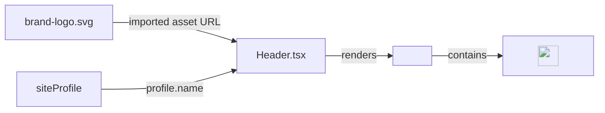

# Requirements

### Overview & Goals
Update the brand/home anchor link in `src/components/layout/Header.tsx` to render the SVG brand logo (`src/assets/brand-logo.svg`) instead of the textual `profile.name` span, improving visual identity while maintaining strict accessibility, responsive layout stability, and 100% test coverage.

### Scope
- **In Scope**:
  - Update `src/components/layout/Header.tsx` to import and render `src/assets/brand-logo.svg` inside the `#hero` navigation anchor.
  - Retain accessible naming on the brand link via `aria-label={profile.name}` and decorative `alt=""` on the logo image (or equivalent accessible SVG markup).
  - Update and expand unit tests in `src/components/layout/Header.test.tsx` following TDD.
  - Update `docs/` (`architecture.md`, `decisions.md`) to reflect the component update.
  - Verify all quality gates (`npm run verify` and `npm run test:e2e`).
- **Out of Scope**:
  - Modifying `MobileNav.tsx`, `Footer.tsx`, or section components.
  - Changing the SVG asset itself (`src/assets/brand-logo.svg`).

### User Stories
- **As a site visitor**, I want to see the brand logo in the sticky header so that I can quickly recognize the portfolio brand and click it to navigate to the hero section.
- **As a screen-reader or keyboard user**, I want the logo link to retain a clear accessible name (`profile.name`) and visible focus indicators so that navigation remains intuitive and accessible.

### Functional Requirements
- The brand link in `Header` must point to `#hero`.
- The brand link must render the SVG graphic imported from `@/assets/brand-logo.svg`.
- The brand link must provide an accessible name (e.g. `Alex Developer` / `profile.name`) to assistive technologies.
- The logo image must have explicit dimensions (`32x32px` or `h-8 w-8`) to prevent layout shifts.
- Focus-visible ring styles (`focus-visible:outline-2 focus-visible:outline-offset-2 focus-visible:outline-accent`) must remain intact for keyboard navigation.

### Non-Functional Requirements
- **Performance & CLS**: Explicit width and height on the image prevent Cumulative Layout Shift.
- **Accessibility**: WCAG 2.1 AA compliant contrast and accessible name resolution.
- **Code Standards**: Zero TypeScript errors, zero ESLint warnings, formatted with Prettier, and 100% unit-test coverage.

# Technical Design

### Current Implementation
In `src/components/layout/Header.tsx`, the home/hero link is currently rendered as text:
```tsx
<a
    href="#hero"
    className="group text-ink hover:text-accent focus-visible:outline-accent flex items-center gap-2 font-mono text-sm font-semibold tracking-tight transition-colors focus-visible:outline-2 focus-visible:outline-offset-2"
>
    <span>{profile.name}</span>
</a>
```

### Key Decisions
- **Static Asset Import via Vite**: Import `brandLogo` directly from `@/assets/brand-logo.svg` using the configured `@/*` alias path, matching existing asset import patterns like `heroLightBg` in `src/App.tsx`.
- **Accessible Name Pattern**: Provide `aria-label={profile.name}` on the `<a href="#hero">` anchor element and `alt=""` on the child `` tag (with `width={32}` and `height={32}`). This guarantees that screen readers announce the link by the site owner's name while preventing redundant image announcements.
- **Styling**: Apply `h-8 w-8 rounded-sm` to the logo image and refine the anchor's classes to `group inline-flex items-center justify-center focus-visible:outline-accent rounded-sm transition-opacity hover:opacity-80 focus-visible:outline-2 focus-visible:outline-offset-2`.

### Proposed Changes
1. **`src/components/layout/Header.tsx`**:
   - Add `import brandLogo from '@/assets/brand-logo.svg';`.
   - Replace the textual `<span>{profile.name}</span>` inside `<a href="#hero">` with the SVG image element.
2. **`src/components/layout/Header.test.tsx`**:
   - Add unit test asserting that the brand link renders with `href="#hero"`, has the accessible name of `profile.name`, and renders the brand logo image with the imported source.
3. **`docs/architecture.md` and `docs/decisions.md`**:
   - Update documentation to reflect the brand logo link in Header.

### Data Models / Contracts
Component props for `HeaderProps` remain unchanged:
```tsx
export interface HeaderProps {
    activeId: string;
    items?: readonly NavItem[];
    profile?: SiteProfile;
}
```

Markup structure:
```tsx
<a
    href="#hero"
    aria-label={profile.name}
    className="focus-visible:outline-accent group inline-flex items-center justify-center rounded-sm transition-opacity hover:opacity-80 focus-visible:outline-2 focus-visible:outline-offset-2"
>
    
</a>
```

### Components
- `Header` (`src/components/layout/Header.tsx`): Updates the `#hero` anchor to render the imported SVG logo with accessible labeling.

### File Structure
- `src/assets/brand-logo.svg` (Existing asset)
- `src/components/layout/Header.tsx` (Modified)
- `src/components/layout/Header.test.tsx` (Modified)
- `docs/architecture.md` (Modified)
- `docs/decisions.md` (Modified)

### Architecture Diagram


# Testing

### Validation Approach
- Follow strict Test-Driven Development (TDD): write unit tests verifying the brand logo link before modifying `Header.tsx`.
- Execute Vitest coverage runner to ensure 100% statement, branch, function, and line coverage.
- Execute Playwright E2E and `@axe-core/playwright` accessibility tests.

### Key Scenarios
1. **Brand link rendered**: `<a href="#hero">` is rendered with accessible name matching `profile.name` (or custom profile passed via props).
2. **Image source & dimensions**: Logo `` has `src` pointing to `brandLogo` and explicit `width={32}` and `height={32}` attributes.
3. **Default props**: `Header` renders correctly without custom `profile` prop, falling back to `defaultProfile`.
4. **Keyboard interaction**: Tab navigation focuses the link with visible `:focus-visible` ring.

### Edge Cases
- Custom `profile` prop with different `name` updates `aria-label` accordingly.
- Fallback to `defaultProfile` when `profile` is omitted.

### Test Changes
- `src/components/layout/Header.test.tsx`:
  - Add test: `renders the brand logo link pointing to #hero with accessible name matching profile.name`.

# Delivery Steps

### ✓ Step 1: Implement brand logo in Header with unit tests
Header renders the brand logo SVG inside the `#hero` anchor with proper accessibility attributes and 100% unit test coverage.

- Add failing unit tests in `src/components/layout/Header.test.tsx` verifying the `#hero` brand link renders an image with the brand logo asset and has an accessible name derived from `profile.name`.
- Import `brandLogo` from `@/assets/brand-logo.svg` in `src/components/layout/Header.tsx`.
- Update the `<a href="#hero">` anchor element to render the brand logo SVG (``) with explicit dimensions (`width={32}`, `height={32}` or `h-8 w-8`), `aria-label={profile.name}`, and appropriate focus/hover transition styles while maintaining semantic markup.
- Execute unit tests to ensure all tests pass and 100% coverage thresholds are satisfied.

### ✓ Step 2: Verify quality gates and update project documentation
All documentation reflects the brand logo in the header and all verification quality gates pass.

- Update `docs/architecture.md` and `docs/decisions.md` to document the brand logo asset usage in the Header shell.
- Run `npm run verify` to ensure zero TypeScript errors, clean ESLint validation, clean Prettier formatting, 100% unit test coverage, and successful production build.
- Run `npm run test:e2e` to verify Playwright end-to-end navigation, accessibility, and theme test suites pass across all viewport matrix configurations.