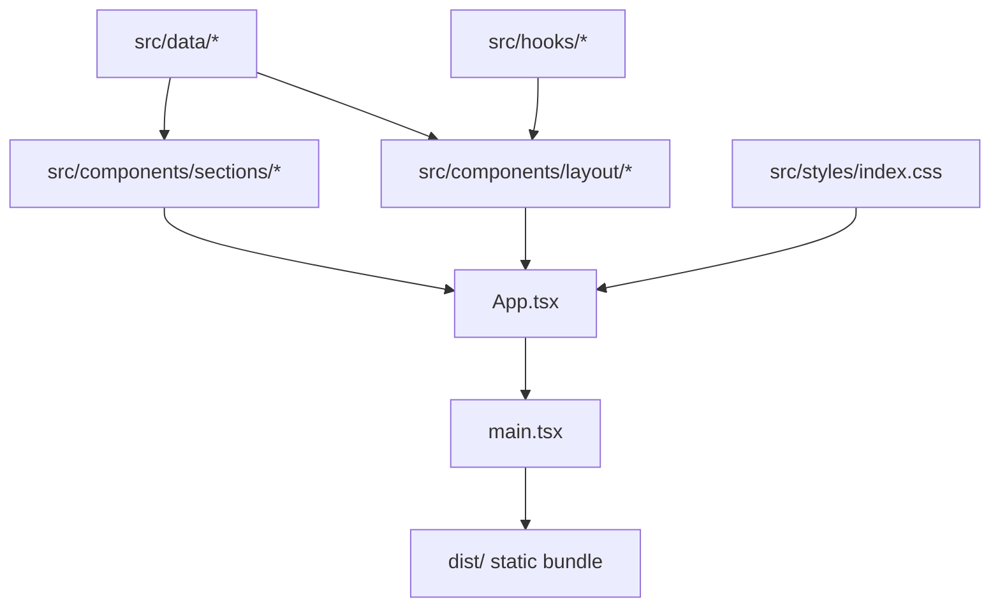

# Architecture Overview

This document provides a condensed overview of the architecture, key concepts, and structure of Oleksandr Misiuk's portfolio website.

## Architectural Concepts

- **Static Single-Page Application (SPA)**: Zero backend, zero database, zero server runtimes. Bundled into static HTML, JS, and CSS chunks deployable to any static host (Cloudflare Pages, Vercel, Netlify, GitHub Pages).
- **Decoupled Data Layer**: All portfolio content (personal profile, navigation items, projects, principles, technologies, about text) is structured as type-safe TypeScript modules in `src/data/`. Components remain strictly presentational.
- **CSS-First Design Tokens (Tailwind CSS v4)**: Theme tokens (cool ink & cobalt palette, fluid typography clamp scales, spacing, transitions) are declared via `@theme` in `src/styles/index.css`.
- **Zero-Flash Theme Scheme**: Initial color scheme (dark or light) is applied before paint via a lightweight inline script in `index.html`. Manual user override is scoped to the session (no `localStorage` persistence).
- **Native Scroll & Animation**: Scroll reveals leverage CSS scroll-driven animations (`animation-timeline: view()`) gated behind `@supports` with full `prefers-reduced-motion` fallbacks.

## Directory Layout & Responsibilities

```
src/
├── assets/             # Static graphics, SVG artwork, and media placeholders
├── components/
│   ├── layout/         # Application shell: Header, MobileNav, ThemeToggle, SkipLink, IndexRail, Section, Footer
│   ├── sections/       # Primary page sections: Hero, SelectedWork, ProjectCard, HowIWork, About, Technologies, Contact
│   └── ui/             # Atomic primitives: ActionLink, Tag, Eyebrow, SVG icons
├── data/               # Content data layer: types.ts, site.ts, navigation.ts, projects.ts, principles.ts, technologies.ts, about.ts
├── hooks/              # Custom hooks: useColorScheme, useActiveSection
├── styles/             # Global styles: index.css (Tailwind CSS v4 `@theme`, `@layer base`, keyframes)
├── App.tsx             # Root application shell assembling layout and sections
├── main.tsx            # Application entry point mounting React root
└── vite-env.d.ts       # Vite TypeScript client declarations
```

## Data Flow Diagram


