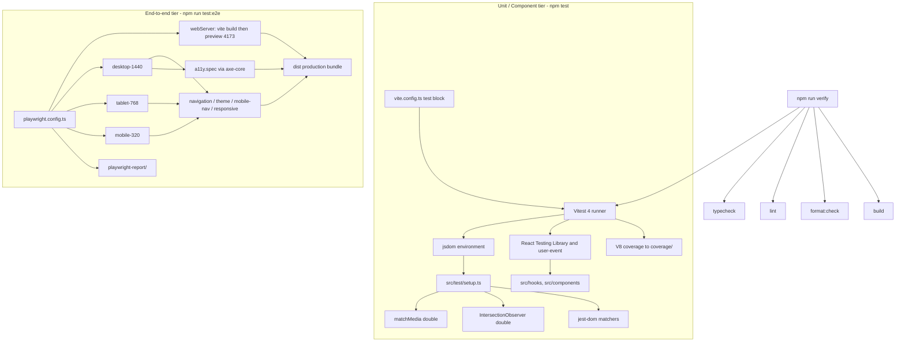

# Testing

This document is the single source of truth for the testing architecture, the TDD workflow, and the coverage policy.

## Testing Philosophy

All development after this document lands is **test-driven**.

1. **Red** — write a failing test that names the behaviour.
2. **Green** — implement the minimum production code that makes it pass.
3. **Refactor** — clean up with the suite still green.

"Tests will follow later" is not permitted. Bug fixes start with a regression test that fails first. The initial suite in this repository was written against already-existing code; the mandate governs every change after that.

**Unit-test coverage must remain at 100%** (lines, statements, functions, branches). That bar is affordable because the runtime surface is small, and `npm run test:coverage` makes it mechanically enforceable. Never lower a threshold, never add a blanket ignore, and never write assertion-free tests to inflate the number.

## Two-Tier Architecture



- **Unit / component tier** owns hooks, presentational contracts, and jsdom-level interaction. Fast, hermetic, no real network/API calls, no data layer coupling, and no browser binary.
- **E2E tier** owns real-browser journeys against the production bundle (`vite build` + `vite preview`): hash navigation, theme persistence, mobile disclosure, WCAG scans, and the viewport matrix.
- Put a test in the unit tier when the behaviour can be driven through React Testing Library or a hook. Put it in e2e when it depends on CSS layout, real `IntersectionObserver`, the pre-paint theme script, or a multi-page user journey.

## Commands

```bash
npm test                 # vitest run — fast, no coverage thresholds
npm run test:watch       # vitest watch loop
npm run test:coverage    # vitest run --coverage — fails below 100%
npm run test:e2e         # playwright test (builds + previews first)
npm run test:e2e:ui      # Playwright UI mode
npm run verify           # typecheck, lint, format:check, test:coverage, build
npx playwright install chromium   # one-time browser download
```

`npm test` is the inner loop. `npm run verify` is the gate that must be green before a change is done. `npm run test:e2e` is required as well but is kept out of `verify` so the coverage gate stays fast.

## Coverage Policy

Thresholds in `vite.config.ts` are 100 on lines, statements, functions, and branches. `coverage.include` is `src/**/*.{ts,tsx}`, so untested runtime files count as 0% instead of vanishing from the report.

The exclusion list is closed. Adding an entry requires a one-line justification here.

| Exclusion | Justification |
|---|---|
| `src/main.tsx` | Bootstrap only: `createRoot(...).render(<App />)` |
| `src/test/**` | The harness itself |
| `src/data/types.ts` | Type-only module, no runtime output |
| `src/data/**` | Static content data layer; decoupled from unit tests so content edits never break test suites |
| `src/**/*.d.ts` | Ambient declarations |
| `src/**/*.{test,spec}.{ts,tsx}` | The tests themselves |

E2E is not instrumented. The 100% bar applies to the Vitest tier only.

A last-resort ignore is an inline `/* v8 ignore next -- reason */` on a genuinely unreachable defensive branch (today: the `MobileNav` panel ref being null after commit). Prefer deleting the branch or covering it.

## Unit Test Conventions

- Co-locate as `*.test.ts(x)` beside the source module.
- Import `describe` / `it` / `expect` from `vitest` — no `globals: true`.
- Never make real API or network calls: unit tests run hermetically in `jsdom` with centralized test doubles.
- Never import runtime data from `@/data`: unit tests must not import runtime data from `@/data` or depend on literal copy/links; pass mock fixtures or props directly to components and hooks. Type imports (`import type { ... } from '@/data/types'`) remain permitted.
- Query by accessible role and name (`getByRole`) before test IDs.
- Use `user-event` (via `renderWithUser`) over raw `fireEvent` for interaction.
- Never assert on Tailwind class strings.
- Drive `IntersectionObserver` and `matchMedia` through `src/test/` — no inline mocks.
- New runtime modules must reach 100% coverage in the same change that introduces them.
- New components need at least a render plus an accessibility-contract test.

## Harness API

`src/test/setup.ts` runs before every unit file. Its `afterEach` calls `cleanup()`, resets both doubles, clears `sessionStorage`, removes `data-theme`, and restores `document.body.style.overflow`.

### `src/test/matchMedia.ts`

- `mockMatchMedia(initial?)` — install the stub; optional map of query → `matches`.
- `setMediaMatches(query, matches)` — update a query and dispatch a real `change` event.
- `resetMatchMedia()` — clear recorded queries (called globally).

### `src/test/intersectionObserver.ts`

- `mockIntersectionObserver()` — install the fake observer (already done in setup).
- `emitIntersections([{ id, isIntersecting }])` — drive the last observer callback.
- `getObserverOptions()` — inspect `rootMargin` / `threshold`.
- `getObservedIds()` / `wasObserverDisconnected()` — observe registration and teardown.
- `resetIntersectionObserver()` — called globally.

### `src/test/render.tsx`

Re-exports RTL (`render`, `screen`, `within`, `waitFor`, `cleanup`, `fireEvent`) plus `renderWithUser(ui)` which returns `{ user, ...result }`.

jsdom `getComputedStyle` returns empty custom properties. Tests that exercise `--header-height` must set the property on `document.documentElement` (or stub `getComputedStyle`) so rem/px parsing is actually covered.

## E2E Conventions

- Specs live in `e2e/*.spec.ts`. Typechecked via `tsconfig.e2e.json`.
- Web-first assertions and role locators. `page.waitForTimeout` is banned (`eslint-plugin-playwright`).
- Assert on landmarks, roles, IDs, and `aria-*` state — never on placeholder section copy.
- Projects: `desktop-1440`, `tablet-768`, `mobile-320`. Skip viewport-specific cases with `test.skip` keyed to `viewport.width`.
- Global `contextOptions.reducedMotion: 'reduce'` neutralises CSS scroll-driven animation flake.
- `e2e/fixtures/axe.ts` exposes `makeAxeBuilder()` scoped to `wcag2a`, `wcag2aa`, `wcag21a`, `wcag21aa`, excluding `[aria-hidden="true"]` so the decorative IndexRail does not fail colour-contrast.
- Dedicated touch controls (theme toggle, hamburger, `ActionLink`) must be ≥ 44×44. Compact desktop text nav is held to WCAG 2.5.8 AA (24×24).

## Troubleshooting

- **Coverage threshold failed** — open `coverage/index.html`, find the file below 100%, add a behavioural assertion for the missing branch. Do not widen `exclude`.
- **Flaky e2e scroll-spy** — assert after hash navigation or after scrolling to the deterministic top/bottom edge; never sleep. Confirm `reducedMotion` is still `'reduce'`.
- **`--header-height` only hits the 64px fallback** — jsdom does not resolve CSS custom properties. Set the property in the test before rendering the hook.
- **Playwright cannot find Chromium** — run `npx playwright install chromium` once.
- **Axe colour-contrast on IndexRail** — inactive rail labels use `text-ink-muted/50` and are `aria-hidden`. They are excluded from the scan; do not "fix" them by asserting on decorative contrast.
- **Diagnosing a failed `verify`** — the chain is `typecheck → lint → format:check → test:coverage → build`. The first non-zero step is the one to fix; `test:coverage` failing is a missing unit test, not an e2e issue.
